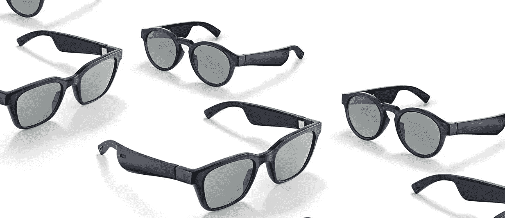

# 帮助盲人的手写数字听写

> 原文：<https://medium.com/swlh/handwritten-digit-dictation-to-aid-the-blind-3debe2ee7acd>

最近我在看 Bose 的音频太阳镜，它给了我一个关于实际使用的想法。这些音频太阳镜里面有扬声器。因此，如果我们给它加上一个摄像头，我们可以有很多有用的功能来帮助盲人。

Fig 1\. Bose Audio Sunglasses

在大量使用神经网络进行目标检测之前，有许多其他有效的特征提取器用于计算机…