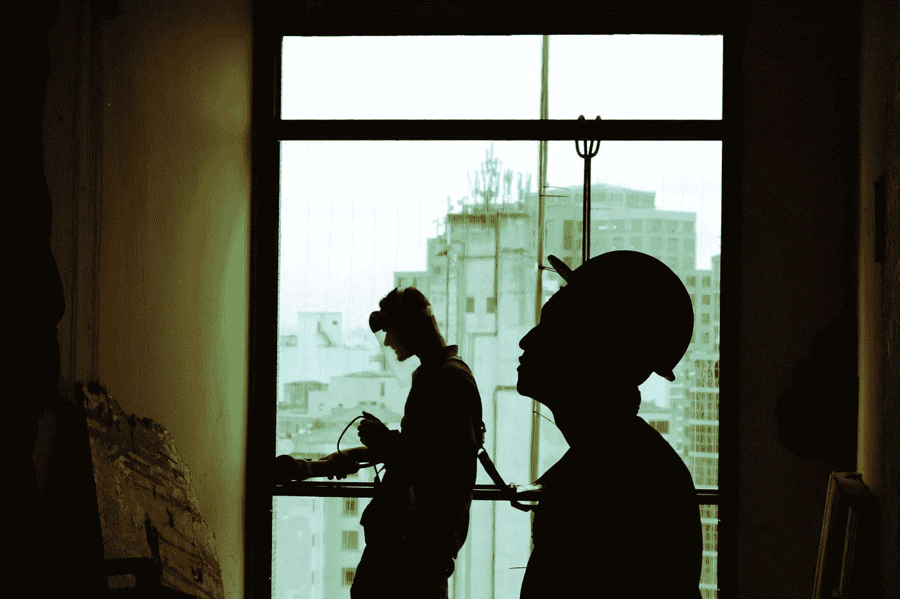

# 更难、更好、更快、更强:人工智能和机器人会抢走我们的工作吗？

> 原文：<https://medium.com/swlh/harder-better-faster-stronger-will-ai-robots-steal-our-jobs-a25f3e973f72>

Credit : Unsplash

*(TW:提及自杀和吸毒)*

对机器可能取代我们的担忧并不新鲜。从查理·卓别林的电影《摩登时代》开始，它就萦绕在小说、散文、电影中。这甚至可以追溯到古代，那时我们想知道牛拉犁是否意味着我们的劳动力过时了。