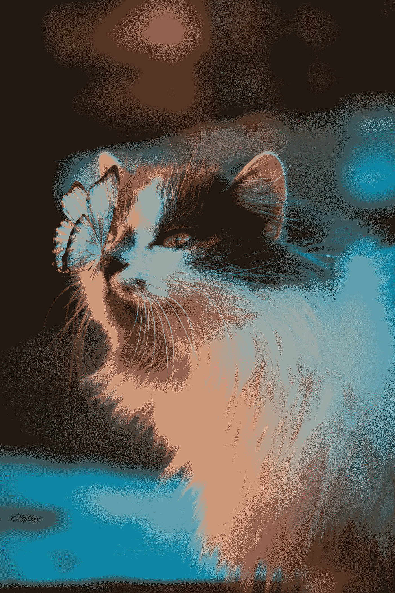

# 村上春树和超现实的快乐

> 原文：<https://medium.com/swlh/haruki-murakami-and-the-joy-of-the-surreal-ed0c6a242486>

Photo by [Karina Vorozheeva](https://unsplash.com/@_k_arinn?utm_source=unsplash&utm_medium=referral&utm_content=creditCopyText) on [Unsplash](https://unsplash.com/search/photos/surreal-cat?utm_source=unsplash&utm_medium=referral&utm_content=creditCopyText)

村上春树出生后，没有什么是真实的。

1949 年的日本是疯狂的——被广岛和长崎的凶手占领，日本青少年试图效仿占领者。

蓝色牛仔裤、摇滚和自由是美国的象征，而不是辐射、毁灭和占领。