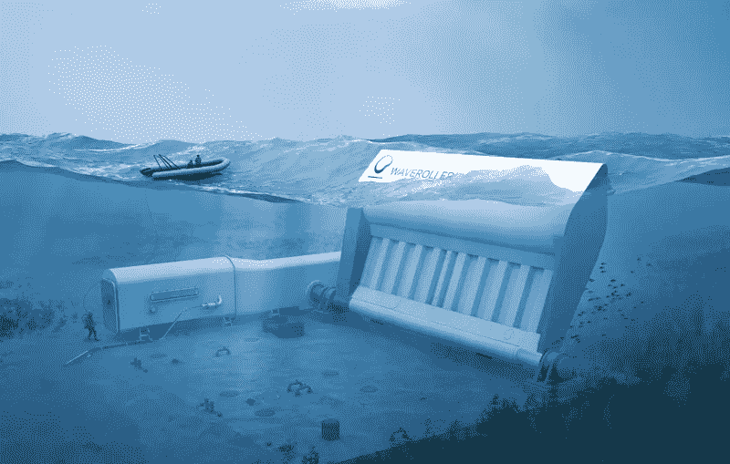

# 波浪能终于成熟了吗？

> 原文：<https://medium.com/swlh/has-wave-energy-finally-come-of-age-b25151fa341f>

波浪能有过许多虚假的曙光。但是现在一家来自芬兰的公司已经在葡萄牙建立并运行了一台 2MW 的样机。波浪能终于被破解了吗？

The near-shore WaveRoller wave energy panel

波浪能是利用波浪向海岸滚动时的动力来旋转涡轮或泵液压活塞而产生的。能量由波速、波高和“提取”——波传播的距离决定。的…