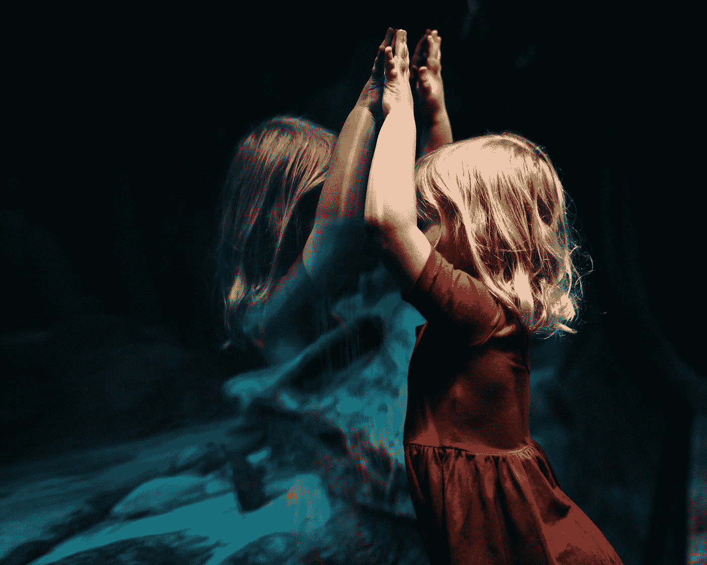

# 你成为你想成为的人了吗？

> 原文：<https://medium.com/swlh/have-you-become-who-you-want-to-be-51cb9169d1be>

[Source](https://unsplash.com/@bekahrussom?utm_source=medium&utm_medium=referral)

## 人格循环

我很胆小。快乐在我的特别角落，远离“酷小孩”。我没有成为大人物的野心。没有期望，没有责任。只有我和我的小朋友圈。我们偶尔会被“酷孩子”欺骗。糟透了。

高中改变了一切。随着青春期的到来，我开始看到我的…