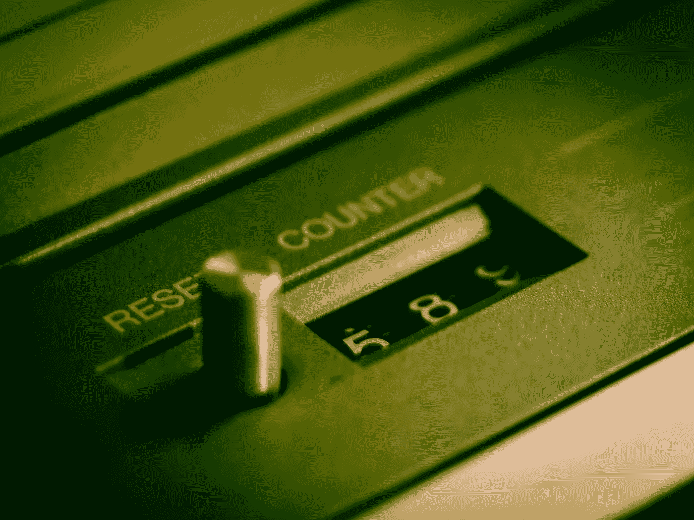

# 你重置你的品牌了吗？

> 原文：<https://medium.com/swlh/have-you-reset-your-brand-814e48795363>

**可能是时候了**

Image by [Thomas Breher](https://pixabay.com/users/TBIT-715211/?utm_source=link-attribution&utm_medium=referral&utm_campaign=image&utm_content=949233) from [Pixabay](https://pixabay.com/?utm_source=link-attribution&utm_medium=referral&utm_campaign=image&utm_content=949233)

当我想到企业和品牌企业时，它们通常被归为两类:(1)那些最近更新了品牌的企业，以及(2)那些需要这样做的企业。

虽然对某些人来说这似乎过于简单，但这是今天的现实。如果你的业务随着业务的未来而发展，它也应该随之改变。随着您的业务发生变化，所以…