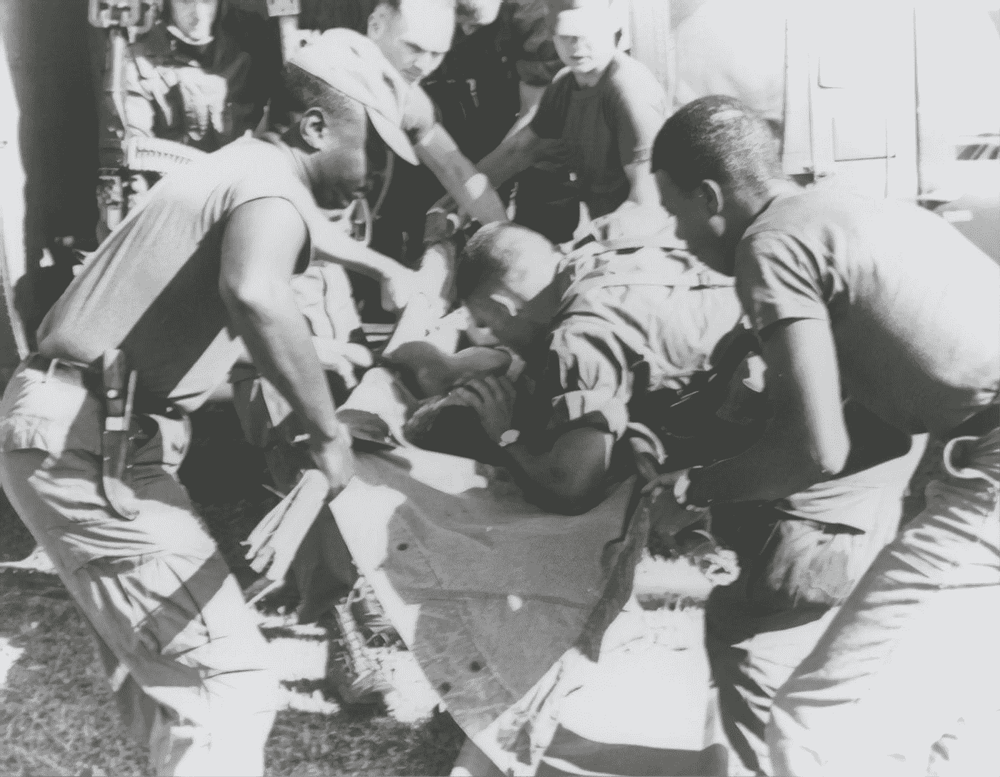

# "他喝酒喝死了。"

> 原文：<https://medium.com/swlh/he-drank-himself-to-death-b2ad3d00a10d>

## 他永远无法忘记越南的画面

Photo by [The New York Public Library](https://unsplash.com/@nypl?utm_source=medium&utm_medium=referral) on [Unsplash](https://unsplash.com?utm_source=medium&utm_medium=referral)

我刚拜访完我男朋友鲍勃的妈妈。她的弟弟上周去世了。我去帮她处理，开车送她去她哥哥的殡仪馆火化。

当我走进她家时，她说的第一句话是，“……他喝得烂醉如泥。他只是永远不能…