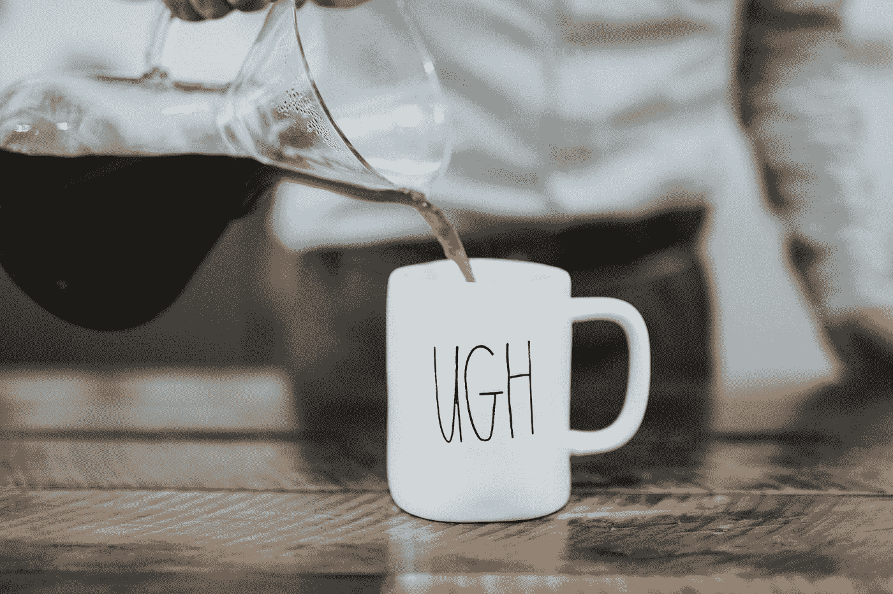

# 为什么我们要去星巴克！…

> 原文：<https://medium.com/swlh/he-knows-i-hate-starbucks-15fd10bba12e>

## 品牌是情感武器

Photo by [Nathan Dumlao](https://unsplash.com/@nate_dumlao?utm_source=medium&utm_medium=referral) on [Unsplash](https://unsplash.com?utm_source=medium&utm_medium=referral)

最近的一项研究表明，夫妻利用品牌来互相争斗。作为一个长期的营销人员，我觉得这令人震惊。作为夫妻中的男人一方…我们当然会！

我做品牌公司已经 25 年了，结婚时间也更长，但这仍然让我震惊。根据这项[研究](https://www.researchgate.net/publication/309341731_Oppositional_Brand_Choice_Using_Brands_to_Respond_to_Relationship_Frustration)，情侣们用品牌来交流…