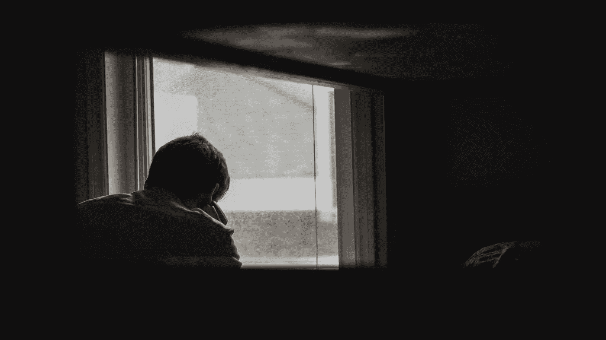

# 他说我永远不会成为作家

> 原文：<https://medium.com/swlh/he-said-id-never-make-it-as-a-writer-f1895580b7b6>

## 我如何证明一个记者的预测是错误的，并为我的生活“编辑”了他的标题

Photo by [Andrik Langfield](https://unsplash.com/@andriklangfield?utm_source=unsplash&utm_medium=referral&utm_content=creditCopyText) on [Unsplash](https://unsplash.com/search/photos/depressed?utm_source=unsplash&utm_medium=referral&utm_content=creditCopyText).

当助理编辑告诉我他对我的未来的看法时，我震惊了。他老了，快要退休了，闻起来有打字机旁满溢的烟灰缸里熄灭的香烟味。那是在 1983 年末，报社就像…