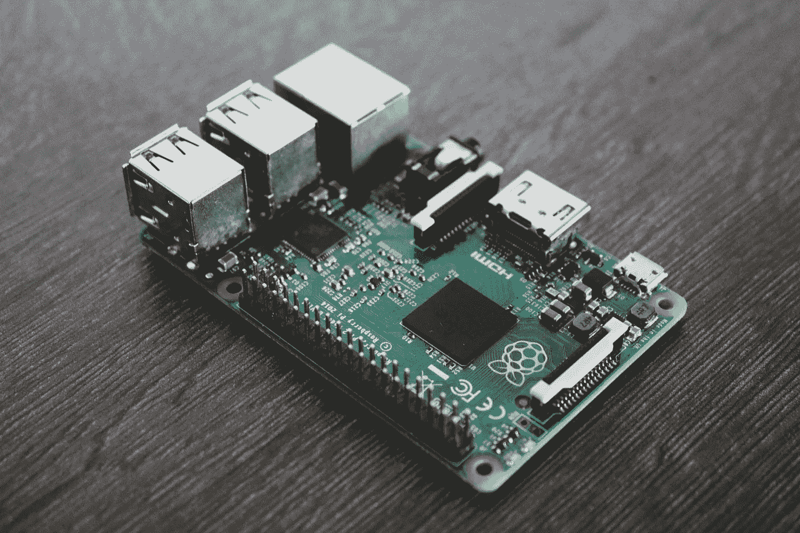

# 无头 Raspberry Pi —安装和配置 Raspbian

> 原文：<https://medium.com/swlh/headless-raspberry-pi-part-1-installing-configuring-raspbian-b8714a767259>



所以你刚刚得到了一个[树莓派](https://www.raspberrypi.org/)——一个微小的[片上系统](https://en.wikipedia.org/wiki/System_on_a_chip)，它可以用作任何东西，从日常的台式电脑，到 DIY 智能家居设备，甚至是驱动世界上下一个突破性医疗硬件的嵌入式控制器。现在你想用它做些酷的事情。让我们实现它吧。

这篇文章将带你走出新玩具的第一步。它是从使用[树莓派 Zero W](https://www.raspberrypi.org/products/raspberry-pi-zero-w/) 的角度来写的——但它应该适用于任何树莓派，如果有的话，难度很小。

# 收集碎片

为了理解这篇文章，你需要一些硬件和软件。

## 硬件

*就个人而言，虽然我链接到了一家声誉很好的流行在线零售商的以下产品，但我敦促您尽可能支持您当地的电子产品商店。此外，许多零售商——实体零售商和仅在线零售商——销售如下所列的产品。*

*   [Raspberry Pi Zero W](https://www.adafruit.com/product/3400) (或类似):同样，任何树莓 Pi 都应该是可用的。你可能想确保有一个带 WiFi 和蓝牙的——没有“正常”的连接选项会限制你的可能性。
*   [Micro-B 转 USB A 线](https://www.adafruit.com/product/592):这将在您的 Raspberry Pi 和您的电脑之间提供数据和电源连接，允许执行“系留”配置。
*   微型 SD 卡和读卡器 Raspberry Pi 没有内置存储器。因此，它的操作系统和数据都必须驻留在插入它的 SD 卡上。选择一个至少 16 GB 的，让你的生活更轻松一点。因为我们将使用计算机来闪存 SD 卡，所以您还需要一种方法来将其连接到您的计算机(例如，内置 SD 读卡器或外部 USB 读卡器)。
*   (可选；强烈推荐)[案例](https://www.adafruit.com/product/3252)——保护你的树莓派。
*   (可选；强烈推荐)[电源](https://www.adafruit.com/product/1995) —您的 Raspberry Pi 可以从您在设置过程中用来连接电脑的数据线上获得电力。但是，如果您希望它在配置后能够自己运行，您需要使用某种电源来打开它。
*   (可选) [Micro-B OTG 转母 USB A 适配器](https://www.adafruit.com/product/1099) —这只真正适用于 Raspberry Pi Zero 系列，它没有 USB A 端口。如果您计划将 USB 外围设备(如键盘或鼠标)连接到您的 Raspberry Pi，您将需要一根特殊的电缆来将其 USB 端口切换到“主机模式”。默认情况下，Micro-B 端口仅允许设备以“从”模式工作。然而，Raspberry Pi Zero 系列支持[USB On-The-Go](https://en.wikipedia.org/wiki/USB_On-The-Go)——一种在“主机”模式下使用 Micro-B 端口的硬件协议。如果你打算连接多个外围设备，另一个可以强制设备进入“主机”模式的选项是使用一个[供电的 USB 集线器](https://www.adafruit.com/product/2991)。
*   (可选)[迷你 HDMI 转 HDMI 线缆/适配器](https://www.adafruit.com/product/2775) —同样，这只真正适用于 Raspberry Pi Zero 系列，它有迷你 HDMI 端口，而不是标准端口。如果你想把你的 Raspberry Pi 连接到屏幕上，你需要这个来利用它的迷你 HDMI 端口。*注意不是 Micro HDMI 口，是 Mini HDMI 口。*

## 操作系统

你需要一个操作系统镜像来刷新你的 SD 卡。这将是你的树莓派将运行的操作系统。

本系列选择了 [Raspbian](https://www.raspbian.org/) 的“light”(又名“headless”)版本，这是一个基于 [Debian](https://www.debian.org/) 的 Linux 发行版，为在 Raspberry Pi 上运行做了很好的调整。Raspbian 的可信版本可以在 [Raspberry Pi Foundation 的下载页面](https://downloads.raspberrypi.org/)找到。这一系列选择了他们的[2019 年 4 月 9 日建立的拉斯边伸展](https://downloads.raspberrypi.org/raspbian/images/raspbian-2019-04-09/)。

我建议不要使用全新的发行版。例如，在撰写本文时，Raspbian Buster 刚刚推出，因此许多软件(例如 Docker 和 Pi-hole)在其上安装和运行时都存在未解决的问题。另一方面，Raspbian Stretch 已经推出了大约两年，当时它与上述软件配合得非常好。

此外，如果你的互联网连接速度较慢，我建议你通过可信的种子(比如 Raspberry Pi Foundation 提供的种子)下载发行版映像——这将显著提高你的下载速度。当使用种子时，不要忘记至少以 1:1 的比例进行播种，以帮助其他下载者像你一样受益。

## 软件

*   [balena etcher](https://www.balena.io/etcher/)——这是一款跨平台软件，你可以用它将下载的操作系统镜像刷新到你的 Raspberry Pi 的 SD 卡上。还有其他软件选项来执行此功能，但这似乎是最容易使用的，也是在撰写本文时最广为人知的。
*   [PuTTY](https://www.chiark.greenend.org.uk/~sgtatham/putty/) (如果在 Windows 上)——Mac 和 Linux 用户，你不需要这个，因为默认情况下你的系统上已经安装了一个 SSH 客户端。为了登录并在您的 Raspberry Pi 上做有趣的事情，您需要 SSH 到它。为了通过 SSH 连接到设备，您需要一个 SSH 客户端，PuTTY 是其中的一个选项。

# 准备您的 SD 卡

现在你已经收集好了所有的东西，你需要设置你的 SD 卡。如果没有插着操作系统的 SD 卡，树莓派只是一个非常糟糕的镇纸。

## 步骤 1 —将操作系统刷新到 SD 卡上

这部分相当简单。将您的 *SD 卡*插入您的计算机——通过您实际计算机上的 *SD 卡读卡器* r，或者您在上面获得的 USB 读卡器。

现在，启动 *balenaEtcher* 并按照它描述的步骤将你上面下载的操作系统映像刷新到你的 SD 卡上。

当这一部分完成后，您的 SD 卡将自动从您的计算机中弹出。为了继续这篇文章，您需要将其移除并重新连接到您的计算机，使其作为一个名为*“boot”*的外部驱动器进行挂载。

*您不能将下载的操作系统映像直接放在 SD 卡上，它不会以计算机(如 Raspberry Pi)在启动时可以识别的方式进行格式化。balenaEtcher 等软件工具可确保执行所有必要的格式化步骤，并确保完成后，SD 卡与您下载的操作系统映像的 ISO 文件所描述的结构相匹配。*

## 步骤 2 —初始配置

现在你的 SD 卡已经刷新了你下载的操作系统映像，并且已经作为一个名为*“boot”*的外部驱动器重新安装到你的计算机上，是时候配置一些初始启动设置了。我们将修改您 SD 卡上的一些文件。当您的 Raspberry Pi 第一次从 SD 卡启动时，它会看到这些文件，并基于它们执行一些特别的配置。这将允许您在第一次启动时连接到您的 Raspberry Pi。

在你的电脑上打开一个 *bash* (或者类似的)终端，进入你的 SD 卡的根目录。

```
# Figure out the name of your mounted SDcard. You should expect 
# this to be something like “boot”. The following command will list
# all mounted drives on your computer.ls -ls /Volumes/ # Actually change into the root directory of your mounted SD card.
# Assuming that the name of your SD card is now “boot”, the
# following command will get the job done.cd /Volumes/boot
```

现在您已经进入了 SD 卡的根目录，您需要告诉 Raspbian 在第一次启动时启用 SSH。作为安全预防措施，SSH 在默认情况下是禁用的。您可以通过简单地创建一个名为`ssh`的空文件来做到这一点。

```
# The “touch” command in bash will simply create an empty file in
# the current directory.touch ssh
```

接下来实际上是告诉 Raspbian 让你的 Raspberry Pi 像 USB 以太网设备一样工作。这将允许您通过 USB 将您的 Raspberry Pi 连接到您的计算机，在您的两个设备之间形成一个小型 LAN 网络，从而允许您 SSH 到您的 Raspberry Pi 并继续其配置。

[*SSH*](https://en.wikipedia.org/wiki/Secure_Shell) *是用于与远程设备通信的安全网络协议。由于您的 Raspberry Pi 在初始启动时不会连接到您的 WiFi 网络，我们需要创建一种不同的方式来通过网络访问它。告诉它充当 USB 以太网设备将允许我们在它和您的计算机之间形成一个小型局域网。*

*一种旧的、可以说不太安全的登录“嵌入式”设备的机制已经过时了* [*序列号*](https://en.wikipedia.org/wiki/Serial_port) *(是的，有点像你用来将打印机连接到现在已经过时的计算机的旧电缆)。市场上有 USB 转串行适配器，但是坦白地说，本系列中描述的技术比搞乱串行协议更容易——至少在我看来是这样。*

告诉您的 Raspberry Pi 像 USB 以太网设备一样工作需要两个步骤。本质上，您将告诉您的设备在启动时加载一个特殊的 USB 驱动程序，这将使您的 Raspberry Pi 的 Micro-B 端口充当以太网适配器。

从 SD 卡的根目录中，执行以下操作。

```
# Append “dtoverlay=dwc2” to the end of the “config.txt” file.echo “dtoverlay=dwc2” >> config.txt# Modify “cmdline.txt” to cause your device to load the proper
# kernel modules for the necessary USB & Ethernet drivers.
# 
# The following command will open the file for editing, but you will
# need to manually add “modules-load=dwc2,g_ether” immediately after
# “rootwait”. Leave exactly one space before and after this 
# addition – this file needs to be formatted very specifically to be
# interpreted properly.nano cmdline.txt
```

## 第三步——插上电源

如果到目前为止您做了所有正确的事情，那么是时候关闭您的终端，弹出您的 SD 卡，并将其放入您的 Raspberry Pi 中。如果你想把它放进箱子里，现在也可以。

用你的 Micro-B 转 USB A 线把你的 Raspberry Pi 插到你的电脑上。确保使用您的 Raspberry Pi 上的数据端口，而不是仅电源端口——这次您希望它充当您的计算机的 USB 以太网设备。

# 登录

通过 USB 将您的 Raspberry Pi 连接到电脑后，可能需要 90 秒才能完全启动。一般来说，直到它的绿色小指示灯不再闪烁，它才能完全启动。

一旦你认为它是开着的，是时候实际登录了。因为你的树莓 Pi 充当的是 USB 以太网设备，应该已经和你的电脑组成了一个小型局域网。

如果你在 Windows 上，你可以使用图形用户界面*PuTTY*SSH 到你的 Raspberry Pi。否则，您需要使用另一个`bash`终端。您的初始登录凭据将是:

*   用户名:`pi`
*   密码:`raspberry`
*   主机名:`raspberrypi.local`

*如果您的电脑不支持*[*Bonjour*](https://en.wikipedia.org/wiki/Bonjour_(software))*，您可能需要使用您的 Raspberry Pi 的实际内部 IP 地址作为其主机名。你可以通过多种方式发现这一点，例如使用一个像*[*Fing*](https://www.fing.com/)*这样的应用程序来扫描你的网络以查找连接的设备及其 IP 地址。*

```
# To SSH into your Raspberry Pi from a Mac or Linux computer, call
# the following from a bash terminal.
# 
# Note that the first command simply removes any old SSH keys for
# Raspberry Pi devices that are on your computer. You likely don’t
# have any, but this will eliminate weird issues you may experience
# if you do. As such, it only needs to be run once.
# 
# The second command is what you can use any time you want to SSH
# into your device.ssh-keygen -R raspberrypi.localssh pi@raspberrypi.local
```

在同意将您的 Raspberry Pi 的公共 SSH 密钥作为友好设备存储在您的计算机上，并可能输入您的密码之后，您应该正在为您的设备进行远程 bash 会话。

# 基本配置和 WiFi 连接

现在，您已经成功登录您的 Raspberry Pi，是时候将它连接到您的 WiFi 网络了。最简单的方法是使用 Raspbian 的配置向导。要启动它，运行以下命令。

```
# Fire up the Raspbian/Debian configuration wizard. The “sudo” part
# of this command causes it to be run as “root” (e.g. with full
# access to the restricted parts of the operating system), a
# necessary when dealing with system configurations.sudo raspi-config
```

进入此配置向导后，按照其对话框执行以下操作:

1.  更改您的密码(又名`pi`用户的密码)。这是一项安全预防措施。了解 Raspberry Pi 的人或者可以访问 Google 的人可以很快发现默认密码是 `*raspberry*` *。当然，为了让这些成为有用的信息，它们还需要和你的 Raspberry Pi 连接到同一个网络。*
2.  (可选)更改您的主机名。类似`raspberrypi-one`的应该没问题。如果你计划在你的网络上同时有多个 Raspberry Pi 设备，这是必须的。
3.  连接到您的 WiFi 网络。您需要选择您所在的地区(例如“美国”)或监管原因，然后手动输入您的 SSID 和密码。打字时要格外小心，以免重复这一步。*如果您希望您的 Raspberry Pi 能够连接多个 WiFi 网络(例如，如果您家中有 WiFi 扩展器)，您可以按照实际 Raspberry Pi 网站上的* [*说明进行高级配置*](https://www.raspberrypi.org/documentation/configuration/wireless/wireless-cli.md) *。*

完成上述所有配置后，继续从 Raspberry Pi 的数据端口拔下 Micro-B 电缆，并将其插入电源端口。你的 Raspberry Pi 应该重新启动并连接到你的 Wifi 网络，而不是用你的电脑创建一个小局域网。

# 无线连接和系统更新

现在，您的 Raspberry Pi 知道了您的 WiFi 网络，您应该能够连接到它，而无需通过 USB 电缆将其连接到您的电脑。这意味着，如果你愿意，你可以通过电源供电，而不是通过你的电脑。

假设您的 Raspberry Pi 和您的计算机在同一个网络上，您应该能够像以前一样 SSH 到它。如果您在上一节中更改了 Raspberry Pi 的主机名，请确保使用它。

```
# When connected to the same network as your Raspberry Pi, you can
# SSH into it using its new hostname and password.ssh pi@raspberrypi-one.local
```

远程登录您的 Raspberry Pi 后，请确认您可以访问互联网。

*如果您仍然通过数据 USB 端口将您的 Raspberry Pi 连接到电脑，您将无法访问互联网。你必须停止使用你的 Raspberry Pi 作为 USB 以太网设备来继续这篇文章——它已经达到了我们的目的。*

```
# An easy way to confirm access to the internet is to ping a
# well-known server, such as Google’s. If the world still exists,
# chances are that Google’s servers are still accessible.
# 
# The “-c 5” argument to the ping command below simply tells the
# program to only ping Google a max of 5 consecutive times. I have
# actually accidentally pinged Google much more than this and
# subsequently gotten myself temporarily blacklisted from connecting
# to their servers due to a suspected DDoS attack.ping -c 5 www.google.com
```

如果您收到来自上述命令的数据包，您知道您已连接到互联网。如果没有，在另一个设备上检查你的互联网连接——你实际上能够 SSH 到你的 Raspberry Pi 的事实表明，问题不在于你的 WiFi 连接本身，而是更高级别的东西。

在确认您的 Raspberry Pi 可以访问互联网后，您需要运行三个命令来更新您的设备及其操作系统。我们将使用 [APT](https://en.wikipedia.org/wiki/APT_(Package_Manager)) ，Debian——也就是 Rasbian 的——包管理器。

```
# Retrieve the latest lists of available packages.sudo apt-get update# Upgrade regular software components to their most current
# versions.sudo apt-get upgrade# Upgrade your operating system to the latest-available version of
# its release. This will not upgrade you to the next release, it
# will simply apply patches (e.g. for security) to your
# currently-installed release.sudo apt-get dist-upgrade
```

*我建议经常运行这些命令，以确保您的设备拥有最新的安全补丁。*

您的树莓 Pi 现在应该完全是最新的了。此时重启设备通常是一个好主意——一些软件只有在重启时才会重新加载(或者通过手动输入的命令，这比简单的重启更繁琐)。

# 区域设置配置

本文将带您完成的最后一步是配置您的 Raspberry Pi 的区域设置。网上有很多关于做这件事的混乱信息，但如果你知道自己在做什么，这并不太复杂。

操作系统的区域设置控制着许多事情——它期望的键盘布局、它在运行的程序上显示的翻译、它显示和处理货币和浮点数的方式，等等。如果你跳过这一步，这并不是世界末日，但是当你在这里的时候，你也可以这样做。

再次打开 Raspbian 的配置向导，进入“本地化设置”菜单。提醒一下，您可以用下面的命令打开向导。

```
sudo raspi-config
```

在这个菜单中，你需要做两件事:

1.  配置您的时区。*这将影响您设备的系统时间。要查看它认为现在是什么时间，可以运行* `*date*` *命令。因为你的设备上可能没有实时时钟，运行在其上的一个名为* `*timesyncd*` *的软件通过* [*NTP*](https://en.wikipedia.org/wiki/Network_Time_Protocol) *从互联网上检索当前时间。如果您的设备没有连接到互联网，您就不能指望它的已知时间是正确的。*
2.  配置您的区域设置。使用空格键取消选择任何不适用于您的区域设置，并选择其他适用的区域设置。无论你选择什么样的语言环境，都选择“UTF-8”版本——你可能只有一个适合你的语言环境。*举个例子，我选择了“en_US。UTF-8 UTF-8“因为我住在美国。*

完成此配置步骤后，您应该不需要重新启动设备。

您现在有了一个运行 Raspbian 的完全配置的 Raspberry Pi。您应该能够随时通过 SSH 访问它，并在许多不同的项目中使用它——这方面有许多在线和印刷的演练。

如果你打算用你的设备做任何安全敏感的事情，你可能想要根据常规的 Linux 安全指南来加强它。

***作者注:*** *我原本计划这是一个系列，而不是一篇一次性的文章，但时间占了我的上风。我真的希望这篇文章能够成为任何希望深入到构建酷东西世界的人的坚实起点。我想向所有一直在等待这个系列的下一部分的人道歉——如果我有机会给它它应得的和需要的时间，我保证我会的。*

*股票图片本文顶部感谢亚历山德罗奥利韦里奥 via*[*Pexels*](https://www.pexels.com/photo/silver-and-green-circuit-board-1472443/)*。*