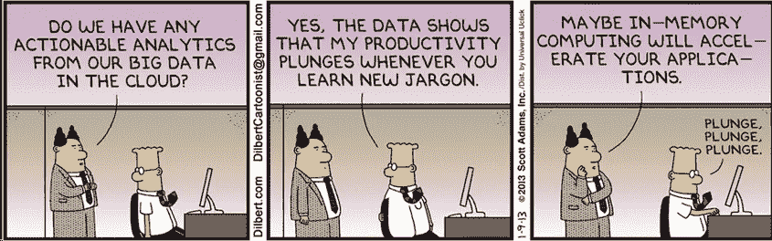
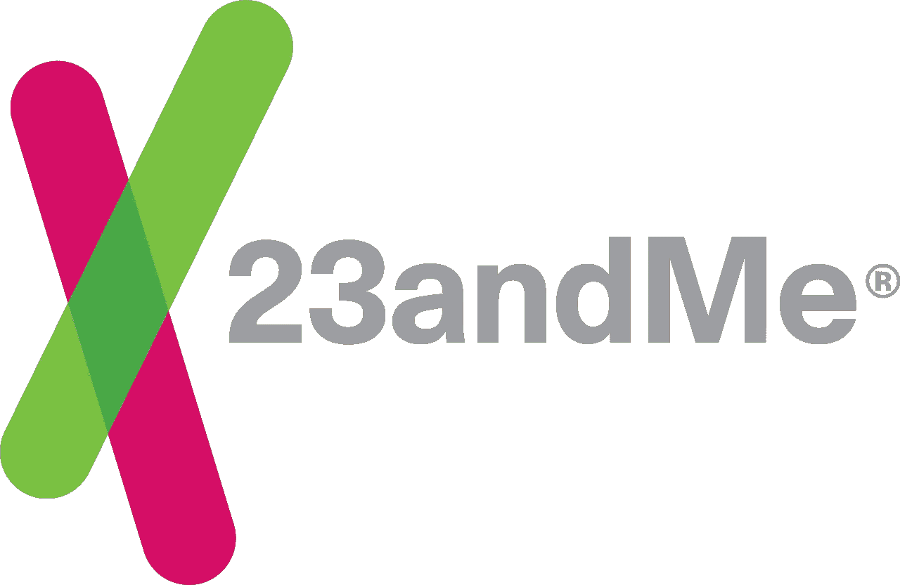
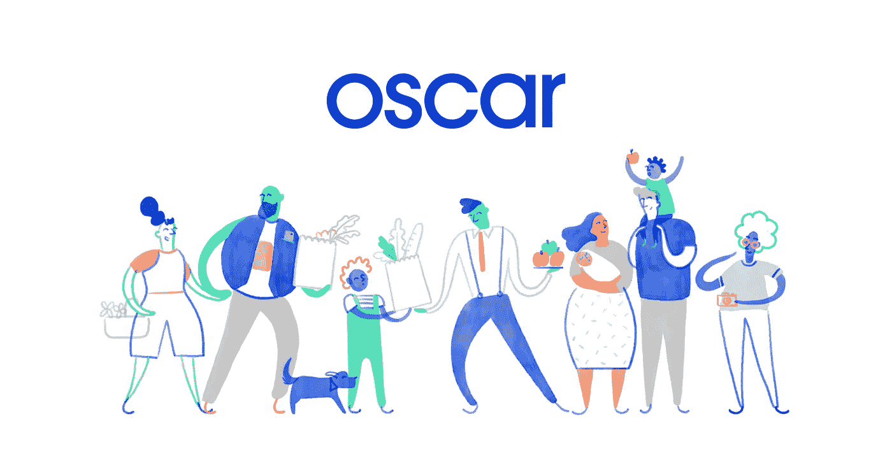

# 简化的健康科技创业公司

> 原文：<https://medium.com/swlh/health-tech-startups-simplified-454b632ea7ec>

## 揭秘医疗保健的熨斗、奥斯卡和三叶草

作为板块上的医疗保健独角兽，你可能听说过这些名字:三叶草健康、熨斗健康、集体健康……但是 ***它们到底是什么*** ？

这些医疗保健初创公司得到了风投界许多知名人士的支持，并通过持续的进展筹集了多轮资金，正在将数字时代带入医学，预计到 2024 年将达到近[4000 亿美元](https://www.marketwatch.com/press-release/digital-health-market-size-to-surpass-379-bn-by-2024-2018-12-05)。从分析平台到护理管理系统，现代医疗创业公司正在推动的技术已经获得了提供商、投资者和普通公众的青睐。

然而，虽然很容易将它们概括为“利用某种数据和技术专注于医疗保健的初创公司”，但我们可以做得更好。公司执行哪种分析？护理整合实际上意味着什么？健康管理平台到底是什么？

Healthcare terminology AND ML/AI buzzwords? That’s a lot to digest there.

除了向硅谷展示医疗保健是一个有利可图的行业，这些数字医疗创业公司实际上正在扩大医疗服务并影响患者。我分解了一些潜在的行话，以解释这些公司具有开创性和价值背后的“如何”和“为什么”。

# 熨斗健康

*TL；DR:一个面向医院和生命科学公司的专注于癌症的软件平台，它将来自多个医疗保健利益相关方的各种类型的数据聚合成可操作的真实证据。*

这家总部位于纽约的健康软件公司**以曼哈顿市中心的熨斗区命名，它跨越了从科学家到制药公司到医生的多个用户**，目的是利用一个共享的技术平台来**改善肿瘤研究** **。**

他们的平台从测序数据库、保险索赔和学术文献库等来源收集**非结构化数据**，从 EHR 医院系统收集**结构化数据**到分析引擎。然后，该引擎通过生成的真实世界证据(RWE)提供更全面的医疗保健状况。

该平台专为这些不同的医疗保健利益相关方的癌症研究量身定制，并以多种方式增加价值:

*   提供者可以跟踪有关其癌症护理服务的指标，并不断根据患者模式调整有针对性的治疗计划
*   医院管理部门可以管理公司的肿瘤项目，并优化报销账单问题
*   学术研究机构可以在为临床试验研究寻找患者方面做出更好的数据驱动型决策

# 三叶草健康

*TL；DR:针对老年人的 Medicare Advantage 保险计划合作伙伴，由健康监测、上门礼宾服务和与您各自的医生进行个性化协作提供支持。*

我们转向客户群(如患者)而不是医疗保健利益相关者，看看我们如何改变老年人的保险。首先， **Clover 是一个健康保险(医疗保险优势)计划的核心**。因此，Clover 的大部分收入来自政府。

虽然医疗保险适用于所有 65 岁以上的美国人，但其传统的覆盖缺口对老年人群构成了障碍(例如，医疗保险不覆盖牙科、视力，有时还包括处方药)。一个不太为人所知的选择是 C 部分 Medicare Advantage 计划，它以相同或更低的保费价格提供更大的保险范围。

**Clover 秉承医疗保险优势计划的理念，专注于通过技术为用户提供更好的服务和健康支持**。

Clover 技术平台收集和分析健康和行为数据，以改善结果和降低患者支出成本。怎么会？

作为一个用例，该平台能够根据监控的患者行为数据检测风险状况，从而允许老年人采取预防措施，避免住院。通过与老年人的护理人员合作，Clover 可以从提供者的角度进一步加快护理协调，并为医生提供有用的分析，从而可能导致特定的治疗过程。

# 23 岁和我

*TL；DR:一家人类基因组研究公司，使其用户能够通过基因变异的基因分型来研究他们的祖先，以及一个药物发现和研究的治疗部门。*

可能是本文中最直接面对消费者的公司，23&Me 提供了对你的祖先的洞察。

长话短说，你把唾液吐到一个试管里，寄出去，6-8 周后你会收到一份电子报告，上面有你的特定基因信息，比如按百分比分列的种族分类。

但是我们可以在这里提问——结果有多准确？之后他们会如何处理这些数据？

## 科学是如何运作的

截至 2018 年 2 月，23&Me 已对全球超过 300 万人进行了基因分型。澄清一下，**公司并不测序，而是对你的 DNA**进行基因型或基因变异测试。通过使用玻璃微阵列芯片并测试与现有变体的杂交，实验室编写了一份**报告，说明你的 DNA 遗传变体如何与具有 X 种族或 Y 疾病史的人的变体相匹配**。这意味着测试结果只有在与你测试前数据库中数百万人的 DNA 相匹配的情况下才是准确的。请注意，这变成了一个样本大小的情况:1)除非你有一个非常罕见的变异，否则结果是相当准确的，但 2)在数据库中代表性不足的变异(即来自不太常见的种族)也会导致更大的假阳性风险。

## 论数据销售

23&Me 卖你的数据吗？[在某种程度上](https://www.23andme.com/privacy/)，在知情同意的情况下。

> 我们确实使用并与第三方共享**聚合信息**,以便开展业务开发、发起研究、向您发送营销电子邮件以及改进我们的服务。

重要的是要明白，聚合信息不是单个信息。23&Me 是*而不是*发送例如 Jane Doe 的 AGCTCGAA 数据的电子邮件，而是*将*用户数据匿名化到更大的统计数据中——比如中值或第 75 个四分位数。聚合通过一个叫做[差分隐私](https://www.quantamagazine.org/making-algorithms-fair-an-interview-with-cynthia-dwork-20161123)的概念在很大程度上防止了隐私泄露，你可以阅读更多相关内容。

# 奥斯卡健康

*TL；DR:一家面向普通消费者和小型企业的健康保险公司，旨在简化获得医疗保健的物流。*

我不会深究健康保险的细节(共付额、共保额、免赔额)，但 Oscar 也不会涉及他们可能没有获得雇主健康保险的客户。基本上，如果安排预约和处理医疗账单给你带来后勤上的麻烦，奥斯卡的目标是尽可能减轻痛苦。

它通过为客户提供以下好处来实现这一点:

*   折扣医生出诊+ 24/7 电话可用性(远程医疗)
*   直接专家访问(例如，不必通过转诊)
*   向用户提供健身跟踪设备和奖励，以进行数据跟踪
*   根据从患者就诊中收集的数据定制医生/药物建议；一定程度上的免费覆盖

请注意，Oscar 的客户仍然必须对其计划下的具体政策保持警惕。虽然 Oscar 确实有助于简化对保险计划的理解，但用户有责任最终了解他们的 Oscar 计划可以覆盖和不可以覆盖的内容。

# 但是等等，还有更多

我在上面的这四家公司停了下来，因为这个名单可能会无休止地继续下去(集体健康，光明健康，边缘基因组学等)，为了简单起见，省略了上面公司的一些其他细节。值得注意的是，这篇文章没有包括大型科技公司在医疗保健领域的任何项目。也不包括制药公司和医疗中介机构最近开发的任何创新。

总的来说，技术和分析正在改变医疗保健行业的游戏规则，但需要一些尽职调查才能真正理解这类产品的工作原理。在加入医疗保健领域的人工智能/人工智能潮流之前，关键是要了解分析是如何应用的，它实际上增加了什么价值，以及数据在哪里得到处理。透过炒作和流行词，我们可以开始正式确定我们的医疗保健格局正在发生多大的变化。