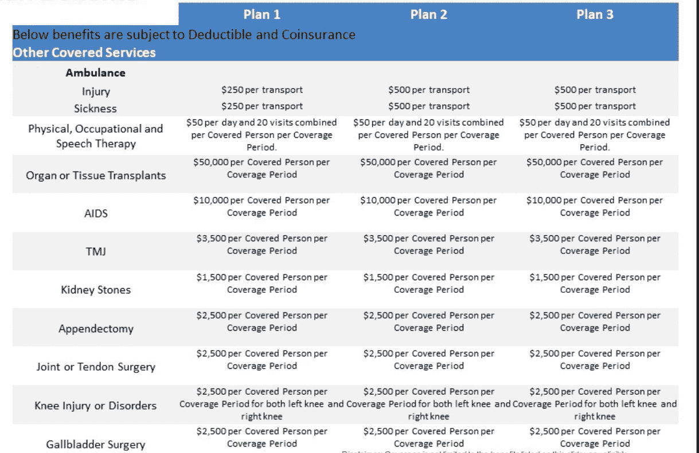

# 医疗保健和隐藏的限制:你知道你的吗？

> 原文：<https://medium.com/swlh/healthcare-and-hidden-limitations-do-you-know-yours-be79d6743008>

健康保险术语可能是消费者最难理解的。这就是为什么你会有一个经纪人为你工作，清晰明了地解释你的政策选择。然而，并不是所有经纪人的工作都合乎道德。你可能没有重视你的保险经纪人，也可能没有详细说明你的保单限制。忽略这些限制是非法的，应该导致该经纪人的终止。相比之下，被保险人通常不会采取法律行动，而经纪人会按他或她期望的方式收取佣金。

这是**而不是**说所有的健康保险经纪人都在这个不道德的领域里运作。正如任何职业一样，有好有坏。你的道德指南针和判断一个人的**意图的能力**是一个重要的因素——人们通常可以闻到一个*低俗的销售人员*。以下是健康保险政策中最常见的模糊限制。当你向你的经纪人询问问题时，这些信息应该足以让你有所准备。

以下是保险公司产品优势总结的截图:

**注意—并非所有政策都有这些限制。问你的经纪人。*

上述优势列表位于政策总结的末尾。谈到健康保险，大多数人对七个因素感兴趣:

自付额/共同保险/最高自付额、医生出诊/专家/紧急护理、网络、处方保险、预防/健康保险、急诊室费用和门诊服务。如果你的保险经纪人仔细检查了这七件事，这就是保单的外观和声音:

1.  选择 500-10，000 美元的自付额/最高自付额(承保范围为 100 万美元)
2.  选择 70/30、80/20 或 100/0 共保
3.  对于医生、专家和紧急护理，无限制的 25 美元共付额
4.  PHCS 网络
5.  对于年度健康/预防性检查，需支付 50 美元的共付额
6.  ER——受免赔额和共同保险限制
7.  流动服务(以上)——每次交通 500 美元

大多数人都会同意，这七件事对健康保险来说听起来棒极了。你所有的日常医疗需求都得到了照顾，还有 100 万美元的保险，对吗？**错了**，让我给你看一个可怕的细目分类，如果你在此保单承保范围内做了阑尾切除术。

平均而言，阑尾切除术的“合理价格”在 7000 美元到 25000 美元之间(可能因邮政编码而异)。如果有并发症，可能会超过 [$35，000 或更多](https://www.cbsnews.com/news/study-appendix-surgery-costs-differ-around-us/)。这是服务及其估计成本的明细。你可以随时查看任何手术，并通过访问[医疗保健蓝皮书](https://www.healthcarebluebook.com/)了解其价格。

1.  医院服务——两天的住院费用大约为 9700 美元。
2.  医生服务——手术和常规术后护理的费用约为 1400 美元。
3.  麻醉——平均手术时间为 1 小时 15 分钟的价格约为 750 美元。

这笔费用加起来大约是**阑尾切除术**11000 美元的下限。如果您看一下上面的示例保单，您会看到在整个保险期限内，阑尾切除术将获得 2500 美元的保险福利。即使您的计划有自付额、共保额和最高自付额；阑尾炎有特定的限制。有了这些知识，被保险人将会留下一张 8500 美元的账单作为自付费用！牢记在心；这些数字是低端的，没有并发症。

当然，有健康保险总比没有保险好。有了保险，剩下 8500 美元阑尾切除术费用可能会降低。[Policygenius.com](https://www.policygenius.com/health-insurance/faq/what-is-negotiated-rate/)很好地解释了**网络协商价格**的功能。没有保险，你将为你的医疗手术支付几乎全部的零售价格，这是一个可怕的想法！

简而言之，这篇文章是对一些保险公司现有限制的一个小小的分解。只要你问了关于这些具体伤害的问题，就没有必要担心或紧张。一些人知道这些限制的存在，但出于支付能力的考虑，他们仍然购买保险。你可以意识到这些，甚至购买该计划，因为由于你的健康状况良好，你可以冒这个险。希望这些信息能给你的健康保险政策带来更多的清晰和信心。