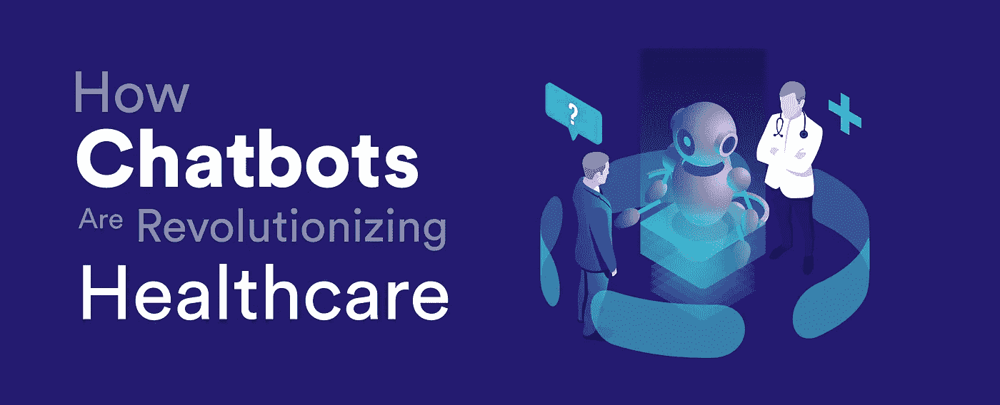
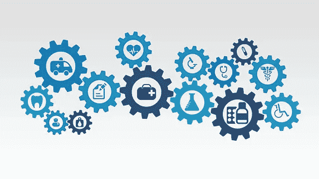
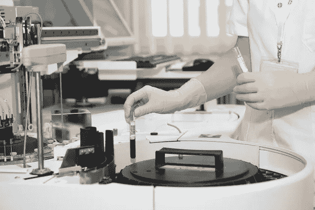
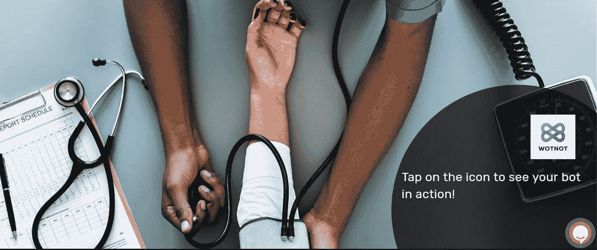

# 医疗保健领域正在变得机器人化。原因如下

> 原文：<https://medium.com/swlh/healthcare-space-is-getting-bot-o-mated-heres-why-34777b722707>

## 医患关系很简单。或者是？

医患关系很简单——如果病人感觉有什么不对劲，他们会去找医生，谈论他们面临的疾病。作为医生，你检查他们的生命体征，检查后给出诊断，并开出相关药物。

然而，医患关系远非如此简单。找到相关的医生或专家，根据他们的可用性、随访、转诊、保险等安排与所述医生的预约。是你的病人在咨询医生前后都要经历的一些操作流程。咨询前和咨询后还会带来大量关于饮食、睡眠习惯等的常见问题。这些问题很重要，但很少需要一个有更多病人要照顾的医生来回答。

> **医院每年花费 14 亿美元来管理医院运营。随着医院利润微薄，医疗保健行业越来越多地采用聊天机器人和人工智能来帮助他们更好地为患者服务。**

聊天机器人有什么帮助？

随着病人数量的增加，有限的医院工作人员发现很难留住病人，并为他们提供力所能及的最佳护理。这损害了病人的体验，让他们觉得在你的医院里受到的照顾更少。

随着所有行业都变得以客户为中心，患者对医疗保健领域的期望也没有什么不同。聊天机器人越来越多地在整个医疗保健行业实施，以改善患者体验——而不需要客户支持团队或医生在另一端。让我们看看如何:

# 1.安排约会

聊天机器人可以根据医生的空闲时间安排与医生的预约。此外，专门设计的聊天机器人还可以跟踪特定患者的所有访问和随访，将信息保存在手边以供将来参考。

# 2.症状评估

聊天机器人可以通过了解患者的症状并建议相关的医生/专家来确定患者需要的护理。在聊天机器人的帮助下，医生可以事先获得必要的细节，如症状的频率和严重程度，这有助于他们更好地了解你当前的健康状况。

# 3.解决一般问题

病人的一般性询问很重要，但很少需要医生的任何投入。

“我怎么才能拿到处方？”

"一个人在病毒感染后多久会有传染性？"

"我 2 岁的宝宝下一次接种疫苗是哪一种？"

"在我服药期间有什么特别的饮食需要遵循吗？"

像这样的问题很重要，但是没有医生也可以解决。

针对这些常见问题训练的医疗聊天机器人可以解决患者的这些一般性问题。一个聊天机器人在你的网站上是 24*7 的，这意味着它可以在病人方便的时候解决他们的问题。

# 4.咨询服务

聊天机器人的非人类本质在涉及到精神健康和心理状况等敏感话题时给用户提供了安全感。

第一个心理治疗师聊天机器人 ELIZA 是建立在一个简单的原则上的，即要求描述用户之前在对话中提到的内容。

用户——我情绪低落。

伊莱扎——你说你情绪低落？多告诉我一些吧。

聊天机器人的倾听特性被证明对精神痛苦的人有治疗作用。

通过使用自然语言处理进行训练，聊天机器人可以通过基于上下文的反应来增强治疗师的工作。

# 5.内部团队协调

不仅仅是你的病人，你的医院工作人员也可以从聊天机器人中受益。如今，护理管理团队的负担比以往任何时候都要重。聊天机器人可以用于各种医院设备的内部记录，如床、氧气瓶、轮椅等。

每当团队成员需要检查设备的可用性或状态时，他们可以简单地询问机器人。然后，机器人将从系统中获取数据，从而使操作信息唾手可得。这导致了更好的团队协作，同时减少了由于团队之间的相互依赖而导致的延迟。

医生和护士还可以访问患者信息，如处方药物、体检报告、过敏、预定和取消的预约等。这将大大减少医护人员在患者信息系统中搜索更新所花费的时间。

# 6.实验室报告的更新

使用聊天机器人，患者还可以跟踪其未完成的报告，找到附近的病理或测试中心，了解各种测试的价格，从而通过指导用户完成每个步骤来加快查询解决。

鉴于医疗报告带来的紧迫感，聊天机器人的即时响应可以让你的品牌在你的患者眼中大不相同。

# 包扎

医疗保健领域充满了需要自动化的场景，以便更好、更高效地提供护理。将简单的用例卸载到聊天机器人可以帮助医疗专业人员专注于耐心地治疗患者。

聊天机器人让您的患者可以全天候访问您的品牌，让您的医疗中心成为全天候护理的代名词。根据他们的需求与你的品牌持续互动也能让病人感到满意，感到被关心。

在**，我们通过部署聊天机器人和虚拟助理与领先的医疗保健提供商合作，解决医疗诊断、预约、数据输入、住院和门诊查询地址以及客户支持自动化等问题。**

**我们还有**预定义的医疗保健模板，您可以免费体验聊天机器人**。花一分钟时间，感受一下你如何获得上面列出的所有好处[这里](https://app.wotnot.io/preview/interact?url=&themeColor=%23F44336&alignment=right&templateKey=healthcare)。**

********

## **这篇文章发表在 [The Startup](https://medium.com/swlh) 上，这是 Medium 最大的创业刊物，拥有+420，678 名读者。**

## **在这里订阅接收[我们的头条新闻](https://growthsupply.com/the-startup-newsletter/)。**

****