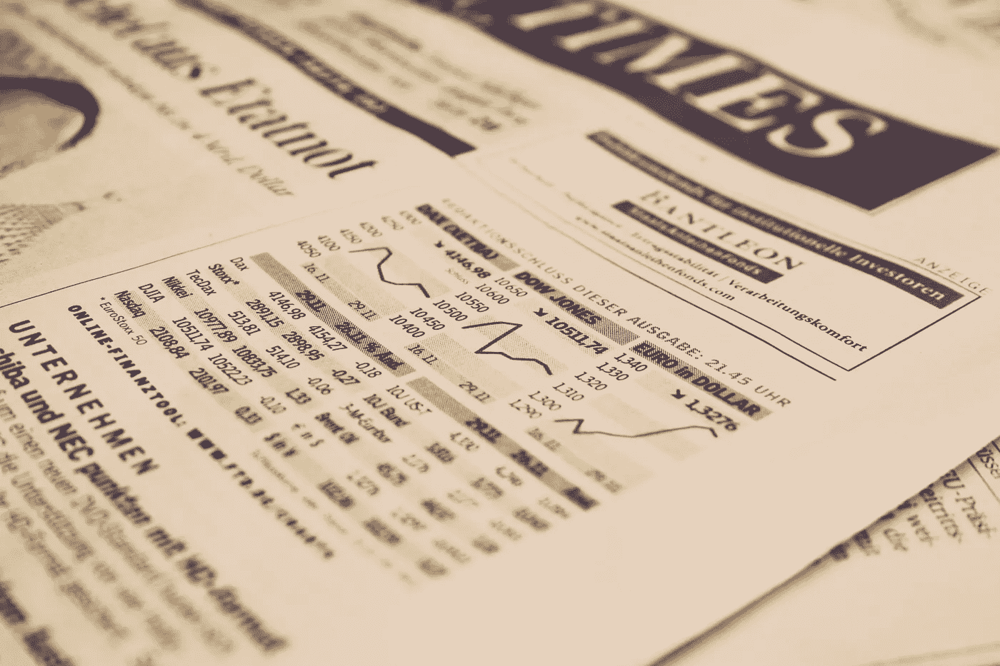

# "救命，我的债务快把我逼疯了！"—如何在今天的美国克服债务

> 原文：<https://medium.com/swlh/help-my-debt-is-kicking-me-in-the-nuts-how-to-overcome-debt-in-todays-america-2b68da3bc5aa>

Photo by [Markus Spiske](https://unsplash.com/@markusspiske?utm_source=unsplash&utm_medium=referral&utm_content=creditCopyText) on [Unsplash](https://unsplash.com/search/photos/debt?utm_source=unsplash&utm_medium=referral&utm_content=creditCopyText)

我们债台高筑。在 2019 年，没有任何债务的美国人确实是一个罕见的景象。目前，纽约美联储估计，2018 年第三季度，[美国个人消费者债务总额突破 14 万亿美元。](https://www.debt.org/faqs/americans-in-debt/)

各种类型的债务继续上升。随着不平等的持续增长，预计…