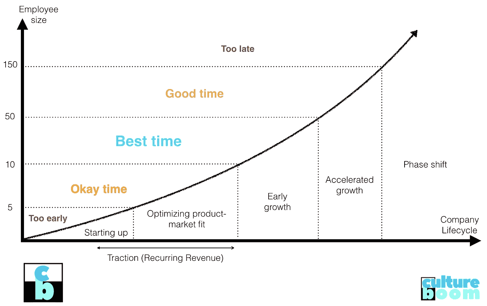
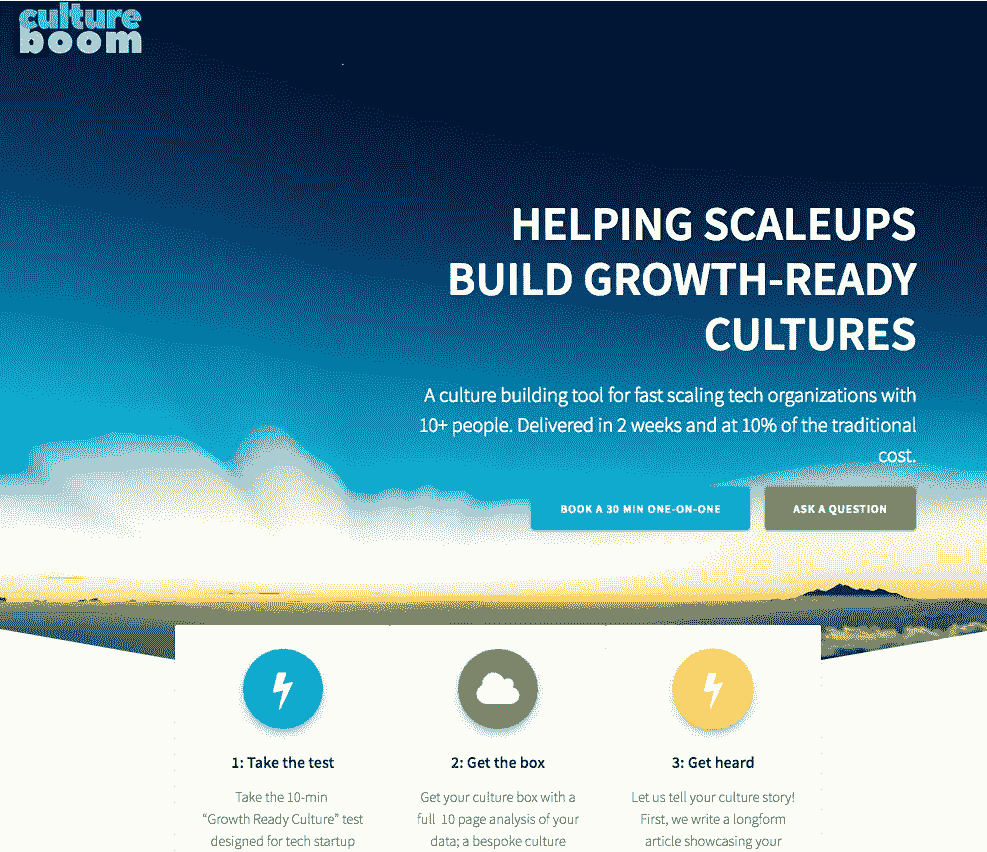
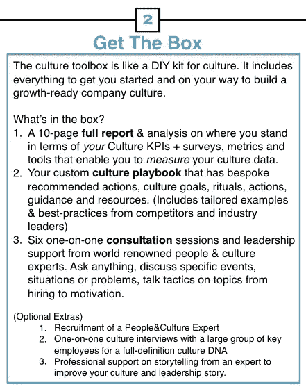
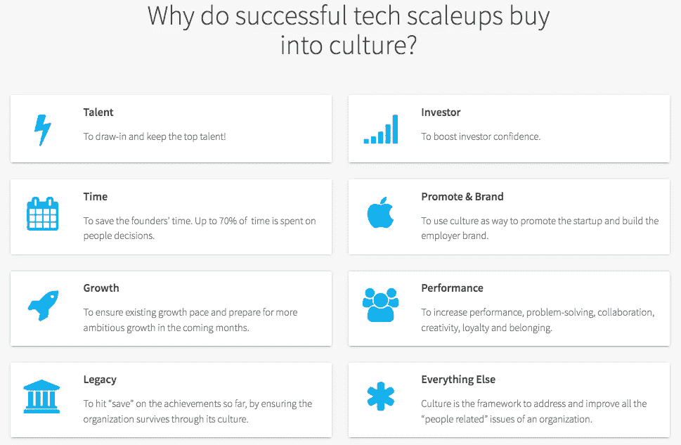

# Cultureboom.co:帮助纵向扩展公司打造一种为增长做好准备的文化

> 原文：<https://medium.com/swlh/helping-scaleups-nail-a-growth-ready-culture-cultureboom-co-36faa58288b1>

## 文化是你在找到产品市场契合度之后第二重要的问题。

本周，我们将推出[cultureboom.co](http://www.cultureboom.co)！这是一个文化建设工具，适用于 10 人以上的快速扩展技术组织。我们的目标是在两周内提供一个三步解决方案(参加测试/拿到盒子/被倾听),并且成本是传统雇佣顾问成本的 10%。但是为什么一开始就需要这样的产品呢？谁会用呢？实际产品是什么？为什么是我？为什么是现在？这篇文章是关于那些**的五个问题**。

# 1.对文化建设产品的需求

**初创公司的第一个问题**是验证产品是否适合市场。这确保了业务的可扩展性和最终盈利能力。

创业的第二个问题是创造正确的公司文化。这包括任何与人和组织相关的东西。

What is the best time for a startup to prioritize focusing on culture?

初创公司的创始人手头有大量的资源、服务、产品和专业知识来帮助他们解决第一个问题；对于第二个问题，他们关注的是一个服务不足的市场。这是 cultureboom.co 试图缓解的。

创业公司是世界的变革引擎。尤其是在今天，创业的准入门槛几乎不存在。然而，如果创始人和早期团队想要将他们刚刚起步的业务发展成为真正为他们的员工和客户创造价值和意义的东西，他们仍然需要克服许多障碍。

让我们看看人和文化的几个关键方面，以真正体会它对业务的影响。

*   整体招聘策略
*   做出正确的个人聘用决定的能力(面试质量)
*   新员工的入职和入职培训
*   在自主性、主人、目的方面设置正确的参数
*   目标设定(将公司目标与个人目标相结合)
*   反馈和绩效管理
*   归属感和意义
*   举行重要的对话和弹性(特别是在解决冲突和分歧时)
*   团队解决复杂问题(真正意义上的合作)
*   任何与该公司特有的“做事方式”有关的东西

> 文化是一个总括性的概念，包括与人们如何沟通和合作有关的业务的所有部分。

如果一家初创公司想在自己的领域竞争，这是最重要的区别。一个伟大的公司文化代表着一台运转良好、和谐的机器。这是一个巨大的不公平优势。

The landing page for Cultureboom.co

# 2.是给谁的？

*它面向规模超过 10 人，但没有时间和非常有限的预算来开展文化建设活动的创始人和领导者。*

对于那些已经确定了最初的产品市场契合度，找到了可扩展性和收入的方法，现在正处于更大增长阶段的初创公司来说，这是理想的选择。一句话:这是为了**放大**。

公司文化的概念是第二个人进入团队的那一天(或者更早——隐藏在商业精神和创始人的性格中)。所以当人们说，“文化应该从第一天起就是你的考虑因素！”我完全同意这一点。

然而，我们并不是生活在一个理想的世界里。作为一名企业家，我非常清楚，如果没有产品市场契合度和收入潜力，就没有公司，也就没有文化。所以在早期，文化退居二线是可以理解的。

虽然尽早关注文化很好，但我们建议的是*最好的妥协*。换句话说，**当你遇到 10 个人时，你必须**关注文化，否则，一连串的问题将会随着时间的推移变得越来越困难。

# 3.盒子里的**是什么？**

Cultureboom 提供定义明确的产品，预算清晰。

## 第一步:参加考试。

你可以参加文化测试，看看你的文化有多适合成长。

## 第二步:拿盒子。

**1。**我们使用您提供的数据来计算您的文化指标，我们的人员&文化专家会为您提供长达 10 页的数据分析。将这些视为文化的关键绩效指标(KPI)。在这些的帮助下，原本非常抽象的东西现在可以测量了。

**2。**我们编写了您的文化行动手册的第一版，以启动您专注的文化建设工作。文化剧本包括你需要遵循的定制行动。适合你的企业的文化目标、招聘策略、目标设定策略和框架、会议和战略沟通类型。

**3。**您还将获得六次一对一的咨询会议，由一位敬业的人力资源专家&帮助您解决更复杂的问题并制定解决方案。

## 第三步:被倾听

成功的企业策划他们的故事和雇主品牌。被倾听对成长至关重要。为了支持这一点，我们首先写一篇展示贵公司文化的长篇社论。其次，我们对创始人进行播客采访，向大众讲述你的文化故事，并确保你的故事被听到。

# 4.为什么是我？

我决定建造 cultureboom.co 并不是巧合。我的专业领域是人、文化和学习。我见过学术界，在管理咨询公司、大型科技公司工作过，也是一名企业家。贯穿我所做的(或希望做的)事情的主线可以用三个词来概括:人、文化和学习。经过多年的自我反省，我找到了最能描述我的东西。我是*制造者*。不，我不做开源硬件，不做工程项目，不做电子产品。我也没有 3D 打印机！但是这么多年后，我找到了称自己为创造者的勇气，因为我认同运动的精神:通过创造获得享受和满足；非正式的、网络化的、同伴引导的、共享的学习。

所以是的，我是创造者。我只是做不同的东西。主要是书籍、创业公司、副业或其他内容，如关于我专业领域的文字或视频文章。

这是我，在我的办公室工作。我制作的几乎所有作品的组合都在这里。

开办自己的创业公司，作为顾问与许多企业合作，或许最重要的是，对未来生活和商业的痴迷让我坚信:创业公司的成功越来越依赖于其文化。这背后是有逻辑原因的。我观察到的一般规律是:随着前端技术变得越来越简单和直观，后端的组件也变得越来越复杂。这意味着，想要拥有竞争优势的公司必须管理两件事。(1)具有良好的人机整合,( 2)具有良好的人与人的整合(文化),以衡量他们的价值创造。创业公司的文化越强大，竞争的机会就越大。

# 5.为什么是现在？

创业是一个相当新的现象。Y-Combinator 的创始人保罗·格拉厄姆是一位真正的知识分子，他将初创公司定义为快速增长的公司。([他的标志性散文](http://www.paulgraham.com/growth.html))

好的产品解决问题的时机已经成熟。

像 Cultureboom 这样的产品要想存在，**需要有足够大的市场**。这有两个方面:市场的规模和目标人物角色(主要是创始人)的胃口。这也暗示着；需要有足够多的经历过创业文化建设问题的人。

这就是为什么*我认为* 2019 年是构建这样一个解决方案的大好时机。但是我的想法有点重要。打造好的产品和企业不像是碰运气的游戏，更像是微观科学实验。这就是我们遵循三步验证流程的原因。

验证的第一步；我们已经进行了十几次客户访谈，向符合人物角色的向上扩展创始人询问他们的问题的类型和大小，因为这与我们正在构建的内容有关。原来他们都想把重点放在文化上，却不知道如何下手。我们发现这些结果令人鼓舞。

验证的第二步；我们将 Cultureboom 打造成了一个 MVP，并向我们的目标人物展示了 [Cultureboom Pitch](https://share.hsforms.com/1ABtVaOkcTqmlFnWNGwByKw3533e) 。在这些演示结束时，我们问了一个简单的问题:“这是你想用的东西吗？”绝大多数人的回答是肯定的，80%的人说“是”。

验证的第三步是解决方案的实际购买和交付。这就是我们目前的处境。由于像文化这样的主题在组织的优先事项中总是处于次要地位的风险，我们仍然很谨慎。好消息是我们已经获得了前两个客户，并邀请你加入他们。

点击此处访问 cultureboom.co 或向 ozzie@cultureboom.co 发送问题进行进一步讨论。 ***在您的信息中提及“boombox”一词，即可享受 25%的优惠。***

## 这篇文章发表在 [The Startup](https://medium.com/swlh) 上，这是 Medium 最大的创业刊物，拥有+421，678 名读者。

## 在这里订阅接收[我们的头条新闻](https://growthsupply.com/the-startup-newsletter/)。

