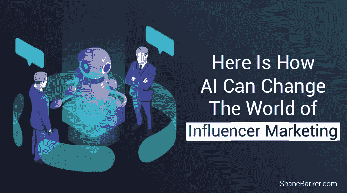

# 以下是人工智能如何改变影响者营销的世界

> 原文：<https://medium.com/swlh/here-is-how-ai-can-change-the-world-of-influencer-marketing-892ffbf2ba39>

影响者营销对品牌来说不再是新鲜事物。根据研究，[到 2020 年](http://mediakix.com/2018/03/influencer-marketing-industry-ad-spend-chart/#gs.2cfze6)，影响者营销行业的全球广告支出将上升至 50 亿至 100 亿美元。

营销人员不再玩弄影响者营销的“是什么”和“为什么”。相反，他们投入更多的时间和资源来提高影响者营销活动的绩效。

精选的相关内容:

*   [56 位有影响力的人分享他们最大的错误以及如何避免这些错误](https://shanebarker.com/blog/influencer-mistakes-expert-roundup/)
*   [你的品牌应该关注的 5 个最重要的影响者营销目标](https://shanebarker.com/blog/influencer-marketing-goals-brand-focus/)

然而，影响者营销不仅仅是与在社交媒体上拥有数百万粉丝的随机影响者合作。

它需要一种有组织的方法，从选择合适的影响者到提供能引起追随者共鸣的内容。

许多品牌现在都在利用人工智能(AI)来使他们的影响者营销活动更加有效。

# 影响者营销:了解问题领域

在我们理解人工智能如何帮助影响者营销之前，让我们看看与影响者合作的挑战。

# 寻找合适的影响者

品牌和营销人员面临的最大障碍之一是识别正确的影响者。你不能仅仅根据追随者的数量来评估一个有影响力的人的潜力。

你需要考虑其他因素，比如他们帖子的参与度。与一个对你的品牌有共鸣的有影响力的人合作也很重要。

否则，你将无法有效地吸引他们的观众。此外，你应该分析他们创建的内容类型，并了解它是否符合你的品牌形象。

社交媒体机器人的兴起也使得人们很难判断一个影响者的可信度。许多欺诈性影响者使用此类机器人来增加粉丝数量，并创建虚假的参与度指标。

考虑到影响者根据他们的影响力和参与度对品牌收费，这一点尤其令人担忧。

事实上，最近的研究显示，一些最大的品牌已经成为虚假追随者的受害者。

决定正确的内容类型

同样很难确定哪种内容最能引起特定影响者的追随者的共鸣。随着图像和基于视频的内容越来越受欢迎，手动跟踪和分析变得越来越困难。

在缺乏详细分析的情况下，你无法确定你的内容是否会吸引人，是否能达到预期的效果。

精选的相关内容:

*   [关于脸书影响者营销你需要知道的一切](https://shanebarker.com/blog/facebook-influencer-marketing/)

# 计算活动投资回报率

品牌面临的另一个挑战是计算影响者营销活动的投资回报率。可以从各种社交媒体平台的分析部分获得喜欢、评论和分享等参与度指标。

但是，通常很难确定该活动是否对您的整体收入产生了影响。在[对 200 名英国营销人员的调查中](https://www.singlegrain.com/influencer-marketing/how-artificial-intelligence-is-transforming-influencer-marketing/)，38%的人不知道他们的影响者营销活动是否能够推动销售。

很明显，影响者营销并不像品牌认为的那样容易。从寻找合适的影响者到计算实际的 ROI，这带来了许多潜在的挑战。处理影响者营销问题的一个有效方法是将其与人工智能相结合。

现在让我们来看看人工智能影响者营销意味着什么，以及它如何能够为品牌带来好处。

# 解码 AI 影响者营销

人工智能是计算机科学的一个分支，专注于创造能够像人类一样操作和反应的计算机。它的应用不仅限于机器人和语音助手。

事实上，影响者营销平台，如[影响力](https://influential.co/)正在使用人工智能来帮助品牌提高其活动的质量。

人工智能影响者营销帮助你克服传统方法面临的问题。事实上，它正在成为营销人员和品牌的热门选择。它可以帮助您自动执行从选择影响者到分析其内容的各个步骤。

# 发现正确的影响者

人工智能影响者营销系统可以分析来自影响者社交媒体档案的各种数据。这包括应用自然语言处理(NLP)来评估他们发布的每一条内容。

这有助于确定他们的在线角色和风格是否与你的品牌形象产生共鸣。这反过来又能确保你与最相关的影响者合作，这些影响者的受众可能会与你的品牌互动。

人工智能影响者营销的最大优势在于其可扩展性。您可以使用人工智能支持的系统来分析不同社交媒体平台上的多个影响者。

您甚至可以根据影响者在帖子中使用的语言来评估他们的表现。此外，您还可以确定影响者是否能够帮助您实现最终目标。

这可以通过分析各种指标来实现，包括单个职位的影响力和参与度指标。自动化此步骤有助于您节省时间和资源，这些时间和资源可用于更重要的任务，如构思和内容创建。

精选相关内容:

*   [6 种最有效的影响者合作类型](https://shanebarker.com/blog/effective-types-influencer-collaborations/)

# 识别相关和有价值的内容

您的目标受众每天都会受到大量内容的轰炸。事实上,[每天有 9500 万张照片发布在 Instagram】上。](https://www.wordstream.com/blog/ws/2017/04/20/instagram-statistics)

切断这种噪音并吸引潜在客户的注意力通常是一项困难的任务。

确保您的内容有吸引力的唯一方法是确保它相关且有意义。人工智能影响者营销系统使用人工神经网络(ANN)在几秒钟内分析数以百万计的在线图像和视频。

这反过来又有助于识别具有特定属性或特征的图像，例如特定的品牌标志或产品。您甚至可以在图像中识别人和他们的面部表情。

这可以帮助您在几秒钟内用数百万张图片标记相关的人和产品。

此外，人工智能影响者营销利用自然语言处理来分析评论情绪，并确定哪些帖子受到了好评。

它帮助您确定最有可能与影响者的追随者产生共鸣的内容类型。这反过来又会帮助您创建有价值且吸引人的内容，从而帮助您与他们互动。

# 预测对影响者的激励

确定影响者的费用非常模糊。影响力和参与度并不是决定你应该付给他们多少钱的唯一因素。

借助人工智能影响者营销，您可以使用人工神经网络和自然语言处理来确定不同影响者的真正潜力。这反过来又有助于确定鼓励他们发布你的品牌的最佳激励措施。

精选相关内容:

*   [为您的业务找到合适影响者的详细战略](https://shanebarker.com/blog/detailed-strategy-find-right-influencers-for-your-business/)

# 检测虚假参与和欺诈性影响者

2018 年 4 月，两位 Instagram 影响者之间的[在线恩怨震惊了许多用户。据透露，这两个影响因素都是计算机生成的。](https://www.thecut.com/2018/04/lil-miquela-hack-instagram.html)

然而，其中一个人，通常被称为 Lil Miquela，在两年内获得了数百万 Instagram 粉丝。事实上，Instagram“个性”甚至为爱欧等美容品牌大声疾呼。

这恰恰说明了品牌和营销人员在与有影响力的人合作时需要多么谨慎。除了这样的[电脑生成的影响者](https://shanebarker.com/blog/cgi-influencers/)，社交媒体机器人也对品牌构成威胁。

人工智能影响者营销有助于过滤此类机器人，消除虚假参与。此外，它还可以轻松区分计算机生成的影响者和现实生活中的影响者。

# 预测你的活动的成功

品牌经常分析他们的影响者营销活动，以确定他们可以做些什么来获得更好的结果。

人工智能影响者营销系统评估影响者在一段时间内的表现。这有助于营销人员确定他们何时可能获得最大的参与度。这反过来又会对你的营销活动选择最佳时机至关重要。

此外，分析以前发布的内容决定了你的内容是否会达到预期的吸引力。反过来，这有助于你精炼你的内容，使之更吸引人。

# 确定影响者营销的投资回报率

人工智能影响者营销使您能够密切监控影响者的表现。此外，它还能帮助您跟踪活动中产生的每一条内容，并分析各种参与度指标。

这反过来有助于您计算活动的实际投资回报率，并了解它是否对您的收入产生了影响。

精选的相关内容:

*   [如何利用影响者营销来加强你的客户关系](https://shanebarker.com/blog/use-influencer-marketing-strengthen-customer-relationships/)
*   [影响者营销协议—了解详情](https://shanebarker.com/blog/influencer-marketing-agreement/)

# 结论

人工智能正在彻底改变品牌感知影响者营销的方式。人工智能驱动的影响者营销系统可以帮助您识别正确的影响者，并创建相关内容。

AI 影响者营销真正的优势在于细致的速度和精准。现在是品牌意识到其重要性并开始将人工智能与影响者营销相结合的时候了。

***最初发表于***[***Shanebarker.com。***](https://shanebarker.com/blog/ai-influencer-marketing/)

**关于作者**

[谢恩·巴克](https://shanebarker.com/)是[内容解决方案](https://contentsolutions.io/)和 [Gifographics](http://gifographics.co/) 的创始人兼首席执行官。你可以在[推特](https://twitter.com/shane_barker)、[脸书](https://www.facebook.com/ShaneBarkerConsultant/)、 [LinkedIn](https://www.linkedin.com/in/shanebarker/) 、 [Instagram](https://www.instagram.com/shanebarker/) 上和他联系。

## 这篇文章发表在 [The Startup](https://medium.com/swlh) 上，这是 Medium 最大的创业刊物，拥有+438，678 读者。

## 在这里订阅接收[我们的头条新闻](https://growthsupply.com/the-startup-newsletter/)。

