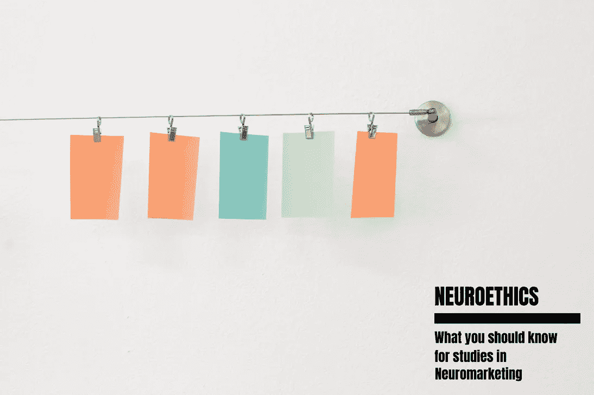

# 以下是你应该知道的关于神经营销中的数据伦理

> 原文：<https://medium.com/swlh/here-is-what-you-should-know-about-data-ethics-in-neuromarketing-f4a23a1539a3>

我们与技术的关系非常亲密和密切。我们现在几乎在任何事情上都使用科技，从联系他人、存储数据到网上谋生。随着我们对大脑、神经科学和技术知识的发展，这些相互交织的领域为我们所有人提出了一个有趣的未来。

Data Ethics in Neuromarketing

# 有哪些局限性…