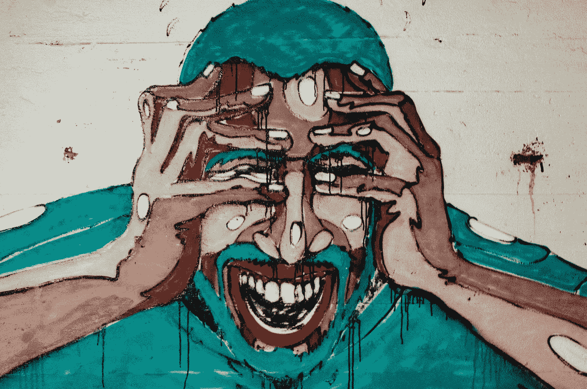

# 这就是为什么你必须拥抱创伤

> 原文：<https://medium.com/swlh/here-why-you-must-embrace-trauma-a062f1986acc>

Photo Credit: [Aarón Blanco Tejedor](https://unsplash.com/@blancotejedor)

> 当天将一个伟大的责任授予任何人时，它将通过苦难锻炼他的头脑，使他的筋骨经受艰苦的工作，使他的身体遭受饥饿，使他陷入贫困，在他的行动道路上设置障碍，以便刺激他的头脑，硬化他的本性，并在他不胜任的地方进行改进。——孟子，中国哲学家

创伤是一种被低估的祝福。

根据[逆境假说](https://www.thespark.org.uk/tag/adversity-hypothesis/) **为了成长，你必须忍受逆境和创伤。**

它进一步补充说，极高水平的增长和发展**只对那些经历了巨大逆境并从中获得胜利的人开放。**

# 从创伤中过渡

不久前，我经历了人生中最黑暗和最阴郁的日子。

我的慢性焦虑达到了导致我溃疡的程度。我情绪非常低落，甚至没有勇气或意愿下床。

现在，四年后，回顾那些日子，我笑得无比开心。

我现在可以坚定地证明，这个时代以及拥抱随之而来的痛苦，是我一生的幸事。它以这样的方式改变了我，现在，每当焦虑或沮丧袭来，它都会让我开心。

## 创伤性事件可以释放你未开发的潜力，标志着你生活中的一个重要转折点。

那时候，我唯一逃离焦虑的方法就是出去跑步。当我跑啊跑的时候，我觉得我快速的心跳在释放某种毒素，这是一种短暂的解脱。

有一天，在我去跑步之前，我对自己说，也许我可以在途中听一本有声读物。所以我在网上冲浪，偶然发现了一本有声读物。

那本书是一个终结的开始。一个折磨人的时代的结束和一个转变的开始。

# 逆境假说

任何传统都有一些命运的概念。印度教徒相信，在出生的那一天，上帝会将孩子的命运写在他或她的额头上。

现在，假设，在你的孩子出生的那天，天使给了你两件礼物:第一件礼物是一副眼镜，通过它你可以阅读这份书面的信仰，第二件礼物是一支神奇的笔，用它你可以以任何你想要的方式改变命运。

现在，想象戴上眼镜，浏览这份书写的命运；这是您看到的列表:

十八岁:以全班第一名的成绩高中毕业，二十岁:酒后驾车发生车祸，导致左腿截肢。24 岁:成为单亲父母。二十九岁:结婚。三十二岁时:出版了一本畅销小说。三十三岁:离婚；诸如此类。

作为一名家长，你会改变清单上的什么？毕竟，哪个父母会忍受他或她的孩子生活中的如此严酷的事件呢？谁会犹豫去减轻痛苦呢？

不管你的直觉和倾向，你必须非常小心你用这支神奇的笔改变的东西。

你的善意可能会变成对孩子的诅咒。如果尼采是对的，“没有杀死你的东西会让你变得更强大”，那么从你孩子的命运中移除逆境会让他们变得虚弱和不发达。

**逆境假说**有两个版本。弱和强。在弱版本 ***中，它假定逆境可以带来成长、力量、快乐和自我完善。—*** 这个弱版本很有研究依据。

假设的强版本更令人不安:**它陈述:**

> ***为了成长，人必须忍受逆境。它进一步补充说*** [***非凡的成就***](https://livelikepros.com/achieve-world-class-success/) ***，成长和发展* *只对那些经历了巨大逆境并从中获得胜利的人开放。***

听起来可能很疯狂，但科学揭示了逆境和创伤可以改变你生活的三种方式

# 创伤后成长

## #1.拥抱创伤释放你的潜力

当创伤袭来时，奋起迎接挑战会展示你隐藏的能力和未开发的潜力。很多时候，如果我们不被迫离开舒适区，我们就不知道自己有多能干。

你可能会说不，如果 X 发生了我就会死，或者如果我失去了 Y 我就无法继续下去。但事实上，在面对 X 或 Y 时，你的心脏不会停止跳动，你必须面对你所发现的世界。

人们从创伤中得到的共同教训是，他们比自己意识到的要坚强得多，这种对自己力量的新认识给他们提供了更大的自信。

经历过战争、强奸、集中营或个人创伤损失的人似乎经常被注射预防未来压力的疫苗:他们恢复得更快，因为他们现在知道他们能应付。

> 苦难产生忍耐，忍耐产生性格，性格产生希望。—乔纳森·海特

## #2.创伤将宝石从泥土中分离出来

第二类好处涉及关系。逆境是一种过滤器。当一个人被诊断出患有癌症，或者一对夫妇失去了一个孩子，一些朋友和家庭成员会挺身而出，尽力以任何方式支持他们。

逆境不仅把酒肉朋友和真心朋友分开；它能加强人际关系，打开人们彼此的心扉。

> 我们对我们关心的人产生爱，我们对那些在我们需要的时候关心我们的人感到爱和感激。

## #3.外伤让你有了一双新的眼睛

创伤改变了对现在(“充实地过好每一天”)和其他人的优先考虑和哲学。

我们都熟悉那些有钱有势的人在面对死亡时进行道德皈依的故事。乔纳森·海特在他的书《幸福假说》中是这样叙述的:

> 许多面临死亡的人报告了价值观和观点的改变。回想起来，癌症的诊断常常被描述为一个警钟，一次现实的检验，或者一个转折点。许多人考虑改变职业或者减少他们在工作上花费的时间。人们常常醒悟到的现实是，生命是他们一直认为理所当然的礼物，人比金钱更重要。

# 创伤如何改变了我

我当时的焦虑源于几个问题。我正遭受着一段持续了两年的有害关系的折磨，并以对她婚外情的创伤性发现而告终！

为了完成硕士论文，我承受了巨大的压力。我和一家濒临失败的公司也有一个项目。

我也给自己增加了额外的负担，因为我把自己投射到了太远的未来，并且不停地折磨自己离我的理想有多远。

回想起来，我觉得很尴尬，因为这些琐事受到了精神创伤(这些琐事真的让我得了溃疡)。

我之前提到的有声读物是戴尔·卡内基的《如何停止担忧，开始生活》。

当我读这本书，运用如何管理压力的技巧，学会如何活在当下，如何围绕过去和未来建立时间墙时，我的压力水平从沸腾的 100 下降到可以忍受的 10。

那一天，那本书，那 100 比 10 的减压是我人生的转折点。我明白了我们所有的痛苦都源于我们的无知，不管是经济上的、情感上的还是健康上的，还是我们的关系上的。

从那天起，我成了一个如饥似渴的读者。从那以后，我从来没有一天不阅读至少一小时。

**自信、高度的自尊、宁静和快乐的精神、经济上的舒适只是从那些“痛苦”的日子里获得胜利的几个果实。**

我欠那些“创伤”的日子，无论我已经取得了什么，无论我将要取得什么。那些日子耕耘了我的土壤，让我做好了准备。

我不想庆祝苦难，为每个人开出拥抱痛苦的处方，也不想淡化它穿透灵魂的折磨。

根据我自己长期遭受痛苦和长期焦虑的经历，我只想指出，痛苦是好的和坏的混合物，那些设法找到并开拓好的东西的人最终会得到一些宝贵的东西:道德和精神发展的关键。正如莎士比亚所写:

> 逆境的用处是甜蜜的，
> 它像丑陋而有毒的癞蛤蟆，
> 头上还戴着一颗珍贵的宝石。

# 结论

如果这个假设的强有力版本是正确的(极高的增长需要经历逆境并战胜它)，它对我们必须如何追求我们的生活有着惊人的影响。

这意味着我们应该冒更多的险，遭受更多的失败。

这意味着过度保护孩子，不让他们品尝生活的苦涩，充其量只能让他们过平庸的生活。

> 杀不死你的，会让你变得更强。

## 这篇文章发表在[《创业](https://medium.com/swlh)》上，这是 Medium 最大的创业刊物，有+424，678 人关注。

## 订阅接收[我们的头条新闻](https://growthsupply.com/the-startup-newsletter/)。

