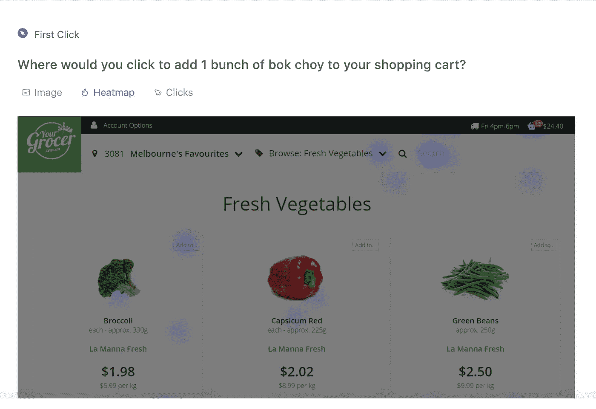
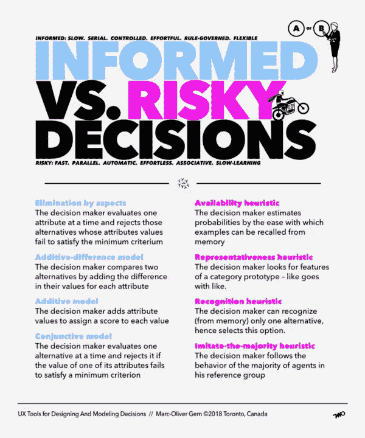

# 这是解决工作纠纷的最快方法

> 原文：<https://medium.com/swlh/heres-the-fastest-way-to-solve-disputes-at-work-9887ba565119>

创业失败的原因有很多。而最常见的一些与产品本身无关。我见过的许多创业失败都归结为一个问题:无法有效解决创意纠纷。

> 当然，有效地解决争端确实很难。

例如，自上而下的发号施令不可避免地会让一方感到被轻视或被冒犯。这也会让决策者对你产生怨恨。无论你在最终确定创作方向时得出什么结论，都应该被各方视为*公平*和*逻辑*——换句话说，是有数据支撑的*。*

# 这就是为什么在解决冲突时，最好的起点是优先考虑数据和逻辑。

但是，你到底是怎么做到的呢？如果双方都坚信自己是对的呢？

> 最好的方法是找到一些方法来快速“测试”每一方的观点或假设，以产生可测量的结果。

然后，这些结果可用于确定最合理的行动方案。这里的目标是鼓励一种文化，在这种文化中，人们可以“犯错”，任何证明最合理的都被认为是最公平的。你不应该一丝不苟地测试每一个争端，但是当双方陷入严重僵局时，遵守这一技巧远比一场持续的、永远无法解决的争论要便宜得多。

以下是如何正确地做到这一点，视情况而定。

# 1)设计决策

创造性的决策是最容易测试的，然而它们也是最有争议和最情绪化的。

在 Dairy Free Games，我目睹了设计师们在看似微小的决定上的大爆发。具有讽刺意味的是，通常情况下，问题越小，爆发越大。当涉及到他们的观点时，设计师天生情绪化和充满激情，并通过更定性的镜头来感知它们。好消息是，即使是定性的意见也很容易快速检验。

> **我发现的测试 UI/UX 决策的最简单的方法之一是在 UsabilityHub 上在线运行一个快速可用性测试。**

通过在[usaability hub](https://www.crunchbase.com/organization/usabilityhub?utm_source=about&utm_medium=blog&utm_campaign=crunchbase-blog&utm_content=solve-disuptes-work?utm_source=about&utm_content=5-priorities&utm_medium=blog&utm_campaign=crunchbase-blog)上进行的“ [5 秒可用性测试](https://fivesecondtest.com/?utm_source=about&utm_medium=blog&utm_campaign=crunchbase-blog&utm_content=solve-disuptes-work)，你可以与真正的最终消费者一起测试，并快速获得你想要的信息。即使在免费计划下，你也可以进行 2 分钟的测试，这已经足够了。如果你点击他们预先选择的面板，你可以在几分钟内得到结果。

*图片来源:* [*UsabilityHub*](https://app.usabilityhub.com/tests/c4c8b3aa12d0/results/36d37cc007ca?%7B%22viewState%22:%7B%22clickSelections%22:%5B%7B%22_clientId%22:%22NnSv7mRw2%22,%22xa%22:0.8375634517766498,%22ya%22:0.6139916126572627,%22xb%22:0.9809644670050762,%22yb%22:0.6267632481890963,%22usability_test_section_screenshot_id%22:400723%7D,%7B%22_clientId%22:%22wfIthfcEh%22,%22xa%22:0.6776649746192893,%22ya%22:0.614944719786504,%22xb%22:0.7880710659898477,%22yb%22:0.6267632481890965,%22usability_test_section_screenshot_id%22:400723%7D,%7B%22_clientId%22:%22NheDnJ47e%22,%22xa%22:0.9111675126903553,%22ya%22:0.571101791841403,%22xb%22:0.9784263959390863,%22yb%22:0.5821578345406023,%22usability_test_section_screenshot_id%22:400723%7D%5D%7D%7D?utm_source=about&utm_medium=blog&utm_campaign=crunchbase-blog&utm_content=solve-disuptes-work)

你最终得到的是人种学信息，它告诉你一个真正的最终用户对设计的直觉反应。它作为第一印象。即使对创意人员来说，这也是难以否认的数据。

最终，我们是在为别人制造产品。让你的团队了解这一点，并优化对终端消费者的任何假设的测试(尽可能),这是减少创造性争议和创造更具协作性和数据驱动型文化的最佳方式之一。

# 2)产品决策

测试也很好地解决了产品争议。无论你是一个游戏工作室还是一个企业软件公司，你已经在测试你正在做的几乎所有事情的多次迭代。

*图片来源:*[*UX 产品设计师的决策策略*](/the-versatile-designer/decision-making-strategies-for-ux-product-designers-30040ab6e127?utm_source=about&utm_medium=blog&utm_campaign=crunchbase-blog&utm_content=solve-disuptes-work)

例如，当涉及到产品营销时，测试不同版本的产品信息是非常容易的。用一组简单的针对不同人群的脸书广告来测试新的定位。与其继续假设，或者在几个月后发现你做了错误的决定，在短短的 1-2 天内，你可以得到足够大的样本量来更加确定你的决定。

您也可以将相同的面向测试的方法应用到产品特性的实际构建中。在 Dairy Free Games，我们通过纸上原型测试游戏或功能的新想法。这个想法是在编码任何逻辑之前尽可能多的做些调查和测试。如果事情通过了纸上原型阶段，我们甚至有了一个单独的 Unity 应用程序。在这个应用程序中，我们测试了新的想法或 UI 布局，只是为了获得可玩性数据并捕捉任何边缘情况。

> 这可能看起来很多，但是添加一个考虑不周的特性或逻辑需要更多的工作。

然后需要回滚，花时间测试并预先整理边缘情况最终会节省大量时间。就像你在高中写论文一样。每个人都讨厌写提纲，因为它需要更多的前期工作，但从长远来看，它不可避免地会节省你的时间，让你的想法更有条理。

# 3)工程决策

技术总是在变化。如果你阅读黑客新闻，似乎每天都有新的“必须使用”的技术、过程、框架或工具发布。自然地，我在工程方面看到的许多冲突都可以追溯到所有工程师的内在愿望，即想要重新设计他们前任的工作或测试新技术。

作为创始人，你的第一反应可能是，你的初创公司已经有足够多的风险了。为什么引入未经证实的技术会带来更大的风险？但显然，你不能拒绝每一个技术上的“风险”，而希望生产出一个现代化的产品。

> 作为一名创始人，你必须让你的工程团队重新关注成本效益。

他们需要考虑什么能为你的公司整体提供最大的价值。如果工程师的建议实际上能给企业带来实质性的好处(成本调整后)，并且他或她带着一个经过深思熟虑的逻辑论证来找你，那么作为创始人，你有责任去检验它。

不要让这个决定变成一个充满假设的僵局，给你的工程师 1-3 天的时间来完成你的代码库并实现他们的想法，或者使用新技术构建一个快速的示例应用程序。过了这段时间，你不仅会有真正的指标来支持一个决策，而且你的工程师也会在这个过程中学到一些东西，他们可以回去和他们的团队分享。

# 4)流程决策

当您考虑一个过程变更，尤其是一个将影响所有团队的变更时，最好在干扰其他人的过程流之前，在单个“试验品”单元上进行您的测试。否则，如果改变被证明是不可行的，你将被迫在整个公司范围内回滚，这既昂贵又耗时。

例如，考虑一下不断引起争议的转换项目管理工具的决定。

在 Glu，我们使用[吉拉](https://www.crunchbase.com/organization/atlassian?utm_source=about&utm_medium=blog&utm_campaign=crunchbase-blog&utm_content=solve-disuptes-work?utm_source=about&utm_content=5-priorities&utm_medium=blog&utm_campaign=crunchbase-blog)作为我们的项目管理套件。当然，每个人都不断抱怨它，建议更新和更性感的工具，如 Asana 或 Trello。很多次，我们试图与一个团队进行交换，几乎总是得到这样的结果:尽管吉拉不是最伟大的，但它对我们来说仍然是最有效的。

> 得出这个结论的代价？相对较低，因为我们用一个小单元来做。

做决定时，最好用尽可能小的样本量进行测试。一个团队或单位就可以了。

# 归根结底，重要的是用逻辑和透明度和平解决创造性的争端。

这意味着，作为公司或团队的领导者，你必须*永远*以身作则。你永远不能假设你所相信的必然是正确的。你必须意识到测试最符合逻辑的结果的重要性，就像你鼓励你团队的其他成员一样。你需要带着支持你的推理的证据来到谈判桌上。创建数据驱动的文化从顶层开始。

因此，当一个人拒绝测试他们的观点时，例如，特别是当测试简单快速时，你需要让你的团队知道这是不可接受的。如果你想要一种最好的决策总是上升到高层的文化，每个人都需要乐于犯错，因为这通常是对公司最好的。

> 记住，在你的团队中总会有争议。在某种程度上，这是一件好事。

你需要一定量的创造性摩擦——这是推动进步的动力。但只有当你推动自己和你的团队以正确的、数据驱动的心态来处理创造性冲突时，这才是真的。

*这篇作品最初发表于*[*Crunchbase*](https://about.crunchbase.com/blog/heres-the-fastest-way-to-solve-disputes-at-work/)*。*

## 这篇文章发表在 [The Startup](https://medium.com/swlh) 上，这是 Medium 最大的创业刊物，拥有+415，678 名读者。

## 在这里订阅接收[我们的头条新闻](http://growthsupply.com/the-startup-newsletter/)。

