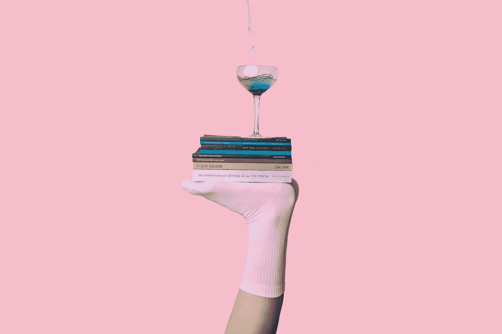

# 为什么多重任务是一个有科学支持的神话

> 原文：<https://medium.com/swlh/heres-why-multitasking-is-a-myth-backed-by-science-7bfc833aaf31>

Photo by [Thought Catalog](https://unsplash.com/photos/FACFpJVoMJs?utm_source=unsplash&utm_medium=referral&utm_content=creditCopyText) on [Unsplash](https://unsplash.com/search/photos/balance?utm_source=unsplash&utm_medium=referral&utm_content=creditCopyText)

## 有一个更好的方法来提高效率

我 19 岁的时候，曾经让自己一天忙碌 15 个小时左右。早上 5 点起床练划船，上课，学习，打两份工，腾出时间娱乐活动。通过这一切，我总是发现自己试图同时完成多项任务，以保持“高效”。我想这个…