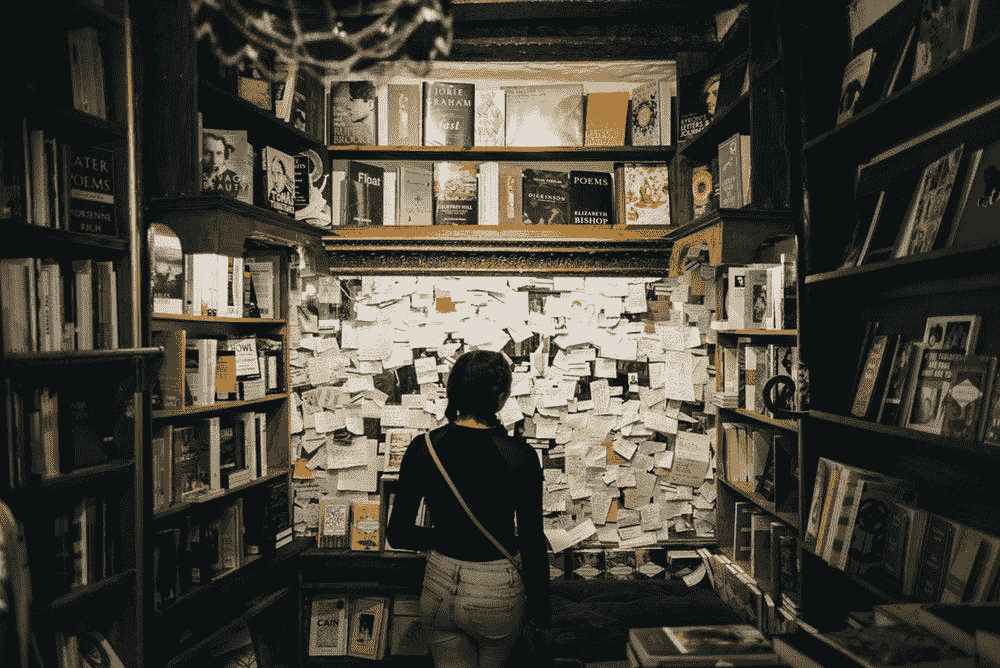

# 高保真

> 原文：<https://medium.com/swlh/high-fidelity-bb17be9cb5d8>

书总是比电影好。

photo by Brandon Lopez for Unsplash

当我第一次看到《摩门经》时，在后期圣徒教会的海报上有一个广告——一个棕色头发、面带轻松微笑的女人，角落里有一本《摩门经》，标语是“这本书总是更好。”我拍了一张照片，发给了我弟弟。我知道他会笑，因为我们家流传的笑话是，我从来没有承认过喜欢一部基于一本书的电影超过这本书本身。这个我不否认。我不反对电影、电视剧或戏剧，事实上，我都喜欢。我甚至理解一本书的大(或小)屏幕改编所需要的改动(尽管当我键入那句话时，“改动”最初是“限制”，这可能是我能给出的对我的观点的最好解释)。

随着《权力的游戏》的完结，对于最后一季制作的质量和效果有无数的观点，而我自己的观点介于两者之间。我被逗乐了，但对节奏的戏剧性变化感到有些沮丧。但我也松了一口气——因为最终会有一本书涵盖所有未涉足的领域，整理零散的细节，让包括我自己在内的许多观众在之前的七季中努力拼凑的细节变得有意义。(在此填写您选择的微妙情节点)的重点是什么？希望在乔治·R·R·马丁的最后几期中能找到答案，而且，像许多人一样，我渴望阅读它们。

事实是，我喜欢故事。我喜欢任何形式的故事——在舞台或屏幕上表演，由天才的叙述者在有声读物或播客中朗读，当然，还有小说中的文字，在那里我可以迷失在我最喜欢的作者给我的地方和角色中。系列丛书让我神魂颠倒——有机会逃离到另一个世界，跟随三本独立书籍的一个故事？是的，请吧。

对我来说，改编的麻烦在于把解释交给别人的想象。我可能非常喜欢他或她的版本，但最终，我更喜欢我自己的版本。我明白，当作者出版书籍时，他们向世界释放了他们灵魂的一小部分，供我们读者整理，我将这一责任铭记于心。我注意包括在内的细节，在我的脑海中制作世界和人的生动画面，试图抓住主题，欣赏对话和所有次要情节交织在一起的方式。我能看出作者什么时候花了时间用许多细节将世界分层，填满了角落和缝隙，所以我脑海中的画面从黑白到深褐色，直到我指尖能感觉到的彩色纹理。

当我看由一本书改编的电视或电影时，我的失望很少来自电影制作或电视制作的质量，或演员或导演的个人努力。它是将我头脑中的三维世界在屏幕上展平成二维图像。才华横溢的作家努力把突出的部分浓缩成一个故事，搬上银幕。但是我想念所有那些在时间的压缩中被挤压掉的有趣的小片段。没有一部电影能像我自己的想象一样让我沉浸其中。这就是为什么我首先读小说，给我的大脑一些开阔的土地去漫游和探索，看看它带我去哪里。

这并不妨碍我看《权力的游戏》之类的节目，或者看根据书改编的电影，凭自己的本事欣赏。我永远喜欢讲得好的故事，不管是什么媒介。一个真正好的改编是一种享受——就像一个世界级的厨师在做我妈妈的食谱。这两个版本在这个世界上都有一席之地……但我的心永远和原作在一起。