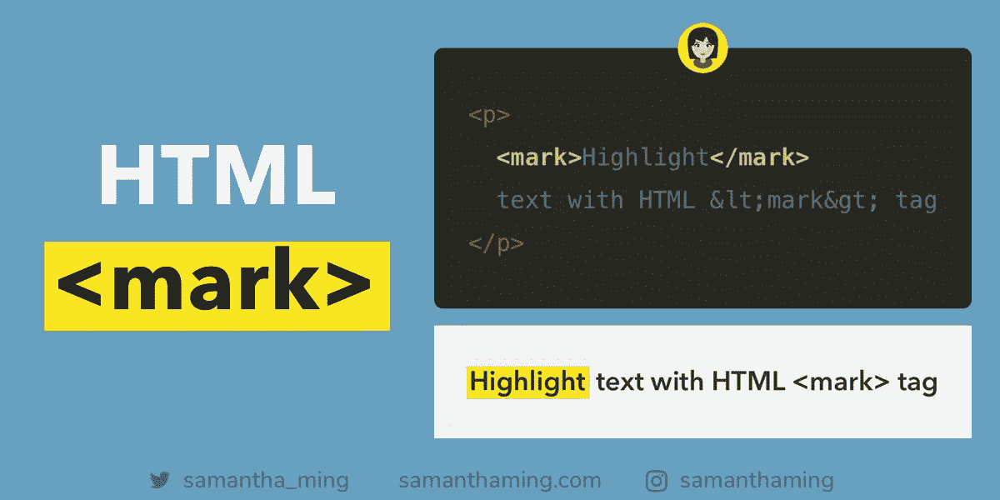

# 用 HTML 标记标签突出显示文本

> 原文：<https://medium.com/swlh/highlight-text-with-html-mark-tag-72297c053be8>



CodeTidbit by SamanthaMing.com

如果你需要标记段落中的文本，最好使用`<mark>`标签。这是黄色荧光笔的 HTML 版本。我一直使用一个带有 CSS 样式的`<span>`标签，没有意识到这种更具语义的选项的存在。HTML5 充满了各种好东西，对吗😆

```
<p>
  <mark>Highlight</mark>
  text with HTML &lt;mark&gt; tag
</p>
```

# 默认`<mark>` …