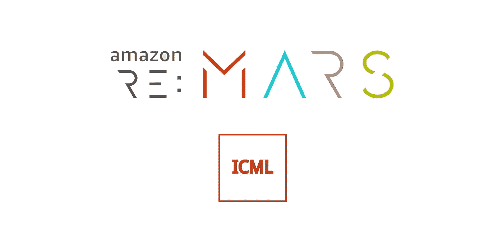

# 亚马逊 re:火星和 ICML 2019 的亮点和趋势(带视频)

> 原文：<https://medium.com/swlh/highlights-and-trends-from-amazon-re-mars-and-icml-2019-with-videos-2a65dbe6347f>

**作者:**迈克尔·特里梅尔(机器学习交付负责人，[马克斯·凯尔森](https://maxkelsen.com)

过去几周，我一直在加州，有时间参加了两个大型机器学习会议——[亚马逊 re:MARS](https://remars.amazon.com/) 和 [ICML 2019](https://icml.cc/) 。在此期间，我参加了大量的讲座，并会见了来自世界各地的机器学习实践者和研究人员。