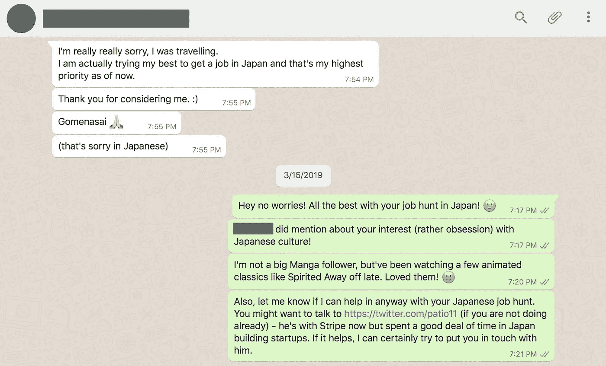
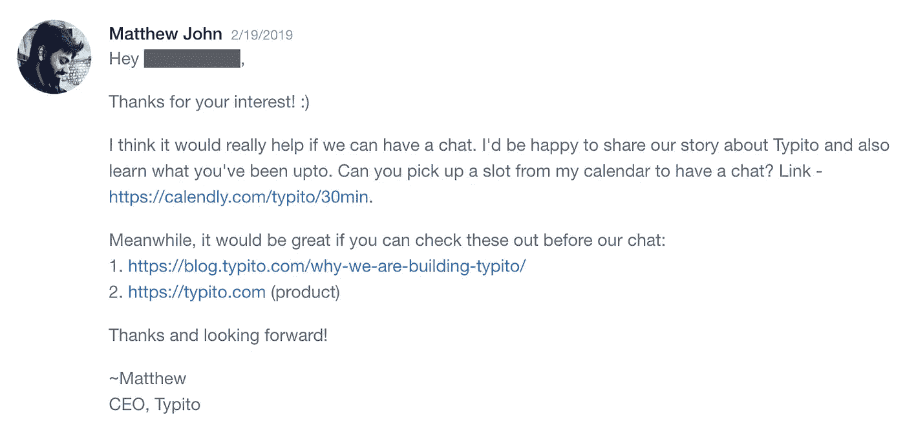
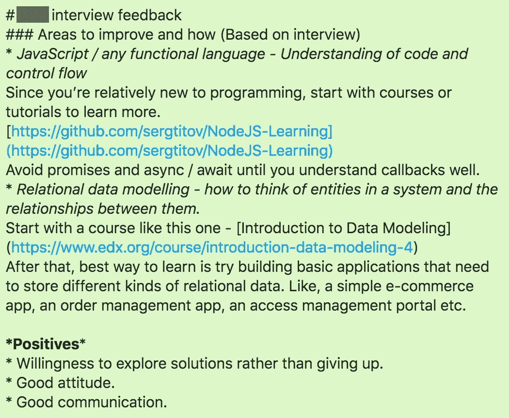

# 在早期创业阶段雇佣软件工程师——流程分解

> 原文：<https://medium.com/swlh/hiring-software-engineers-at-early-stage-startup-process-break-down-2add59ca7df9>

我们在招聘软件工程师时的理念，以及这一过程是如何随着时间的推移而演变的。

招聘是初创公司的任务之一，其时间投资回报就像在赌场玩轮盘赌一样随机。你要么运气好，突然有一个优秀的软件工程师加入你，要么你在 3 个月内面试了 50 名候选人，仍然无法填补你团队中的关键职位。与招聘顾问和招聘相关的初创公司合作，肯定会帮助你在这项任务上投入更多的资源，慢慢地，你会掌握在你的初创公司招聘人才时什么行得通，什么行不通。

Hiring in an Early Stage Startup can be tough. Photo by [Charles 🇵🇭](https://unsplash.com/photos/rRWiVQzLm7k?utm_source=unsplash&utm_medium=referral&utm_content=creditCopyText) on [Unsplash](https://unsplash.com/search/photos/interview?utm_source=unsplash&utm_medium=referral&utm_content=creditCopyText)

虽然获得大量候选人线索进行面试本身就是一项挑战(与您的客户获取流程没有太大区别)，但我想借此机会介绍一些精益实践，这些实践从第一次与候选人通话到提供/拒绝团队中的职位(我称之为“候选人入职和面试流程”)都帮助了我们。

> 让我们深入了解一下在求职者入职和面试过程中对我们有什么帮助

## 首先是基本规则

在开始面试程序之前，我想列出一些我们认为在 Typito 招聘时必须了解和遵守的基本规则。这很大程度上受你创业公司文化的影响([这是我们的](/@tmatthewj/if-there-is-a-thing-called-culture-at-typito-9dc870f34bff))，可能与我们认为的关键有所不同。让我来分享一下我们在与候选人接触之前制定的基本规则:

**a)尊重他们的时间:**我们大多数人都有过这样的经历，别人让你等了很长时间——如果有更好的计划，这本来是可以避免的。我们认为那种令人讨厌的行为来自一个有权或缺乏同理心的地方，我们绝对不想去那里。所以我们尽最大努力以各种可能的方式来适应候选人已经很忙的日程安排。

关心他们:在面试中有两个实体——候选人和创业公司。当他们期待参与一段关系时，这两个实体都期待成长，并在他们今天所做的事情上变得更好。虽然这很重要，但我发现大多数公司都不太关心候选人，尤其是在他们得出不合适的结论后。虽然这种扭曲的单方面行为可能是需求和供应动态的结果，但我们认为这不公平。不管候选人是否加入我们，我们都尽力去了解如何真诚地帮助他们。

We believe helping candidates win (by joining us or otherwise) can go a long way. And in most cases, it’s not that difficult to lend a helping hand.

告诉他们需要知道的一切:我们告诉我们的候选人一切有助于他们做出决定的事情。我们什么时候开始在 Typito 上工作，我们每月的收入是多少，未来的挑战是什么，等等。我们尽量不把事情描绘得过于乐观，而是谈论让我们兴奋的事情——未来几年我们在 Typito 的前景。这样，它可以帮助他们了解他们正在进入的是什么，以及他们可以如何为旅程做出贡献。

d) **让他们表达自己**:这是我们的文化特有的，我们鼓励工程师想出解决问题的办法，而不是完全用防水产品需求文档灌输。我们已经意识到，当团队中的每个人都建立起对自己的项目、功能和端到端发布的信心时，这有助于我们小而精干的团队更快地前进，而这通常始于让团队能够表达自己。

现在我们已经设定了基本规则，让我带您了解一下面试的不同阶段:

## 开始

初始阶段是您亲自与候选人见面进行交流(30-60 分钟)或与他们通电话(15-30 分钟)以了解他们的故事并向他们讲述您的旅程。这种对话有助于他们了解你的情况，并慢慢开始构建他们如何帮助你的创业公司实现目标的蓝图。相反，它也有助于你理解这个人在他/她的职业生涯中处于什么位置，并想象你在初创公司的经历在未来会如何帮助他们。

在打电话的前一天，你可以让候选人检查一下你的产品和任何你认为会让谈话更容易的资源。这是在我们决定聊天时间之前，我发给候选人的一条信息的快照。

It helps to prep the candidate about your product / startup before having the chat.

通话中的一些讨论点可能是技术堆栈、您所面临的挑战、他们喜欢当前公司的哪些流程等。询问他们的期望薪资也有帮助——这给应聘者一个正确的反馈，表明你在认真对待这次谈话。如果你认为这个人要求的报酬远远超出了你的职位预算，这是一个很好的时机指出来，然后优雅地离开——做正确的事情并不可耻:)。在这通电话的最后，候选人会很确定他们是否想继续下去。如果他们愿意，我们告诉他们关于**任务**阶段，这将是我们寻找的能力的初步筛选。下一节将详细介绍！

## 分配

赋值是做两件事的好方法。这可以确保候选人准备好回应你的承诺，让工作顺利进行。它还能让你以一种对你的初创公司很重要的方式测试这个人对技术的理解(对我们来说，我们想知道候选人是否能自己编写和部署一个简单的 web 应用程序)

我们的任务是我的联合创始人 Srijith 的创意，他称之为宝丽来之眼。这是一个简单的 web 应用程序作业，基本上测试了候选人在基本的全栈 web 开发方面的熟练程度。我们与候选人分享作业链接，并告诉他们，他们可以花尽可能多的时间来创建它，但我们也敦促他们为作业设定一个他们认为合适的截止日期。这有助于候选人端到端地拥有任务，因为他们现在负责按照他们建议的截止日期将其发送出去。

在我们的案例中，任务也是非常松散的，所以它要求候选人以他们认为合适的方式来构建它——用户界面，UX，数据库的选择(如果有的话)和一切。我们作业中的这些调整有助于我们评估我们认为非常适合打字的两件事:**如果候选人能够按照他们的时间表拥有和交付**和**如果他/她能够自信地在从事一个大项目**时独立地做出较小的决定。我不应该忘记说，检查作业提交是有趣的！看看我们为宝丽来之眼找到的一些条目:)

[这里是宝丽来眼科作业模板](https://paper.dropbox.com/doc/The-Polaroid-Eye-Typitos-Engineering-Assignment-Template--AaBJLlrGK2fHk0wYC1QzXlWAAQ-98HwT09fTuIjbXOMovGO9)的链接，如果它能帮助你为候选人起草自己的作业。

## 面谈

审查任务后，我们决定候选人是否有资格参加下一轮面试。如果没有，我们会通知候选人为什么我们不能进入下一轮，并尝试提供反馈，候选人可以继续工作，以提高软件工程师的水平。记住——这个人在百忙之中花了很多时间来完成任务，他/她的工作绝对值得肯定和反馈。

如果分配轮次通过，我们将进行 3 轮面对面或电话技术面试，其中两轮由 Typito 外部的高级工程师参加，最后一轮由 Typito 的工程师参加。外部面试主要有两种类型:

1.  web 开发 101 :第一次面试试图进一步挖掘候选人在完成任务时所做的决定，同时也测试这个人对 Web 应用程序的基本概念的理解。http 请求是如何工作的，或者异步和同步调用之间有什么区别等等。
2.  数据结构&算法 (DSA):在成功完成第一次面试后，将测试候选人对 DSA 的理解程度。虽然这次面试不会像谷歌或亚马逊 DSA 那样广泛，但我们会尝试评估候选人如何思考解决问题。

这些外部面试消除了我们在招聘候选人时通常会有的偏见，并带来了局外人的新视角。

> 进行这些外部面试的一个技巧是自愿去面试其他创业公司，并让他们的工程师去面试你的候选人。这是早期创业公司绝对可以互相帮助的一个领域。

外部面试结束后，候选人将与我们团队中的一名工程师交谈。这更像是一次谈话，但肯定是用来筛选候选人的。这次面试有助于你了解候选人是否符合公司文化，是否能与潜在团队成员有效沟通。对于候选人来说，这也是一个很好的机会来详细询问我们的技术堆栈或我们在工程方面所做的决定。

## 定论

如果候选人通过了目前为止的所有测试，并且如果我们对给候选人一次机会有 100%的信心，我们通常会在讨论报酬和其他细节后提供一个职位。在 Typito，这个对话由我负责，也可以由负责招聘的创始人来完成。

如果候选人没有通过所有面试，我们会从面试官那里收集相关反馈，然后通过面对面交流或电话交谈的方式与候选人分享。分享一份书面总结也很有帮助，他们可以在以后有时间的时候阅读:

Here’s a summary of feedback that we shared with a candidate who didn’t make it after the interviews

再重复一遍，这个人花了相当多的时间浏览你的面试过程，当你说不的时候，给他们反馈也很重要，这样他们就可以继续努力了。如果有积极的方面，大声说出来，帮助他/她强化你的想法，告诉他/她什么是好的，什么是需要改进的。

## 就是它了！

这将使我们的招聘过程更加全面。虽然我们仍然在试验我们的面试过程，但我们已经从候选人那里获得了很多很好的反馈，关于他们如何喜欢我们的招聘过程，特别是宝丽来眼分配，以及我们如何花时间向没有成功的候选人提供反馈。

你的创业工程招聘过程很大程度上取决于你的要求、团队文化和其他因素。然而，我希望这个我们如何在 Typito 面试候选人的流程分解会给你一个额外的视角。如果你在创业时在招聘方面有一些有趣的流程，请随意分享。期待向您学习！

## 关于作者

Matthew 是 typico T1 的首席执行官和创始人，这是一款在线视频制作工具，被营销人员和营销机构用来制作专业视频。像 Canva，但是对于视频。Typito 现在是一个 4 人团队，正在寻求扩大核心团队。你可以在这里查看[的空缺职位。](https://angel.co/typito/jobs)

*本文原载于*[*typico 博客*](https://blog.typito.com/hiring-software-engineers-typito-process-break-down/) *。*

## 这篇文章发表在 [The Startup](https://medium.com/swlh) 上，这是 Medium 最大的创业刊物，拥有+438，678 读者。

## 在此订阅接收[我们的头条新闻](https://growthsupply.com/the-startup-newsletter/)。

