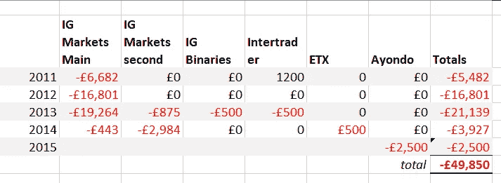
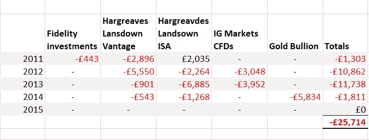
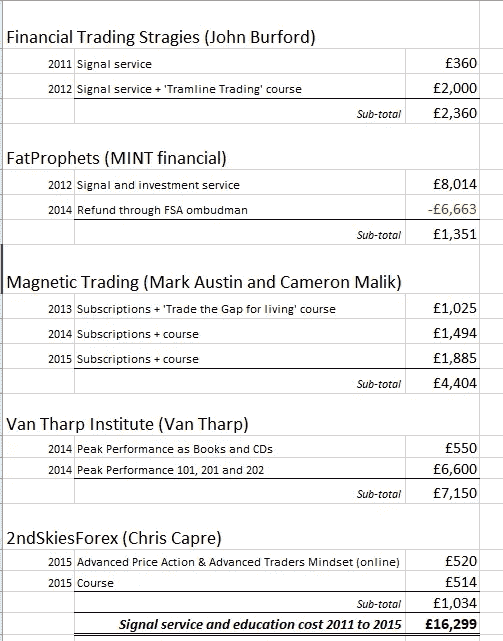
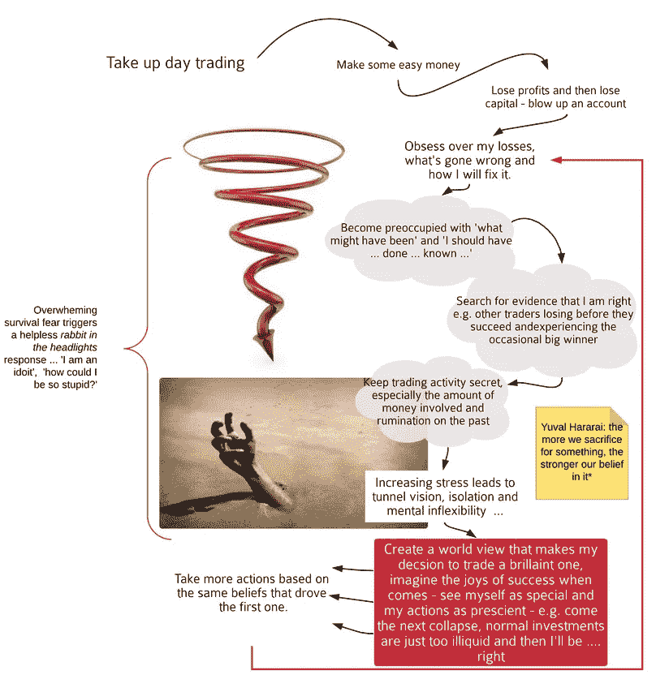
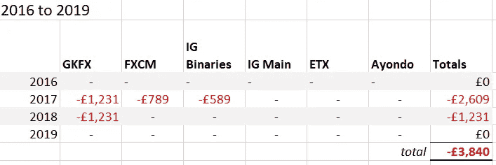
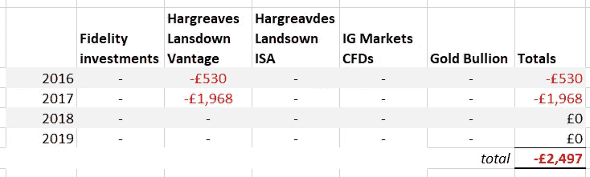
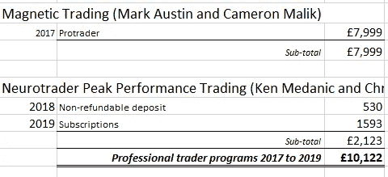
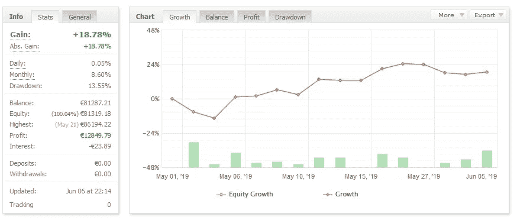

# 希望终于消失了——做了八年的日内交易者

> 原文：<https://medium.com/swlh/hope-dies-last-18ddc988469b>

我开始时有大量的资金，我使用了世界上一些最好的交易者的信号服务，并接受了业内知名人士的思维训练。

随着时间的推移，我专注于设计最有效的思维定势:我每天洗冷水澡，早晚冥想，并进行一次精力充沛的呼吸练习。我光脚慢跑，戒酒，喝防弹咖啡。我记录每一笔交易，研究市场，甚至创建了自己的网站，解释如何交易 Dax 指数，描述我所有的设置以及它们为什么有效。

在成为交易员之前，我为投资银行撰写过债券和奇异期权的文档。在那之前，我培训过技术分析人员，也写过大量关于各种金融衍生品的使用和估值的文献。我的第一个学位是经济学。

因为我在休假，所以有足够的时间来学习我的新手艺，我计划利用这段时间去找一份新工作。

*还能出什么差错呢？*

# 如何改变你的生活

开始日内交易，赚一些钱，然后亏钱，赚一点回来，然后再亏钱，然后继续交易。为你的行为辩护，说“*这很正常，每个人都需要几年才能盈利*”或“*这是一项技能——就像任何其他职业一样*”。通过说“*只有其他交易者知道亏损(很多)是完全正常的——实际上是必要的”*来证明你的活动至少有点秘密。保守你的交易目标的秘密——也许甚至对你自己——因为人们不明白发大财有多容易，你最不想看到的就是他们在你的火上撒尿。毕竟，你只是知道有一天一切都会水落石出。当这一切发生时，你将解决所有的财务问题，你将可以自由地做任何你想做的事情——到那时，你将能够告诉所有人你在通往成功的道路上失去了多少。他们肯定会尊重你。

也许你的工作很无聊，或者你不喜欢你住的地方，或者你有点孤独，总觉得自己是个局外人。这可能是因为你觉得自己在生活中犯了很多错误，并发现很难摆脱它们。也许你没有在你真正想做的事情上取得成功，或者没有勇气去尝试。你全身每一个细胞都在抗拒你的处境，你需要一个梦来分散你的注意力。

幻想你的光明未来是少有的交易成功故事之一，这提供了完美的逃避:每当你对生活有不好的感觉时，你可以立即用“ *…但是当我成功交易时，它将远远弥补我的挣扎/不幸/错误*”。毕竟，一旦你成为一个盈利的交易者，你就可以自由地实现你所有的梦想。

# 我做了什么

**2011**——开始使用金融交易策略的[约翰“熊”伯福德的信号服务进行交易。在咖啡馆、酒吧、工作室——任何有手机信号的地方——都可以用我的手机交易。](https://www.tramlinetraders.com/about-john-burford/)

2012 年——我以越来越大的强度和预算追求我的目标。

参加了约翰·伯福德的交易课程，学习他的“电车线交易方法”

意识到我有看跌倾向，所以买了看涨倾向，交易教育和来自[胖先知](https://www.fatprophets.com.au/)的信号服务。

我在国内和国外交易。我在一天中的任何时间交易——只要有信号出现——我花几个小时看图表。如果我有头寸，我也会一觉醒来查看我的图表。

我记得有一次交易中，我亏损了-3000 英镑。忙于其他事情，我看着手机上的交易，我看到市场接近我的止损，但只是错过了它。当我上床睡觉时，交易悬而未决，整晚都在考虑止损。当我的闹钟早上响起时，我已经+6000 英镑了。我没有平仓，因为我显然已经触及了一个趋势，而且我正飞往伦敦，所以无法监控它们。

**2013**——我对逆势交易的偏好正在增长。我一次又一次地做空道琼斯指数，因为我知道它不会再涨了:这是顶部——我能感觉到..我*知道* …我也喜欢在不稳定的[非农就业会议](https://www.investopedia.com/articles/forex/09/non-farm-payroll-report.asp)期间做空黄金——同样是因为我在看图表，我知道它已经达到了当天的高点——它不可能继续上涨！不会吧！一定是这个。

我意识到我的交易需要更多的结构，于是我找到了磁铁交易的创始人马克·奥斯汀。我报名参加了他的信号服务，并参加了他的课程。我看得出他的客户做得很好。

2014 年——更多的相同。

买了[范塔普](https://www.vantharp.com/)的巅峰性能家庭学习课程然后亲自上了他的[巅峰性能 101，201，202](https://www.vantharp.com/workshops) 。

磁力交易的服务给我留下了非常深刻的印象，我参加了他们的另一门课程，然后也注册了[卡梅隆马利克](https://magnetictrading.com/bios/)的道琼斯交易信号服务。我喜欢这个系统，所以我对它进行了深入的研究和彻底的回溯测试。

**2015**——参加了 2ndSkiesForex 的 [Chris Capre](https://2ndskiesforex.com/about-chris-capre/) 的培训课程，买了他的高级交易者心态课程和高级价格行动课程。

做了一些演示交易。

我在 Ayondo 开了一个账户，因为如果你在他们那里存钱，他们会给你奖金。我尝试了社交交易，并仔细研究了可用的选项。我把我的资金放在了持续盈利最大、亏损最少的交易者那里。

我赚了一大笔钱的一项投资被受托人清算了，所以我得到了更多的现金。

# 2011 年至 2015 年的结果

***点差投注***

2012 年的 NFP 下午花了我 2000 英镑。其中一条道指短裤——是我从餐馆喝得醉醺醺地回来后服用的——导致我醒来时瘦了 1000 磅，但第二天晚上我又做了同样的事情。类似的例子还有很多。

*股票、差价合约和交易所交易基金*

*教育*

# 厄运的交易者周期

随着损失的增加，我成功的决心(绝望)也增加了。从外面看，这一切似乎很合理:交易是一个很难掌握的游戏，但我有好老师，我投入了必要的时间。

事实上，我已经进入了典型的上瘾者的恶性循环。

# “如果你想让人们相信虚构的实体，如神和国家，你应该让他们牺牲一些有价值的东西。”

― [尤瓦尔·诺亚·哈拉里，《德乌斯人:明天的历史》](https://www.amazon.co.uk/Homo-Deus-Brief-History-Tomorrow/dp/1784703931/ref=sr_1_1?keywords=homo+deus&qid=1562081986&s=gateway&sr=8-1)

在我的例子中，*虚拟实体*与其说是一个实体，不如说是一个五花八门的概念，大概是这样的:

我可以通过交易拿回我所有的钱，并恢复我的财务安全+交易是实现这一目标的唯一途径
+如果我坚持下去，我就会成功
+我在交易时感到的焦虑和对损失感到的遗憾可以被正确的身体/心灵练习所克服。

正如哈拉里预测的那样，随着我投入交易的时间和金钱越来越多——同时也减少了投入更有回报的工作的资源——我对交易的信心越来越大。

# 第二口苹果

有了新基金，我的交易生涯得到了喘息的机会。我清楚地知道我错在哪里，并发誓不再犯错。从与范·塔普、T2、克里斯·卡普里和其他人的课程中，我知道我糟糕的心态是罪魁祸首，我以前也知道这一点，但至少他们给了我一些改变它的技巧，我决定这么做。

我参加了更多的研讨会，告诉自己我必须摆脱所有的恐惧和冲突，否则我也会错过这个机会。

**2016**——主要是演示交易，但使用 ETF 交易美国大选。

**2017**——我仍然决心完成这项工作，我报名参加了[磁力交易](https://magnetictrading.com/case-studies/)的(现已不存在的)Protrader 项目。我知道他们是优秀的交易者，每天只在头几个小时交易。完美。这意味着我可以继续交易，回到这个世界，做我应该做的工作——即使我仍然不知道那是什么。我所要做的就是听从他们的指示。这很容易。如果我每次交易的时候没有抖得太厉害，以至于不能集中注意力，不能做决定，当然也不能遵循指示，那就好了。我害怕交易，希望每次交易都不会发生，这样我就不用交易了。

在这段时间里，我养成了我的思维定势:清晨、交易前冥想、冷水淋浴、锻炼和拉伸，使用 [ETF tapping](https://en.wikipedia.org/wiki/Emotional_Freedom_Techniques) 和 [Heartmath](https://www.heartmath.com/) 。

2017 年底，我在 Skype room 为 Protrader 计划发布了一条消息，描述了我的真实情况。我喜欢我得到的回应，诚实后感觉更好。Dax 大师赛[的 Graham Levine 和 Amit Desai 出场。](https://www.daxmasters.com/)

**2018**——埋头与这些新人交易几个月。他们是伟大的交易者，但我不是；我看着他们日复一日地赚钱，我理解他们说的每一句话，我记录了他们所有的交易设置和决策过程，但我还是输了。我也失去了很多额外的时间，因为我也为这些人写文档，以换取免费订阅。他们没有要求这样做，但我这样做了，因为我终于学会了交易。

# 技术拯救世界

与此同时，我在 2ndSkiesForex 与佛教徒兼交易者克里斯·卡普雷(Chris Capre)有过接触，他是我最喜欢、评价最高的交易老师之一。他刚刚与[肯·梅丹尼克](https://www.trustpilot.com/review/www.neurotrader.com)成立了一家合资公司，后者开发了一个名为[神经交易员](http://neurotrader.com/)的系统(这个网站上的推荐完全是伪造的——他发表了我对克里斯教练的评论，就好像我在谈论他一样)。使用 Neurotrader 软件和可穿戴技术，你的压力反应将在交易时被监控，最棒的是，当你不在“最佳表现”状态时，它会停止你的交易。他们一起做了一个关于技术的演示，并抛出了一个巨大的胡萝卜:你可以从他们的对冲基金获得资金，而且你只需要有一点点利润就可以这样做。在主推介结束后，Chris 为他认为可能成为最昂贵方案候选人的人举行了一次特殊的邀请会议，这是一个专业交易员发展计划，为期 12 个月，每月花费 699 美元。只有 10 个名额。今天购买或错过这个千载难逢的体验！受宠若惊，又有点绝望地想找到解决我日益减少的交易资金的办法，我交出了我的信用卡资料。

这是一场灾难。这项技术从未成功过。Neurotrader 改变了最后期限，然后错过了。思维课程非常保守，倾向于传统的一神论。其中包括诸如“你相信上帝吗？真的还是假的？你和万物的创造者有亲密关系吗？真的还是假的？这个项目失败了，Chris Capre [离开了](https://2ndskiesforex.com/trading-strategies/forex-strategies/why-i-am-ending-my-jv-with-neurotrader-ken-medanic/)，结束了合资企业，Neurotrader 的 Medanic 进行了一次网络研讨会，告诉我们如果我们和他在一起，我们将为对冲基金工作，我们甚至可以获得股份。

# 2015 年至 2019 年的结果

至少出血已经停止了。

*点差投注和差价合约*

*ETF*

*教育*

# 交易技巧终于来了

具有讽刺意味的是，当神经交易者的梦想破灭时，我已经开发了自己的系统，并且知道了如何交易 Dax 指数。这只是一个模拟账户，但 2019 年 5 月和 6 月的结果令人印象深刻，增长了 18.8%。

% growth May and June 2019

看着这些结果，我觉得自己被拉回到整个项目中。但是，我开发的技能如何转化为薪水和财富创造呢？

*选项 1:交易自有资金*

工资目标是 50，000 欧元/年，我可以用来投资交易账户的最大金额是 20，000 欧元。这意味着我必须持续获得 250%的回报。如果我能做到这一点，我会是一个交易天才。即使赚 20，000 欧元，我也只能勉强维持生活，这需要 100%的年利润——能够年复一年地做到这一点将保证我进入交易名人堂。

根据 ESMA 关于价差交易的新规定，我可以使用的最大交易量是 30 份合约，所以根据我的交易风格，每笔交易的风险是 300 欧元。按照这个标准，我一周需要清理 3R——这也是一个非常令人印象深刻的结果。

这些结果不太可能是(1)的结果。)一个兼职交易员和(2。)和我有同样经历的人。

磁力交易的交易员建议他们的客户每周 1%的目标，所以如果你想从交易中赚钱，你需要一个 100，000 欧元的账户。

*选项 2:获得资助*

私人交易者可以从[精神病院](https://psyquation.com/en)等公司获得资金。然而，在现实中，这个选项也很棘手:我没有持续的实时交易记录，这至少需要六个月的时间。当你得到资助时，头几个月只有 10，000 到 20，000 英镑。持续的盈利能力将为你赢得更多的资金。但问题是你只能得到 20%的利润。

即使你达到了每周 1%的交易目标，你也需要一个 500，000 欧元的账户来赚一份像样的薪水。此外，如果你违反了风险规则，你可以很容易地从项目中除名。

**这不是失败主义，这是现实。**

# 现在

六月的一个阳光明媚的星期二早上，我像往常一样交易，练习神经交易程序，我走出我的办公室，对我的合伙人说“我对交易上瘾了，必须停止了”。就这一句话，一个酝酿了八年的幻想破灭了。

我并不沉迷于这项活动，也不沉迷于买卖 Dax 指数，但我沉迷于这样一个想法:如果我坚持下去，我就会成功，收获多年辛勤工作的回报，从而解决我所有的财务问题。这些年来，我也产生了一些奇怪而扭曲的想法——这些想法属于*神奇思维*的范畴:

*   交易是一种炼金术，因此是一种艺术活动，所以当我交易成功时，我会再次成为艺术家。
*   我真正的目标是通过非二元理解获得精神自由。随着这越来越成为我的生活经历，我将完全独立于金钱，因此独立于我的交易结果。到那时，我将获得某种形式的启迪——并在这个过程中赚了一大笔钱。这就是所谓的[精神唯物主义](https://www.youtube.com/watch?v=dLAaEP6R6Zg)。*(另外，如果我处于这种状态，我真的还想做交易员吗？*？？)
*   如果我继续做我的灵修，拒绝我对安全的所有怀疑和担忧，交易资金自然会被我吸引，我所有的欲望都会得到满足……更令人尴尬的精神唯物主义。

随着这些更古怪的交易目标的暴露和消失，没有获得资金的前景，我自己也没有足够的资金，继续下去还有意义吗？号码

一旦我面对现实，我永远不会通过交易拿回我的钱，永远不会通过这种方式恢复我的财务安全，救赎的故事永远不会上演，我看到了我把交易当作精神安慰毯的程度。当我凌晨醒来时，或者当我看到我的朋友们靠丰厚的养老金提前退休时，我会用巨大成功的梦想来减轻我对未来的恐惧和对过去损失的羞愧。

我失去的不仅仅是钱；这也是我做交易者时花在生活上的钱。现在我只剩下原始资金的 5%;我没有任何经济保障，但我很感激至少当我这样做的时候我停止了。我有偿付能力——我仍然有资源去追求我真正想做的事情。我摆脱了成瘾和自欺的精神阴影。我所做的向自己和他人隐藏我的羞耻的事情实际上是在喂养它，所以羞耻也消失了。

经历了这一切之后，我开始明白快乐和正直是一体的，而宽恕是一切的关键。

我不适合做孤独的交易者。我是一个外向的人；我和一个艺术家从与人相处中获得能量。多年来，我尽我所能忽略我的身体告诉我的一切，隐藏在屏幕和数字给我的虚假安全感中。现在，我终于可以对自己承认，我想做一些有用的事情，继续我的职业生涯，成为一名身体工作者、课程创造者和身心问题作家。这个想法没有给我交易时的冲动，但是当我做这项工作时，它就是*感觉正确。如果我从八年的日内交易中学到了一件事，那就是认真对待*的感觉*。交易令人兴奋、贪婪、绝望、势不可挡、强烈、有力，但从来没有对过。*

PS——自从我写了这篇文章，很多交易者和我联系，告诉我他们也遇到了类似的问题。

真正能帮助我戒掉失去的瘾并恢复理智的是告诉别人我在做什么。知道这个行业如何运作的人是理想人选。在过去的 18 个月里，我一直在培养成为那样的人所需的技能。你可以在这里找到我 beingnessnow.com。我提供了一个免费的探索会议，这样我们可以见面，看看我们是否是一个很好的适合，如果我可以帮助你放下过去，向前看。

# 如果你在交易中遇到困难，请和别人谈谈，告诉他们发生了什么。如果我当时这样做了，我很可能会为自己节省数万欧元。