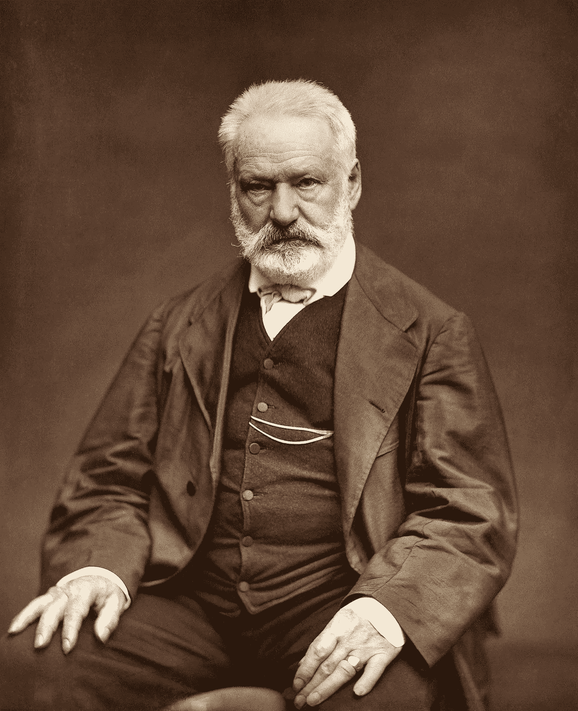

# 与 Travis CI 一起在 GitHub 页面上主持 Hugo 博客

> 原文：<https://medium.com/swlh/hosting-a-hugo-blog-on-github-pages-with-travis-ci-e74a1d686f10>

[阅读我博客上的原文](https://cjolowicz.github.io/posts/hosting-a-hugo-blog-on-github-pages-with-travis-ci/)

Portrait photograph of [Victor Hugo](https://en.wikipedia.org/wiki/Victor_Hugo) published in the widely distributed serial publication entitled ***Galerie contemporaine, littéraire, artistique***. By Étienne Carjat — Bibliothèque nationale de France, Public Domain, [https://commons.wikimedia.org/w/index.php?curid=28384247](https://commons.wikimedia.org/w/index.php?curid=28384247)

这篇文章描述了如何使用 [Hugo](https://gohugo.io/) 建立一个博客，这是一个开源的静态站点生成器。博客托管在 [GitHub Pages](https://pages.github.com/) 上，这是 GitHub 提供的一项网络托管服务。Travis CI 持续集成服务用于将变更部署到博客中。

> 这篇文章基于 Artem Sidorenko 的文章 [Hugo on GitHub](https://www.sidorenko.io/post/2018/12/hugo-on-github-pages-with-travis-ci/) …