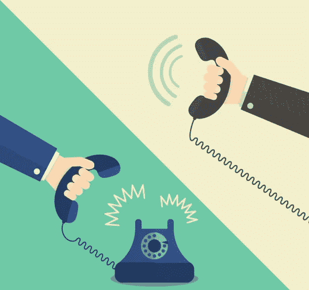

# 给投资者打电话的热门事实

> 原文：<https://medium.com/swlh/hot-facts-for-cold-calling-your-investors-9ebe2ba5ff11>

现在是谈话的好时机吗？

只是在职业界，有时候一个电话绝对比短信有意义。人们倾向于保留 12 个月的谈话记忆，显然会忘记 12 周内的电子邮件。如今，大多数销售人员都在进行电话推销；无论是营销、销售、推销、演示、合同。

大约 78%接受调查的决策者已经预约或参加了一个来自陌生电话的活动([来源](https://blog.hubspot.com/sales/sales-statistics#sm.000192hi7x101mdhvw2cuusbsvcxt))。随着全球销售设备的增加，人们可能会认为电话将成为过去。然而，电话推销仍然是 B2B 销售策略的一个重要组成部分。

把这些放在桌子上，让我们来看看推销的利弊:推销的好与坏的统计数据

根据买家的说法，在电话推销时创造积极销售体验的最佳方法包括:

1.  倾听买家的需求(69%)
2.  不要急于达成交易(61%)
3.  提供相关信息(61%)
4.  及时回复(51%)
5.  确立业务的紧迫性(42%)
6.  与相关潜在客户取得联系(37%)
7.  克服价格异议(35%)
8.  达成更多交易(28%)
9.  提高销售漏斗效率(18%)
10.  改进销售技术和方法(11%)

# 良好的统计数据

9/10 的买家使用丰富的工具来检查业务

7/10 的客户观看社交平台上的视频

6/10 的客户希望在第一次通话中讨论定价细节

5/10 的潜在客户希望在第一次拜访时看到产品的效果

# 不太好的统计数据

90.9%的时候，电话推销是无效的

只有不到 2%的陌生电话会促成会面

不到 1%的电话推销促成了销售

2007 年，平均需要 3.68 次电话推销尝试才能找到潜在客户。今天需要 8 次尝试！！

# B2B 电话营销策略的事实

1.  打电话的最佳时间是下午 4 点到 5 点
2.  一周中最好的日子:周三和周四
3.  你的演讲不应该超过 1.6 分钟
4.  仅致电决策者(人力资源/营销/ IT)
5.  给潜在的大买家打电话；抓住大鱼
6.  会面时提供定制优惠
7.  在第一次互动之前需要 8 次呼叫尝试
8.  按照要求，会后打五次跟进电话
9.  只准备一个潜在周转的数据库

所以现在，当你打电话给你的客户或投资者时，你已经掌握了如何打电话达成交易的事实。继续打电话！

## 这篇文章发表在[《创业](https://medium.com/swlh)》上，这是 Medium 最大的创业刊物，有+430，678 人关注。

## 订阅接收[我们的头条新闻](https://growthsupply.com/the-startup-newsletter/)。

