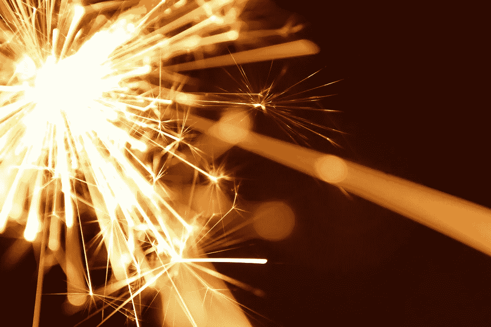

# 42 个火花如何改变你简单的一天

> 原文：<https://medium.com/swlh/how-42-sparks-can-change-your-simple-day-in-a-productive-day-7e96c9f97b97>

## 尽可能多的阅读它们

分心和心不在焉会让我们中最优秀的人垮台。而且在处理复杂情况的时候，很容易忘记基础……这种情况很可能发生在你身上。只是动机的一致性能够让你有意识地建立一个富有成效的一天，而不会忘记任何事情。

又一天，[娜塔莉·法甘](https://medium.com/u/29969368da99?source=post_page-----7e96c9f97b97--------------------------------)在她的[文章](https://link.medium.com/SFyCZRtj1T)中问道:“你从《媒介》中学到了什么？”...首先感谢娜塔莉的分享和提问。第二，正如我之前在《媒介》中所写的，我有一个理论叫做“心智的必要条件”——sqn Mind，它帮助你保持从书本中学到的东西。简而言之，你要把“书的段落”分离出来，尽可能多读几遍。这将把你的大脑转变成原始知识的海洋，准备好适应你的现实，在任何情况下解决问题。

所以，在这种特殊的情况下，为了回答娜塔莉，我在下面用了一些“中引号”，或者最好的说法:S P A R K S，来自我在这里读到的几篇文章！阅读这些火花可以让你简单的一天变得富有成效。为什么？因为在《最后的火花》的结尾，你会想要一遍又一遍地阅读所有的东西……引导你的行为朝着改变的方向发展！试试！

**01|** 问一问你希望如何被人记住，或者你这一生想做些什么。

把重要的工作和不重要的工作分开，不要迷失在假想的焦点中。

大的东西有时是小包装的。

**04|** 保持身体健康。经常锻炼对学习、记忆、情绪和减轻压力都有好处。

**05|** 花在反应上的时间就是花在失败上的时间。发展攻击性动作。忙碌并不等同于高效。

**06|** 项目失败不是因为一个馊主意，而是因为一个糟糕的执行。

想想你的工作。你赢了还是输了？

伟大的想法总是有被抛弃的危险。不要被下一个好主意分散注意力。记录你的进步。

T21 追求梦想的唯一必要品质是愿意努力工作。胜利是意志。

韧性是一种练习，尽管遭到拒绝，你也可以通过拒绝放弃来建立。即使看起来对你不利，也要坚持下去。

要实现你的潜力，你需要“坚持”，也就是看到全局的能力；和“控制”，意思是根据大局实际组织和管理你的义务的能力。

大声说出你的目标。没有人愿意公开失败。

拥抱变化，敢于冒险。

学习如何关闭让你陷入无限循环的自动驾驶仪。

只要你有正确的态度，没有什么梦想是大不了的。

RAS(网状激活系统)让我们能够集中注意力，它可以被引导去注意某些事情。在纸上写下明确的目标，这样你的大脑就可以开始无意识的工作了。你的 RAS 过滤器将不断寻找对你的任务有帮助的消息或信息。

大多数人倾向于设定低目标。给自己定一个很高的目标——很多人认为不合理的目标。最终，你会比那些退而求其次的人获得更多。永远不要给自己的成就设限。甚至你的失败也会比大多数人的最好。

乐观和成功之间没有完美的关联。然而，悲观和失败之间有着近乎完美的关联。所以，选择做一个乐观主义者。

自信是成功的关键。这是你每天选择和必须建立的东西。实现目标的过程比目标本身更重要。胜利不是一切。这是唯一的事情。

不要让自己被新的挑战吓倒。相反，准备测试你的极限，创造你自己的现实。

你想什么，你就是什么。如果你觉得自己是个失败者，那你就输了。如果你像胜利者一样思考，你就会胜利。转变你的思想。

成功不是最终的。失败不是致命的。重要的是继续下去的勇气。

要成为伟人，你不需要天生就有天赋。你需要做的是努力工作，表现出坚持和决心。

关于具有挑战性的目标，你应该把它分解成更小的目标，你可以在接下来的一周或一个月内完成，并逐步达到最终目标。

就像祈祷一样，简单的写作是一种强大的行为，它能把我们变成一块磁铁，吸引住我们生活中最想要的东西。

不要近视，要看到你未来的可能性。不要浪费你所有的精力去解决摆在你面前的问题。

我们就是我们反复做的事情。因此，优秀不是一种行为，而是一种习惯。

T2 仅仅因为你做了梦，梦就不会实现。努力工作才能使事情发生。努力工作才能创造变化。

**29|** 如果你没有把你最好的给这种生活，那你是在为哪种生活节省呢？

**30|** 是意志。不是技能。在任何地方努力工作。

如果你第一次解释的时候就有人喜欢你的想法，说明你的想法不够冒险。

坐在办公桌后不会产生伟大的想法。

成功人士主动出击，他们不会等待。他们是代理，不是对象。

在我们的世界里有两种人。那些需要赢得一切的人和那些努力尝试的人。

如果你没有特殊的才能，做一个充满好奇心的人。

只有那些疯狂到认为自己可以改变世界的人，才是真正改变世界的人。

多做一些真正重要的事情。时间和注意力是世界上最有限的两种资源。

失败不是成功的反面，而是成功的垫脚石。

重要的不是我们在生活中拥有什么。这就是我们如何利用我们所拥有的。

为了成长，我们需要乐于接受不适。

只有当你冒着失败的危险时，你才会有所发现。当你谨慎行事时，你并没有最大限度地表达你的人类经验。

对我们大多数人来说，最大的危险不是我们的目标太高而错过，而是目标太低而达到。

这是另一个必要条件的例子。单独的书段甚至是介质段！尽可能多的阅读它们。与那些不读书、不读书、不记所学知识的人相比，一个有 SNQMind 的人在不同领域都有很好的成功机会。

没有动力，人们不会离开惰性，停滞不前。有你的名言…有你的火花，引导你的行为朝着改变的方向发展:从简单的一天到富有成效的一天！

The DJerian theory number ONE

## 这篇文章发表在 [The Startup](https://medium.com/swlh) 上，这是 Medium 最大的创业刊物，拥有+420，678 名读者。

## 在这里订阅接收[我们的头条新闻](https://growthsupply.com/the-startup-newsletter/)。

