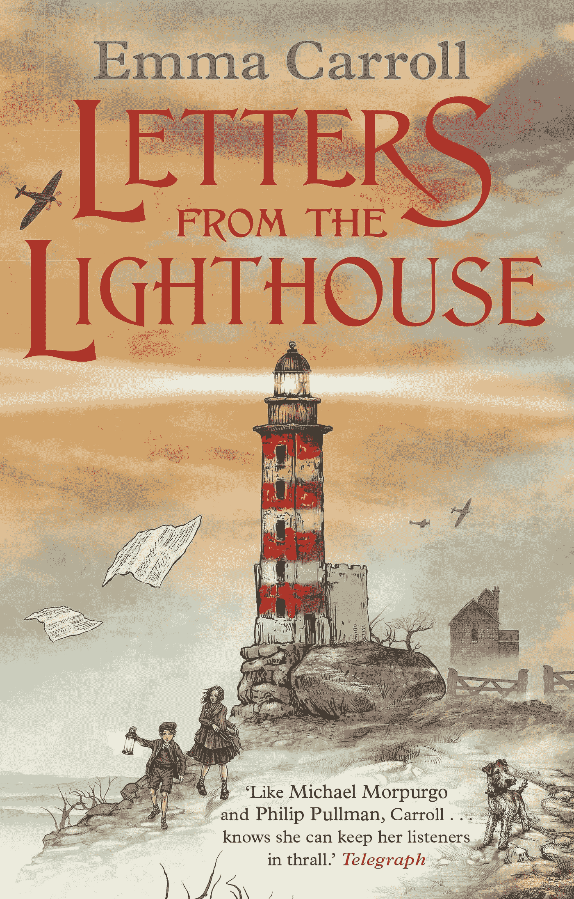

# 一本书如何改变我孩子的写作？

> 原文：<https://medium.com/swlh/how-a-book-transformed-my-childrens-writing-2f5a5659d2a4>

本学年早些时候，我读了一本书，从我开始读它的那一刻起，我就被吸引住了，并把我带回了 1940 年的二战。人物似乎跃然纸上，我被他们的集体故事深深吸引。那本书是艾玛·卡罗尔写的《灯塔来信》。当时我一点也不知道；这将会改变我课堂上的游戏规则。