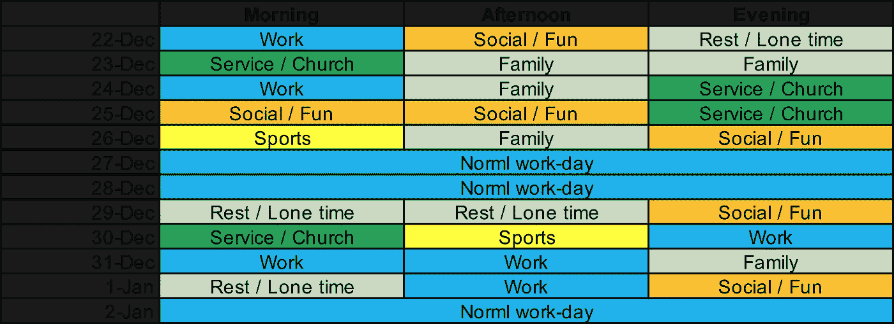
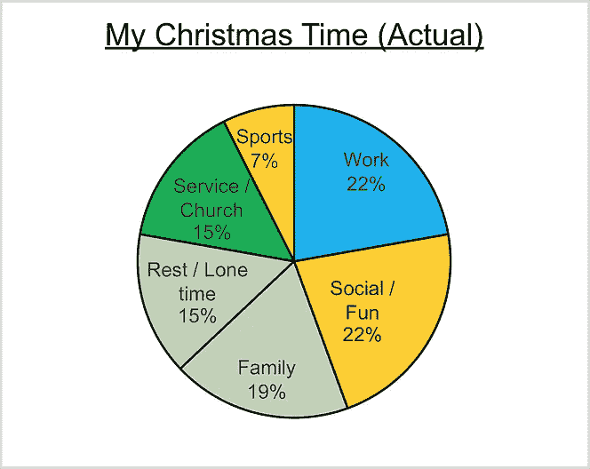
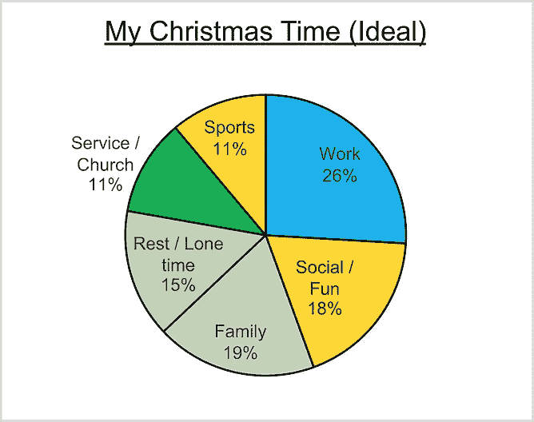
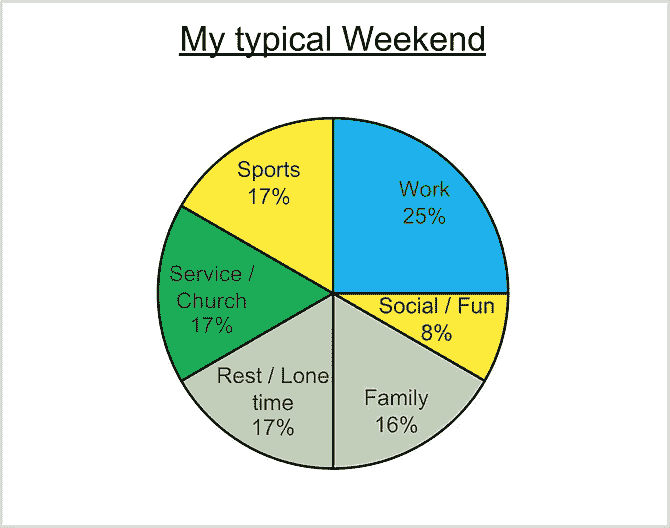
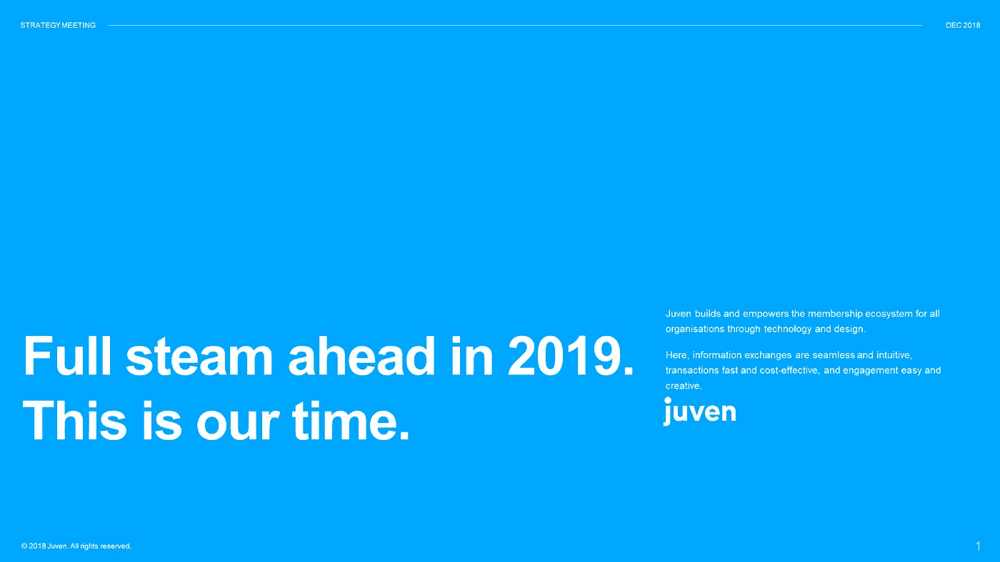
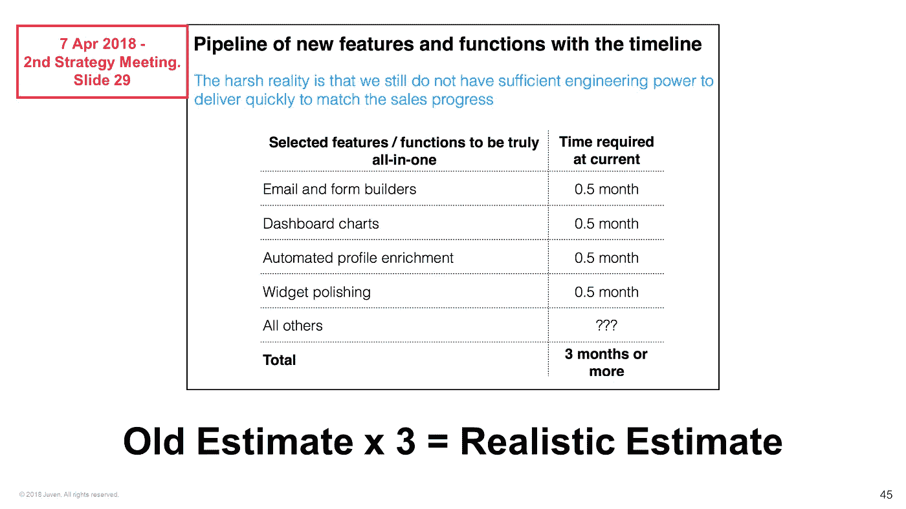
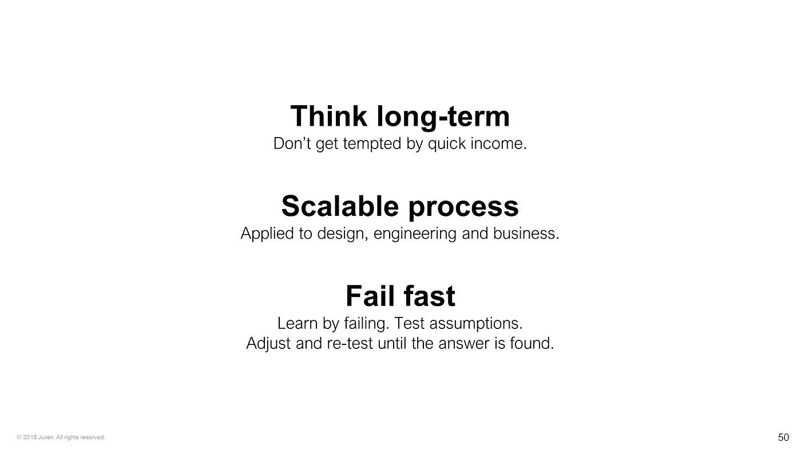
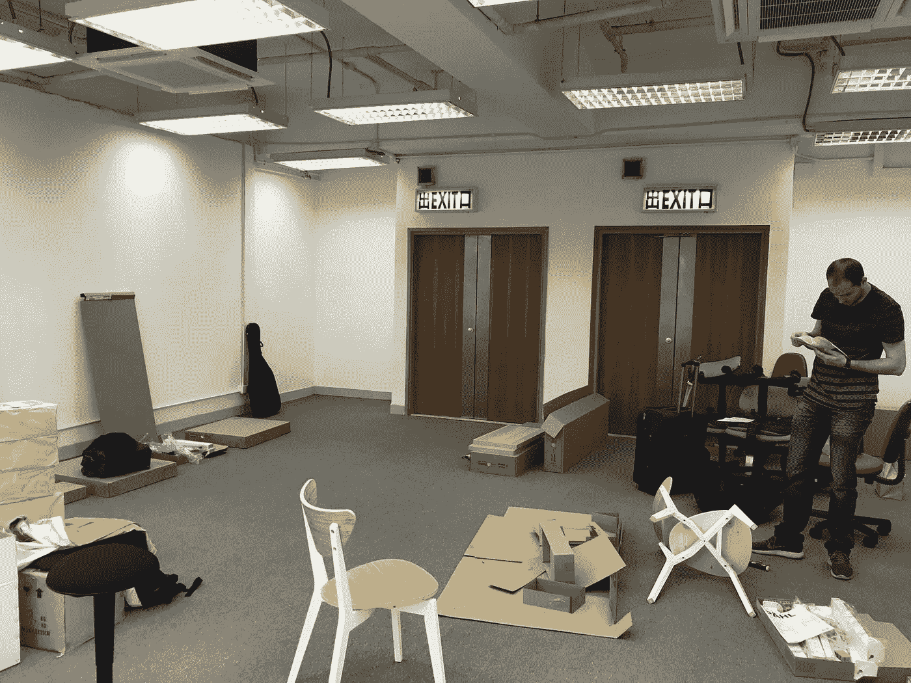

# 在完成 200 万美元的 A 轮融资后，Juven 的首席执行官如何度过圣诞节

> 原文：<https://medium.com/swlh/how-a-ceo-of-a-startup-spent-christmas-ac76d0eaa2ab>

## 我的冬歇期是如何影响尤文的，我从中学到了什么。

A concert I attended during the Christmas holidays

嗨，我是爱德蒙。2017 年 1 月，我[在香港联合创办了一家初创公司](https://juven.co/)，我担任首席执行官。像许多其他创始人和首席执行官一样，我有一个残酷的时间表。原因如下:我们正在建立一个组织平台，帮助人们将社区与组织联系起来。我们为各种规模和性质的协会、慈善机构、俱乐部、公司和组织提供服务。我们对自己的创业寄予厚望！

That’s me!

2018 年，与 2017 年相比，我们的组织用户账户和收入增长了 5 倍。我们的团队成员也从 4 人增加到了近 20 人。我们刚刚在 Juven 上达到了 1000 个组织账户的[里程碑](/@juven/1000-on-board-98f958f24dea)。由于巨大的产品和业务势头(以及好运)，我们设法在 2018 年底完成了两笔 Pre-A 轮融资中的第二笔，金额约为 200 万美元。我们的成交率接近 100%——这意味着对于我们争取到的每一个潜在投资者，我们几乎都已经成交了(请继续关注，我将在未来的帖子中讲述我们是如何做到这一点的)。虽然我受到成功的鼓舞，但我仍然感到筋疲力尽。

> 你可以想象，像许多其他创始人和首席执行官一样，我有一个残酷的时间表

你可以想象，初创公司的 CEO 们总是在全速运转。我也不例外。在雇用新员工、管理公司、向投资者推销和照顾关键客户之间，我和许多其他创始人和首席执行官一样，面临着身体、心理、情感、职业和精神上的不同挑战。所以，终于，在圣诞节和新年假期期间，我有了一个长假，我可以用它来偿还我对家人、朋友和我自己的“美好时光债务”。

我很高兴用这篇文章来回顾我是如何度过假期的，并与读者分享我的一些感悟。

在我开始在创业公司工作之前，我在香港的一家大银行做过一段时间的定量分析。自然地，在假期期间，我的定量自我开始在我的寒假做一些分析。为了简单起见，我把我做的每件事分成 6 类，“工作”、“家庭”、“社交/娱乐”、“休息/独处”、“服务/教堂”和“运动”:

My ideal spending of holidays compared with reality — pretty close to ideal

正如您从图表中看到的，我实际花费的时间非常接近理想值(尽管我本可以做更多的锻炼)。你可以在这里找到[我休息的具体细节](/@juven/the-exact-details-of-juven-ceos-christmas-and-new-year-break-405c596941a3)。

## 反思 1——每个人都很重要，包括首席执行官！

假期不仅让我有机会休息，也让我有时间把每个团队成员作为一个整体来思考，而不仅仅是他们的头衔、角色或专业能力。让我澄清一下我的意思:

作为首席执行官，从周一到周五，工作占据了 80-90%的清醒时间。周末的话，还是四分之一左右。然而，我知道，延长工作时间不一定会有进一步的帮助，从长远来看，实际上可能会损害质量和可持续性。所以假期给了我一个机会去思考作为一个完整的人，什么对我帮助最大。

支持我的最重要的因素是我的家庭。我的家庭真的是我个人的一块基石。因此，我很感激我的家人如此理解我，让我疯狂地工作，并经常错过和他们在一起的美好时光。

圣诞节期间，我花了更多的时间在“社交/娱乐”活动上，因为我欠朋友们“宝贵的时间”。但我觉得这有点过了。在正常的周末，我不喜欢花太多时间和朋友在一起或社交。相反，我通过独自阅读、思考或简单的休息来获得能量和提神。有一个清醒的头脑对于做出好的经营和战略决策是非常重要的。

教会和服务对我的精神生活、内心的平静以及在竞争激烈的商业世界中保持高情商和同情心都很重要。

运动对身体健康很重要。我喜欢打篮球，我过去一有机会就会去打。然而，与过去相比，这几个月我锻炼得少多了。我胖了一些，看起来没有以前那么精神了。健康的身体对过企业家的生活有明显的好处，我决定改变并将为此分配更多的时间。

如你所见，我身体、情感和精神健康的所有这些方面都会影响我的工作。这是在日常的忙碌中经常丢失的东西，事实上，我不得不为我的创业公司推动增长的残酷的工作时间表。但是如果我在这些方面做得不好，我会把这种能量带进公司。我的所作所为影响着我，因此也影响着整个公司。

创业团队的每个成员都会影响整个公司。由于我们的人数仍然很少，这一点尤其正确。每个团队成员都会影响办公室里其他人的情绪和精力水平。作为一个年轻公司的 CEO，我要为它和每一个队友的成功负责。

这里的教训是，我必须采取主动，积极主动地在我生活的许多方面和领域全面照顾我的福祉。这样，我就能给我的团队带来最好的正面形象和积极影响，这样他们也能发挥出最佳水平。

Juven investors and team members hanging out on a balcony

## 反思 2——产品，而不是销售，是增长的真正驱动力

Opening slide for our strategy meeting

12 月 22 日，我们与投资者和我们的团队召开了 Juven 战略会议。这是我们今年的第四次战略会议。会议总结了这一年，回顾了我们如何从我们两个联合创始人开始建立这家公司。能够思考公司和我们产品的历程是件好事。

Realistic estimations are crucial in managing client expectation

我们学到的一件事是，虽然我们必须有远大的梦想和雄心，但我们也必须在这些雄心与开发产品的工作量的现实估计之间取得平衡。这对于规划产品开发以及管理客户的期望来说尤为重要。

在这两年中，我们还了解到，推动增长的真正关键因素不是销售，而是打造真正伟大的产品。

早期，我们对我们的产品有一个大致的想法，但是它没有经过市场的检验。自然，我们认为这是惊人的。所以当我们最终得到第一个客户时，我们发现我们的产品实际上在很多方面都需要改进。我们正在做的事情也不可扩展。最终我们不得不彻底改造一切！这很痛苦，但却是必要的。但是一个伟大的产品是要自我推销的！我们今年的经历确实证实了这一教训。

Another 3 lessons

## 反思 3——改变常规会有意想不到的好处

12 月 24 日上午，这是香港的一个工作日，我走进新办公室监督互联网的安装。我告诉团队的其他成员在家工作，那天放松一下。然而，我们的开发人员迪迪埃也来到了办公室。

Putting chairs together with Didier

我还花了一些时间制作了一些我们买的宜家家具。作为首席执行官，我没有时间花在这种琐事上。事实上，在常规操作期间，如果我这样做，我将会错误地管理我的时间。然而，我是一个手巧的人，因为这是一个比较慢的一天在办公室(因为平安夜通常是商业慢)。我们的工程师(当然是软件)Didier 忠于他的职业，证明他对物理工程也很有帮助！

我已经有一段时间没有做这么方便的事情了，我真的开始喜欢自己了。在我们做了一些椅子和桌子后，我们一起吃了午饭，聊得很开心。

我的想法是，有时放慢脚步，改变我们的日常生活，让我们尝试一些新的、超出我们常规的东西，从中我们可以受益，用新的视角刷新我们的思维。在这种情况下，我不得不与一位我通常不会花太多时间相处的同事建立关系，帮助我建立关系，这最终也会积极地反馈到公司。

## 还有一点

就在新年之前，我收到了关于我作为尤文 CEO 的表现的反馈。我得到了三条建议:领导纪律和激烈，设定正确的基调，不断挑战自己和公司，以实现最大的业务可持续性。我认为我收到的反馈可以成为你感兴趣的一篇文章的主题，所以请继续关注！

我希望我的思考能让你对香港一家科技初创公司的首席执行官的生活有所了解，并对在初创公司工作的非凡挑战(和回报)有所了解！下次见。

> Juven 开发集成的组织平台软件，使各种组织能够建立、参与和发展社区。我们认为，组织应该能够获得美观、直观和可靠的工具，以产生更大的影响。

## 这篇文章发表在[《创业](https://medium.com/swlh)》上，这是 Medium 最大的创业刊物，有+411，714 人关注。

## 订阅接收[我们的头条新闻](http://growthsupply.com/the-startup-newsletter/)。

