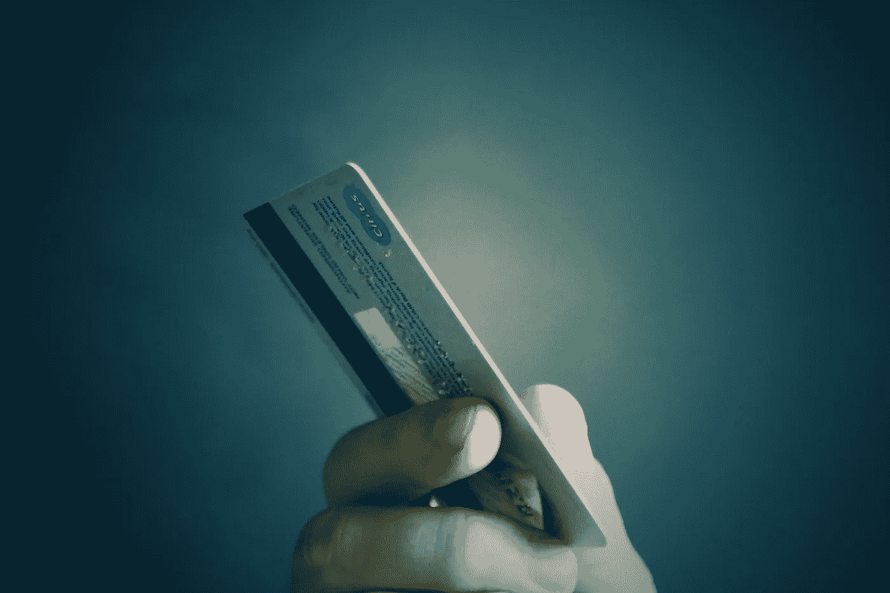

# 一个免费的地铁三明治如何导致十年的信用卡债务

> 原文：<https://medium.com/swlh/how-a-free-subway-sandwich-led-to-a-decade-of-credit-card-debt-869d2a984df4>

## 为什么银行爱理财无知的大学生

Image by [mastersenaiper](https://pixabay.com/users/mastersenaiper-4157718/) on [Pixabay](https://pixabay.com/photos/credit-card-card-credit-2308179/)

大学生喜欢便宜的食物。免费的食物更好。

在南加州一个温暖、阳光明媚的下午，我走出教室，感觉很饿。我在一所私立大学读大学一年级，已经几个月了。