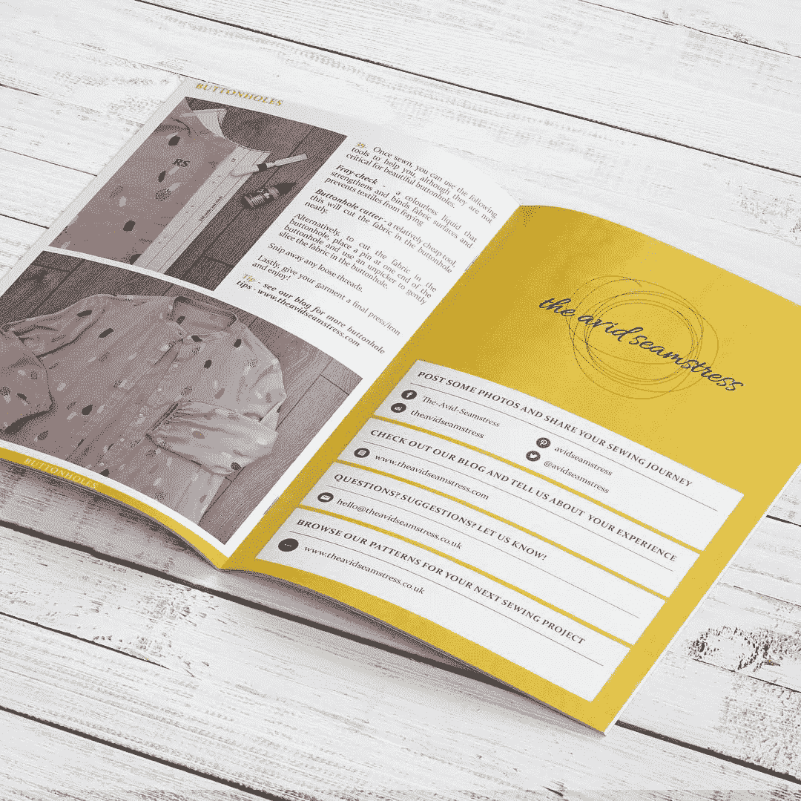

# 一本杂志如何帮助你增加销售额

> 原文：<https://medium.com/swlh/how-a-magazine-can-help-increase-your-sales-f3ea5ab2a08e>

Credit: [Mixam](https://mixam.com/magazines)

作为一家企业，你应该随时准备在提高销售额方面多做努力。致力于扩大品牌的公司转向了最不可能的地方。

只有当它恰当地向目标受众展示其产品和服务时，业务才会增长。最好计划最有效的方式来展示你的服务和结果。

拥有一本商业杂志或创办自己的商业杂志是一个很好的销售助推器。商业杂志使产品营销变得容易，视觉展示总是更好。事实上，当每月至少阅读一本杂志的人被问及他们更喜欢阅读他们最喜欢的杂志的印刷版还是电子版时，44%的人选择了印刷版，相比之下，只有 27%的人声称只阅读电子版。因此，为了增加销售，你可以创办自己的杂志，分发给你的目标观众。

以下是为什么创办自己的印刷杂志并将其用于广告可以导致销售增长的一些主要原因。

**1。获得更多品牌认知度**

今天，为你的品牌获得曝光率的最快方法之一是分享对你所追求的客户类型有吸引力的有用内容。大多数企业通过制作数字内容(或管理在线内容)来吸引追随者和展示品牌。

不仅如此，一份成功的杂志还能带来可观的广告收入，同时你还能支付[杂志的印刷成本](https://mixam.com/magazines)并吸引新订户。将这些订阅者的电子邮件放入你的邮件列表，用于促销和新产品发布。因此，你的生意会得到很好的曝光，你的品牌会被很多人知道。

**2。利用它进行激光定向营销**

当你确定了目标受众后，推销你的产品就变得很容易了。在自己的杂志上做广告，这绝对是最大的优势。有什么比创办一本人们喜爱的杂志更好的方法来在你的领域找到读者呢？

你可以利用这些观众来发展你的业务，这将直接导致销售额的增加。例如，如果你在销售一种针对父母的产品，你可以创办一本育儿杂志。这样你可以确保那些真正对你的利基市场感兴趣的人会看到你在杂志上投放的广告。最后，这一切都是为了让你在杂志印刷上的投资获得正回报，拥有目标受众将帮助你实现这一目标。

**3。让你的内容(和广告)在货架上持续很久**

你上次去候诊室是什么时候？如果你记得的话，你会注意到阅读桌上有相当多的杂志，也许还有几份报纸。由于印刷杂志是用高质量的纸张制作的，它们往往比报纸寿命更长。

此外，报纸每天出版(在某些情况下，每周出版)，而不是像大多数杂志那样每月出版一次。这就是为什么杂志在阅览室和图书馆的书架上停留的时间更长。

最重要的是，你将在印刷杂志上找到的内容通常比你在报纸上找到的内容质量更高，这就是为什么更多的人会通过它们来寻找和阅读有趣的文章。当然，这会增加人们在那里看到你的广告的可能性。

**4。与在线媒体相比，让您获得更多的广告参与度**

对于杂志，你可能会注意到与在线媒体相比更高的参与率，因为人们实际上会拿起杂志认真阅读。这不像一个网站，大多数人只是浏览内容，通常会忽略他们在页面上看到的广告。另外，当有人读完一本杂志后，他们可以把它给他们的朋友或亲戚看，这意味着更多的读者会注意到你的广告。

**5。它可以成为贵公司的一个独立媒体部门**

现在，这是你的杂志最好的情况。你可以扩大规模，让它变得足够大，成为一个独立的媒体部门，为你的公司创造收入(和利润)。你的杂志甚至可以成为一个很好的博客。一旦人们开始关注博客或杂志，就会有很多人阅读你的内容和观看你的广告。这将增加你的业务收入，并广泛宣传你的品牌。

因此，拥有一本杂志不仅会增加你的销售量，还会增加你接触到的广大读者。

## 这篇文章发表在[《创业](https://medium.com/swlh)》上，这是 Medium 最大的创业刊物，有+432，678 人关注。

## 在这里订阅接收[我们的头条新闻](https://growthsupply.com/the-startup-newsletter/)。

