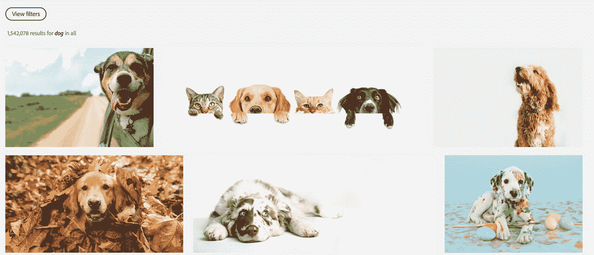
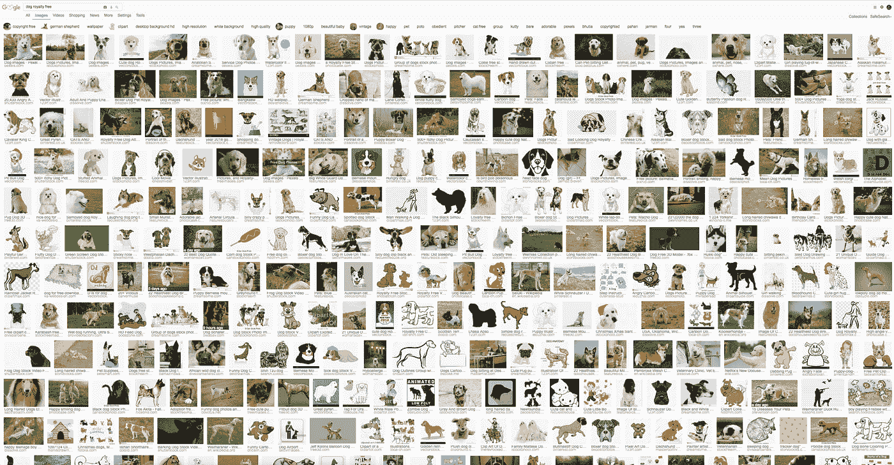

# 人工智能如何改变库存照片库市场

> 原文：<https://medium.com/swlh/how-ai-is-transforming-the-stock-photo-library-market-150a18e413cd>

降低成本、扩大规模和增加市场潜力

目前，全球领先的图片库中有 10 亿张图片待售。这些形象的 75%由前 4 名玩家持有。任何收藏的总规模都暗示着可信度，并让用户安心，因此他们更有信心找到他们需要的东西。但是定期下载的图片的实际数量只占可用数量的一小部分。领先馆藏的大规模和多样性对新的提供者来说是一个进入壁垒，但也产生了处理、存储和检索的连锁成本。

拥有大量用户(摄影师和顾客)支撑了月订阅模式的价值。订阅基于每个图像的低 ASP(平均售价),在一个大的经常性客户群中运行。吸引和留住顾客至关重要，这依赖于供应商拥有足够多样化的收藏来满足每个用户的需求——真实的或感知的。然而，一旦照片集合达到相当大的规模，并且需求水平相对固定，手动处理、存储和检索的时间和成本就会导致收益递减。

需要新的内容来保持系列的新鲜，并涵盖新的时尚、风格和趋势，但很难找出哪些新图像是真正的添加剂。随着时间的推移，一些旧风格的内容会失去价值，但大多数多面手摄影在未来仍保留一些价值。估计每个新图像的寿命值不是一件简单的任务。

潜在的挑战是图像捕获的规模和速度呈指数级增长，而最终用户的需求变得越来越挑剔。随着越来越多的库存被接收，为每个用户呈现最相关的内容并相应地扩展流程变得越来越困难。

人工智能提供了一条前进的道路。

# 人工智能正在改变照片库经济学

深度学习是人工智能和机器学习的一个子集，现在正在提供重新确定运行大规模照片库的成本结构的能力，并为新工具提供动力以改善用户访问。在过去的 5 年里，深度学习的学术领域已经改变了语言和视觉的检测和分类。这些工具现在可以用作图像库产生价值的基本组件。

大多数垂直行业的领先企业在过去的 1-2 年里一直在用新的深度学习技术进行实验和试点，从而对其跨领域的适用性和未来价值有了更广泛的理解。在股票照片市场，主要参与者正在进行收购，建立内部团队，并测试围绕深度学习技术构建的解决方案。

在 Pimloc，我们已经能够与一系列商业和遗产图书馆合作，以建立对深度学习现在和未来可以带来的价值的实际理解。我们看到深度学习正在以两种主要方式从根本上改变照片库的运营:

1)降低运营成本:加快并取代手动处理，支持使用更大规模的平台

2)增加收入:增加相关渠道的内容曝光率，推动销售转化/使用

# 1 —流程自动化/降低成本

很大一部分图像接收和处理仍由人工管理。照片库投入资源以确保进入系统的数据质量:验证/编辑来自摄影师的元数据，检查图像内容和质量，重新格式化，修饰，裁剪，标记和字幕。越来越多的内容可供使用，但处理所需的成本和时间也成比例增加。

手动注释和图像分级不可避免的可变性(通常由大型离岸团队执行)降低了上游资产价值。元数据的质量和可比性完全决定了哪些图像随后会通过搜索浮出水面。这些过程的自动化和增强不仅允许更快地处理图像和视频，还提供了更可靠和可重复的元数据和搜索索引创建方法。

采用这些新功能的图像库将在中期内建立竞争优势，并有能力保持这一地位。拥有利基、专业产品的较小提供商将会生存下来，但如果无法获得显著的技术平台优势，经营通才产品将变得越来越困难。

自动化图像处理可用于加快新图像的摄取，并对现有和遗留集合中的元数据进行经济高效的清理。对重复/近似重复内容、元数据质量和内容重叠的检查同样适用于这两项任务。快速处理大型集合的能力也为从市场上不断增长的捕获设备和渠道中引入新类型的视觉内容创造了机会。

使用大量带注释的照片数据通常是训练深度学习模型的优势。但是模型构建者需要敏锐地意识到他们训练集中的任何固有偏差(即性别/年龄/种族和标记语言/术语的权重)。适合于每个分类任务的神经网络的设计、调整、训练和测试需要专业知识、经验、时间以及平衡的训练数据集。

关注元数据是如何生成、检查和存储的，将来会有好处。例如，语言环境是一个重要的问题。相同集合的用户使用相同的文本标记语言，但是根据当地文化以不同的方式搜索和浏览。

随着这些新方法的引入，它们提供的访问和可用性方面的改进将成为与收藏内容本身一样多的战略资产。对于图书馆业务来说，它们节约了成本，提高了服务质量，增加了资产价值。对于顾客来说，它们提供了与整个系列的强大联系，以及留在现场寻找和购买图像的强大理由。这将在下一节中详细讨论。

# 2 —服务创新/增加收入

**驱动向上转换**

大多数图像库主要将人工智能视为降低成本的一种方式，而不是其增加市场份额并最终扩大整体市场规模的潜力。

让我们假设，在短期内，对图像和视频内容(即每天主动搜索照片使用的人数)相对固定。对于一个图片库来说，最关键的挑战是如何将尽可能多的网站访问者转化为顾客。

对于一个搜索一只狗的图片的用户来说，返回一大堆缩略图(根据上面的搜索结果是 1.5m)并没有特别的帮助，除了让用户确信他们需要的图片可能就在某个地方——如果他们能找到的话。即使指定了狗的品种，用户的挑战仍然是巨大的。基于文本的标签搜索很少在结果的前几页中提供所需的图像。

从我们在这一领域开发系统的工作中，我们知道用户的搜索策略需要从文本快速切换到与图像集合的视觉内容直接交互。他们的搜索优先级可能涉及图像中某些对象的细节、整体场景或背景、色彩、风格、布局或色调。这些细节可能很难或不可能用简单的文字来表达。

在未来，大多数搜索仍然可能从基于文本的过滤器开始，但用户将很快开始更直接地与图像互动，以此作为改进搜索的手段。

***“文本图像标签过于约束和二进制，无法帮助发现创意图像”***

在 Pimloc，我们构建了深度学习应用程序，为最终用户提供工具，根据用户与图像内容的直接交互，快速浏览视觉结果。标签是开始搜索的有用且必要的锚，但是一旦图像的子集(例如 100s — 1000s — 1Ms)浮出水面接受审查。为了最大化现场转换，照片库需要为用户提供更灵活的发现工具，允许快速(和愉快地)探索图像的动态子集。

一旦这些工具到位，转化的主要障碍就变成了定价和库存——这两者目前都是通过订阅和更大的收藏规模来管理的。

随着时间的推移，深度学习系统可以被设置为基于个人用户、群体和特定频道的过去使用和/或当前发布的图像来学习其独特的视觉偏好。可以在搜索结果中自动进行精选推荐，从而基于用户偏好提供不同的初始结果排名。随着时间的推移，这可以允许系统提高搜索初始阶段的性能。但是基于内容的工具总是需要的，以确保提供商在所有搜索上最大化转化率。

**提高曝光度**

一旦工具到位，以最大限度地提高现场转换，挑战就转变为将更多的可用市场与供应商的图像联系起来。

作为占主导地位的搜索引擎，谷歌图像搜索已经成为许多需求挖掘活动的重要组成部分。Google 将网络上与图像相关的元数据编入索引，包括股票图书馆网站。它拾取显示在每个照片页面上的图像标题/描述/标签，并使用它们来显示与用户图像搜索查询相关的图像。

谷歌没有明确透露其排名算法，但众所周知，它降低了重复内容的权重，并试图专注于提供相关/高质量的结果。当应用于具有大量相同或接近相同的文本标签和遍布数亿张图像的标题的集合时，这两者都很难实现。深度学习技术可以提供一种基于更细粒度的图像分类自动生成“唯一相关”照片描述的能力，以限制元数据重复并确保相关性。

除了图像搜索引擎，每天还有数百万人使用的大量内容发布、创作和编辑平台。深度学习系统可以为特定平台索引图像内容类型，并使用这些内容来创建配置文件，以将其主要集合的子集服务于更专业的领域。

在 Pimloc，我们已经创建了一个原型系统，可以在写作时分析文案，并自动建议将相关图片直接插入到文章或博客中。这是一种在小规模下使用人工管理的图像集效果良好的策略，但需要自动化系统来优化全球渠道。将相关图像和视频内容直接注入领先的发布平台，可以消除使用单独搜索平台的摩擦，推动用户将图像添加到出版物中。

随着时间的推移，获胜的照片提供商很可能是那些将多样化的照片库存与搜索和编辑它们的最佳工具结合在一起的人。

如果您有兴趣了解更多基于图像的过程自动化和/或新形式的基于图像的搜索工具，请通过以下方式联系:

西蒙·兰德尔【simon@pimloc.com 号

更多关于 Pimloc 平台的信息可以在[www.pimloc.com](http://www.pimloc.com/)找到

## 这篇文章发表在[《创业](https://medium.com/swlh)》上，这是 Medium 最大的创业刊物，有+440，678 人关注。

## 订阅接收[我们的头条新闻](https://growthsupply.com/the-startup-newsletter/)。

