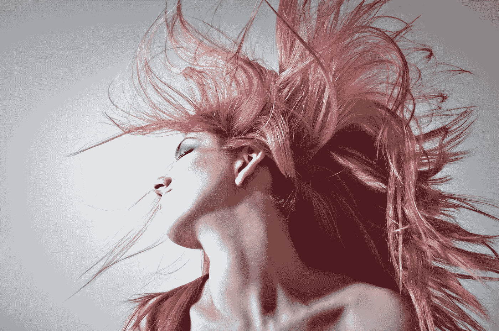

# 一个发型师如何让我意识到我是多么的近视

> 原文：<https://medium.com/swlh/how-an-hair-stylist-made-me-realize-how-gorgeously-myopic-i-was-ce8122b3ade9>

事情发生在 2016 年，至今记忆犹新。

Photo by [George Bohunicky](https://unsplash.com/photos/qJKT2rMU0VU?utm_source=unsplash&utm_medium=referral&utm_content=creditCopyText)

我遇到了一个发型师。她给了我一个惊喜。

在那之前，社会企业家在我脑海中勾勒出一幅画面——他们通过更好的住房、餐桌上更多的食物、更好的卫生设施、更好的教育、更好的生活、小额贷款等等来倡导生活水平的提高。在我的…