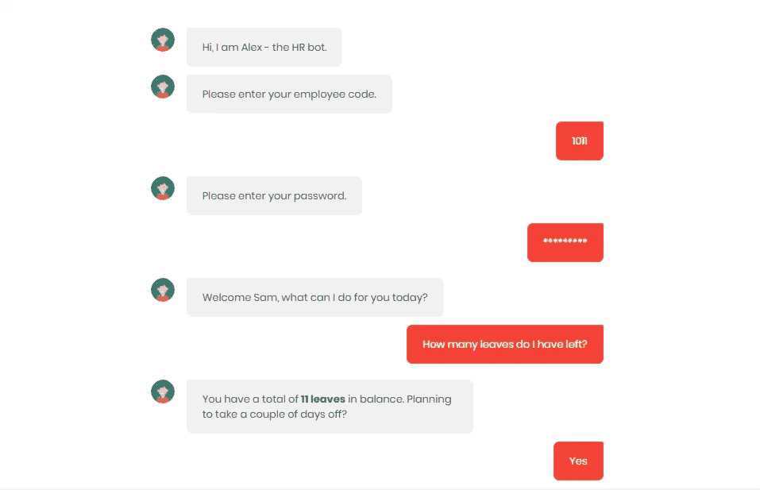

# 聊天机器人是如何扰乱人力资源领域的

> 原文：<https://medium.com/swlh/how-are-chatbots-disrupting-the-hr-space-d88d3c7c2973>

## 聊天机器人可以使人力资源更人性化——了解如何…

人力资源领域似乎不适合实现聊天机器人；毕竟，它是“人力”资源。但令人惊讶的是，人力资源聊天机器人可以让当前的人力资源场景更加人性化。在这篇文章中，我解释了聊天机器人将如何帮助你精简人力资源部门。

你的人力资源团队被你的员工的电子邮件和电话轰炸，询问重复的内部问题。对于人力资源团队来说，不仅要解决常见的内部问题，还要手动执行评估员工绩效和审核评估等流程，这既耗时又费力。

随着对话式人工智能的出现，聊天机器人现在越来越多地用于通过自动化操作和重复任务来简化组织流程。在过去的两年中，人力资源部门的聊天机器人帮助专业人员将时间用于战略和紧迫的工作，同时减少了在重复性和操作性问题上花费的时间。

招聘、培训新员工、登记福利、解决与工作场所相关的一般问题是人力资源部聊天机器人可以帮助员工的一些用例。

聊天机器人正在以下列方式扰乱人力资源:

## **1。公司相关常见问题解答**

员工通常会花大量时间寻找与公司相关的基本信息。有了人力资源聊天机器人，员工可以快速获得他们想要的答案，而不必搜索各种文档或网页。除了节省时间，这也提高了员工的生产力。

## **2。招聘**

回答有关职位空缺及其申请流程的常见问题，安排面试等。是一些耗费人力资源团队大量时间的运营任务。使用人力资源聊天机器人可以轻松实现申请流程的早期自动化。

如果你的公司收到大量求职申请，智能聊天机器人也可以被训练来筛选申请，并根据资格和经验等指标对候选人进行排名。

## **3。入职**

人力资源部的聊天机器人让新员工和人力资源团队的入职过程变得轻而易举。

人力资源聊天机器人可以处理日常入职流程，例如:

*   对新员工进行公司政策和合规性教育
*   澄清工作职能和绩效预期
*   公司着装规范

有了人力资源机器人，只有像帮助新员工建立跨部门关系这样的人际活动需要由人力资源团队来处理。

## **4。员工培训**

聊天机器人可以确保员工在培训期间进行更多的互动，而不是坐着看标准的培训视频或观看 powerpoint 演示。此外，通过人力资源机器人，员工可以按照自己的节奏训练自己，遵守规定的时间。

人力资源部的聊天机器人也收集员工的反馈，进行情感分析，这有助于衡量员工的情绪。

## **5。年度审查/评估**

人才管理的一个重要部分是进行年度评估。许多人力资源经理认为传统的审核流程已经过时且无效。人力资源聊天机器人可以方便地传递绩效见解和反馈，从而帮助人力资源团队节省时间，并轻松地与员工互动。

## **6。内部沟通和反馈**

组织中缺乏有效的沟通会导致员工沮丧和流失。通过有效放置聊天机器人，员工可以轻松获得公正的支持，接收信息并提供诚实的反馈。

## 7.员工排班

人力资源部门最耗时的任务之一是手动处理员工的排班请求，并在计划外缺勤期间填补班次。员工还需要登录不同的系统，或者向人力资源团队和经理发送一连串的电子邮件，以便申请休假。所有这些都导致孤立系统之间的大量导航和不必要的时间消耗。

有了聊天机器人，员工可以通过与机器人进行简单的文本交流，轻松地提出休假请求。聊天机器人还可以与后端人力资源系统和调度软件集成，将两者联系起来，消除手动执行日常管理任务的需要。

随着上述用例被人力资源聊天机器人自动化，以下是聊天机器人将如何使人力资源团队和组织受益:

## **提高效率**

人力资源流程的自动化提高了人力资源团队的生产力，也使工作变得更加轻松。人力资源中的聊天机器人为更好地管理他们的任务和提高生产力提供了帮助。

## **情感分析**

该机器人可以在几天或几周的时间里向员工提出一系列简短的问题。这基本上取代了反馈表格的旧的传统规范，同时给予人力资源部门可操作的洞察力，以便做出与流程或法规相关的重要决策。

## **多通道**

Chatbot 可以放在多个渠道上，如您的内部通信应用程序、公司网站或您公司使用的内部网。这消除了员工熟悉新应用程序或新系统的需要。

## **快速反应**

你的员工不必花时间去联系他们的上司或人力资源部的人。如果他们有问题，只要他们需要答案，就可以通过移动设备使用文本/语音直接与机器人交谈。

## **满意的员工**

聊天机器人让人力资源部门更加平易近人，因此有助于让员工满意。随着在运营任务上花费的时间减少，人力资源员工可以将时间投入到更有价值的活动中，如员工发展和欣赏。随着当前留住员工变得越来越困难，实施聊天机器人对提高员工满意度和留住员工大有帮助。

[**WotNot**](https://wotnot.io/) 是一个聊天机器人开发平台，让你专注于重要的事情。在 WotNot 的非凡旅程中，你可以[只需 **3 个简单步骤**就能体验到为你的公司量身定制的人力资源机器人](https://app.wotnot.io/preview/experience?url=&themeColor=%23F44336&alignment=right&templateKey=hr)。你需要做的就是:

1. [**输入您的网站**](https://wotnot.io/) **:** 您只需输入您想要提供一对一对话体验的网站名称。

2. [**选择模板**](https://app.wotnot.io/preview/choose-template?url=) **:** 从您需要聊天机器人的 15 个模板中进行选择(在本例中为 HR 模板)。

3. [**预览聊天机器人**](https://app.wotnot.io/preview/personalise?templateKey=hr&alignment=right&isPreviewed=0&url=&themeColor=%23F44336&templateTitle=Jade&botIcon=https%3A%2F%2Fapp.wotnot.io%2Fstatic%2Fimg%2Favatars%2Fz8376pCFUQvk152741913198pBl0YiP3_thumbnail.png) **:** 你没听错吧！在做决定之前，你可以免费预览你的机器人。

WotNot 使在您的组织中实现聊天机器人变得轻而易举！请点击这里注册免费试用[。](https://app.wotnot.io/preview/request-demo?url=&themeColor=%23F44336&alignment=right&templateKey=hr)

*Experience the HR template now!*

## 这篇文章发表在 [The Startup](https://medium.com/swlh) 上，这是 Medium 最大的创业刊物，拥有+426，678 名读者。

## 在这里订阅接收[我们的头条新闻](https://growthsupply.com/the-startup-newsletter/)。

