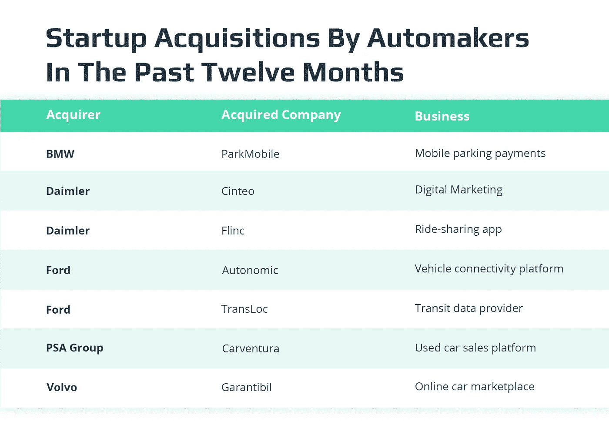
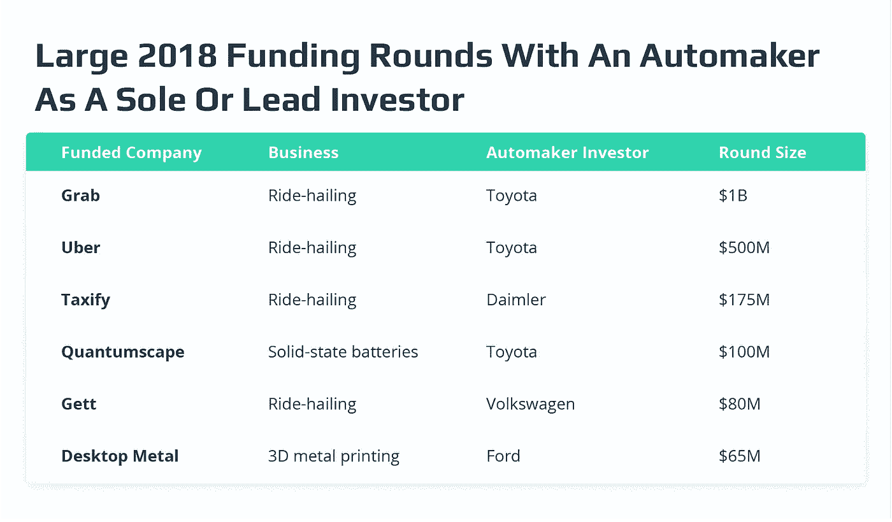
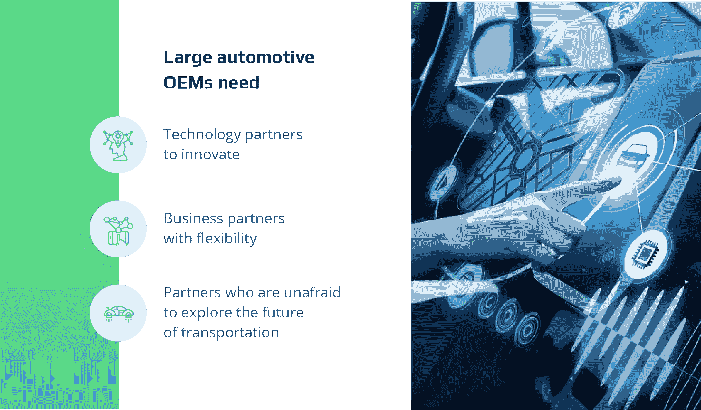

# 汽车原始设备制造商如何与创业公司合作创造新机遇

> 原文：<https://medium.com/swlh/how-automotive-oems-partner-with-startups-to-create-new-opportunities-7d271bf650a7>

建立与不同类型的初创公司合作的战略方法，以激发创新并找到新的盈利工具。

为什么汽车厂商需要稳定的创业伙伴？

技术革命正在如火如荼地进行，汽车制造商必须适应。生存下来的不是最强的，也不是最聪明的，而是那些对变化最敏感的人。快速大胆的技术进步并不是主要汽车制造商的特长。这就是为什么原始设备制造商需要创业公司来创新和引领数字化转型。另一方面，创业公司需要公司成长并保持运营。因此，合作是双赢的局面。

*来源:* [*嘎吱嘎吱*](https://news.crunchbase.com/news/automakers-pump-record-sums-into-startups/)

最大的汽车制造商，包括福特、宝马、丰田和通用汽车，已经在过去五年中与初创公司合作。例如，福特[收购了](https://www.wired.com/2016/09/ford-acquires-demand-shuttle-service-chariot/)战车穿梭服务，而[通用汽车收购了](https://media.gm.com/media/us/en/gm/home.detail.html/content/Pages/news/us/en/2016/mar/0311-cruise.html) Cruise Automation，以推进自动驾驶汽车的发展，并在汽车市场上获得优势。

> *“Cruise 为我们公司提供了独特的技术优势，这在我们的行业中是无与伦比的。我们打算大力投资，进一步发展邮轮团队已经建立的人才基础和能力。”*
> 
> *—通用汽车公司执行副总裁马克·瑞斯*

因此，让我们更深入地探讨这个主题，定义原始设备制造商在考虑与初创公司合作时要遵循的策略，以及他们需要克服的可能挑战。

# 汽车创业公司的类型

首先，有必要明白，并非所有的初创公司都生来平等。

自动驾驶汽车行业有超过 260 家创业公司。但是，与名单上的任何人合作都不会成功。只有深入分析一家初创公司的重点和潜力，才能让原始设备制造商决定最佳匹配，以加强他们的市场地位。

汽车的未来在于增加的移动性、位置数据和服务的使用、高级人机交互、网络安全、物联网平台、驾驶员安全和地图解决方案。这些技术提供了高质量的汽车共享体验，并支持自动驾驶。原始设备制造商的目标是找到一家已经证明有能力以低成本快速创新的后起之秀。根据 [CrunchBase](https://www.crunchbase.com/hub/automotive-startups) 数据池，自 2012 年以来，有超过 1000 家汽车初创公司获得了 260 多亿美元的资金。

这些汽车初创公司大多处于单一的技术垂直领域，专注于移动性问题，如拼车、用电驱动汽车和人工智能联网汽车。

*来源:* [*嘎吱嘎吱*](https://news.crunchbase.com/news/automakers-pump-record-sums-into-startups/)

汽车原始设备制造商可以从与初创公司在三个主要领域的合作中受益匪浅:硬件、中间件系统/平台和应用。在选择了一个或几个需要外部投入的专业领域后，与初创公司建立合作也有不同的方式。

## 硬件创业公司

硬件初创公司正在开发突破性的汽车硬件和成功的产品，如用于自动驾驶的[传感器](https://www.intellias.com/sensor-fusion-autonomous-cars-helps-avoid-deaths-road/?utm_source=medium.com&utm_medium=referral&utm_campaign=IS&utm_content=oems%20and%20startups)。不像软件公司那样只有几个开发人员就能维持运营，硬件公司发现组建团队更加困难。这样的创业公司需要硬件工程师、产品设计师和软件开发人员来完成工作。由于硬件的构建既昂贵又复杂，因此从一开始就需要付出更多的努力。与硬件初创公司合作让原始设备制造商能够立即获得关键的人才库。

## 中间件系统/平台初创公司

汽车行业的中间件系统或平台就像任何设备上的操作系统。它们使所有的软件和应用程序协同工作，允许顺畅的通信和数据管理。由于对车载应用和软件解决方案的需求不断发展，对中间件系统的需求不断增加。

## 应用初创公司

汽车应用业务通常始于一个想法。它们提供了一种独特的方法，在车载软件和应用程序的帮助下解决日常挑战。应用程序初创公司专注于提供突破性的解决方案，并为他们所在的领域带来创新。接近一个应用程序/软件开发的启动，原始设备制造商得到了一个准备好生产高质量产品的创造性思维的池。

# 汽车制造商和汽车创业公司:为什么、何时和如何？

汽车制造商和创业公司之间的关系并不容易。为了理解这些关系的复杂性并汲取积极的经验，我们需要看看拥有创业伙伴的好处和坏处。

需要一个稳定的创业伙伴不仅仅是一个噱头。这里的问题是，原始设备制造商开发一辆汽车可能需要长达 7 年的时间。而对于一家初创公司来说，开发一个硬件可能只需要一年，开发一个应用可能需要几个月。一旦汽车投入生产，它们可以被使用几十年。失去一个开发汽车关键部件的技术合作伙伴，对于汽车的持续维护和原始设备制造商的品牌形象来说，代价是巨大的。

推出自动驾驶汽车的动力越来越大，这是汽车制造商和汽车初创公司之间交易的主要因素之一。 [CB Insights 通知](https://www.cbinsights.com/research/autonomous-driverless-vehicles-corporations-list/)目前有 46 家公司正在努力推动自动驾驶汽车，包括特斯拉、苹果、戴姆勒、日产、奥迪、捷豹以及本文前面提到的所有其他汽车制造商。然而，当与自动驾驶汽车初创公司合作时，他们的努力变得更加重要。

## 与创业公司合作的好处

在小企业的帮助下，公司可以更快地扩大规模。初创公司提供了获得尖端技术、专业团队的途径，因此也提供了更快的发布速度。创新是提供未来竞争优势的一种行之有效的方式。因此，为了捍卫自己的战略地位并站在市场发展的最前沿，企业应该与对真正的颠覆性技术和解决方案更加开放的外部创新者合作。

此外，如果不与新的解决方案提供商合作，原始设备制造商可能会错失潜在的收入来源。专注于颠覆和更少管理成本的初创公司是一个答案。

创业公司也可以给老式组织带来敏捷文化。在今天的商业世界中，培养一种企业家文化，对创新和新的、创造性的业务流程持开放态度，这是非常有价值的。

## 与创业公司合作的缺点

不是每个汽车制造商-创业交易都有好的结局。选择错误的合作伙伴会让公司损失一大笔钱，所以在采取任何严肃的措施之前，挑剔并了解所有的风险是至关重要的。以通用汽车为例:两年前他们在 Lyft 的 5 亿美元投资[今天还没有回报](https://jalopnik.com/gm-dumped-500-million-into-lyft-but-its-not-really-wor-1826793919)。

为什么这种伙伴关系会失败？

以下是一些可能影响情况的因素。

*   初创企业和原始设备制造商在规模和结构上的差异
*   提供不同的产品(软件与车辆)以及产品生命周期跨度和生产速度的差异
*   初创企业需要持续的资金支持，OEM 对失败的容忍度低
*   创业文化带来的敏捷和更快的步伐
*   将几十人整合成几千人具有挑战性，可能不会取得成功
*   共享/获取知识产权，同时拥有不同的安全协议
*   心态和年龄的差异导致意见不一致

# 汽车原始设备制造商如何从与创业公司的合作中获益的策略

1.  **收购硬件初创公司**

最好收购硬件初创公司，以便立即进入人才库。初创公司的整合过程必须缓慢进行。这样做的原因是，你不想拆除吸引人才的创业文化。通过保持创业公司文化的完整，原始设备制造商有更好的机会在他们的公司结构中留住新员工。

**2。与中间件/平台初创公司建立合作关系**

中间件系统/平台初创公司渴望得到一个固定的合作伙伴，如汽车 OEM。公司可以投资共享股权，同时确保它们对初创公司的技术路线图产生影响。最重要的是，原始设备制造商需要计划如何采用初创公司开发的产品来满足他们的需求。最后但同样重要的是，原始设备制造商必须愿意在其他主要市场参与者和消费者中积极推广新开发的系统，以确保其普遍应用。

**3。吸引应用创业**

由于应用程序初创公司专注于提供产品和服务，他们很容易被你的客户所吸引。原始设备制造商需要确保他们建立的生态系统对应用和服务提供商有吸引力，同时不影响用户的移动性。

# OEM 创业生态系统的未来会怎样？

通过将汽车发展的谨慎和缓慢与创业公司的快节奏联系起来，你可能会在两个方向上都遇到挫折。那么，原始设备制造商究竟为什么会继续吸引创业公司，并渴望创造互利的生态系统呢？

原始设备制造商将初创公司视为帮助他们创新的可靠技术合作伙伴、帮助他们扩大规模的灵活业务合作伙伴，以及不惧借助技术探索交通运输未来的合作伙伴。

今天，有几个大的汽车联盟，例如日本的丰田、美国的菲亚特-克莱斯勒和德国的大众汽车公司。它们中的每一个都是大型 OEM，试图与顶级初创公司一起建立自己的先进生态系统。他们可以在一定程度上成长和成功。然后他们将需要加入其他人的规模。

与苹果和谷歌的故事相比，我们认为它们是移动生态系统中的两个关键角色。他们的故事是独特的，因为这个行业是新的，没有很多参与者，这意味着竞争更少。汽车原始设备制造商没有这种奢侈，因为汽车行业供应商过多。在这种环境下，显然需要一个大型联盟来建立一个单一的移动生态系统，以与这些科技巨头竞争。这可以通过互利和务实的方式实现，如 [HERE 开放位置平台](https://www.here.com/en/vision/innovation/here-open-location-platform)，这是一个查找和使用位置数据和服务的单一位置。这里收集了大量可用于自主和未来移动服务的数据。

这种大型联盟可能会成为应对技术给汽车行业带来的新挑战的答案。请继续关注以获得更多见解，不要犹豫，请联系我进一步讨论这个话题。

## 这篇文章发表在[《创业](https://medium.com/swlh)》上，这是 Medium 最大的创业刊物，有+431，678 人关注。

## 订阅接收[我们的头条新闻](https://growthsupply.com/the-startup-newsletter/)。

