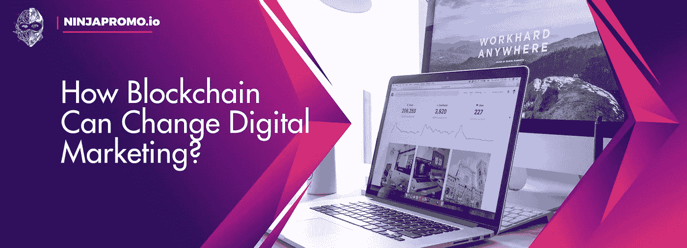
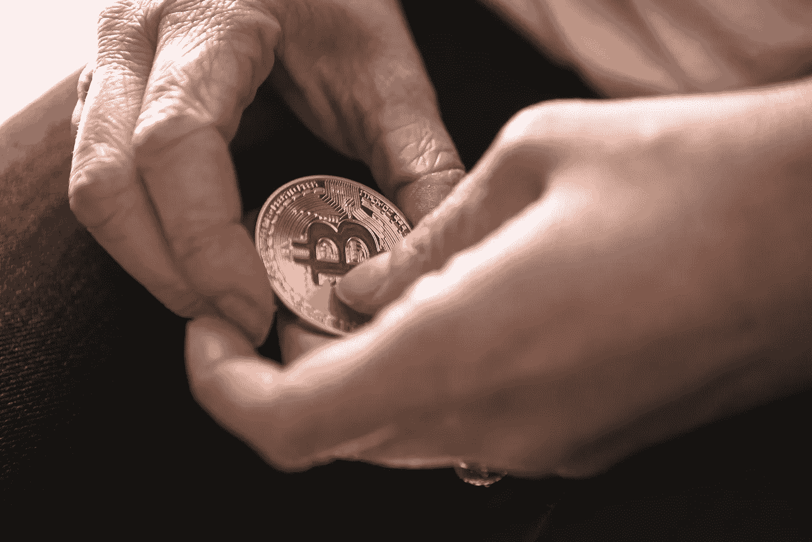

# 区块链如何改变数字营销？

> 原文：<https://medium.com/swlh/how-blockchain-can-change-digital-marketing-c0cbc27a664c>

新时代，新技术，新观点…

只有在 90 年代，我们见证了互联网如何改变传统营销，现在我们可以观察区块链如何在数字世界中做同样的事情。NinjaPromo 决定深入研究一个问题。

# **区块链如何改变一切？**

区块链最重要的一点是，它将彻底改变做生意的方式。首先，这是一种与客户互动的创新方式。

这是因为区块链是一个普通、可靠和公共的系统:“你可以看，但你不能碰”

区块链没有中央政府。由于个人关系的这一元素，买家可以控制他们的数据，并查看他们是如何使用和共享的。

# **区块链如何影响营销人员？**

电视和网络广告的发展导致了大量垃圾邮件和机器人的出现，因此成立了新的公司来解决这些问题。更高的透明度加强了品牌和客户之间的信任。得益于区块链，整个广告生态系统正在进化。

例如，在沃尔玛和 IBM 开始合作后，顾客的信心增加了。因此，超市的供应链变得更加透明。多亏了区块链，客户能够追踪产品的来源。

**这里还有一些营销人员如何使用区块链的例子:**

*   验证广告投放:确保真人在规定时间内观看了广告。
*   验证广告的参与度或有效性。
*   防止相同的广告再次显示给用户，设置最佳显示频率。
*   支付给出版商、科技公司、负责创造、交付和广告效果的机构。
*   支付客户使用他们的数据，如行为或偏好。
*   跟踪与任何投放广告的互动及其效果。
*   奖励提供明确数据的用户，如个人信息、兴趣和购物计划。
*   向消费者展示(如有必要)广告商是如何使用具体数据的。

Photo by [Chris Liverani](https://unsplash.com/photos/dBI_My696Rk?utm_source=unsplash&utm_medium=referral&utm_content=creditCopyText) on [Unsplash](https://unsplash.com/search/photos/blockchain?utm_source=unsplash&utm_medium=referral&utm_content=creditCopyText)

*   确保总体数据使用的透明度。
*   为消费者与内容的互动付费。
*   奖励为广告活动创建定制内容的消费者。
*   确保意见领袖真的对订户有影响，并且符合营销人员设定的标准。
*   确保你的订阅者和你的合作伙伴的追随者是真实的人，而不是机器人。
*   确保任何广告和非广告内容在发布前已获得相关方的批准。
*   以投票为例，确定比赛的获胜者，保证每个人都有一票，每个参与者都要满足一定的标准。
*   为营销人员提供为新产品或服务创建 ico 的能力。与投资者互动。
*   确保只有机构员工能够访问特定的客户数据并拥有适当的权利。
*   为消费者创建新的透明忠诚度计划。
*   检查和认证每一份合同。
*   为交易记录创建保险单。
*   组织一个数字资产商店，作为云托管的替代方案。
*   从内容创作者处获得在广告活动中使用内容(音乐、视频、照片)的权利。
*   查看招聘候选人的信息。
*   从衡量工作时间过渡到衡量绩效和效率。通常的时间表可以替换或更改。
*   确认发送电子邮件，并跟踪营销人员与其目标受众之间的信息传递。
*   将安全性作为商品资产，因为区块链可以最大限度地减少欺诈和垃圾邮件。

# **区块链可以帮助提升和加强忠诚度**

据《福布斯》报道，区块链可能会增加广告需求。公司将更好地了解他们的 TA 是否正在查看他们的广告，从而避免不必要的成本。

这种方法的一个很好的例子是 AdChain，它是一家使用本地令牌来创建安全空间的公司。它提供活动审计和安全的印象跟踪，所以你可以尽可能有效地把预算花在广告上。

**区块链能够“清理”我们的行业，这不仅适用于广告。新技术将影响与客户的所有互动形式。**

如今，营销人员特别难吸引眼球。区块链可以解决这个问题:现在公司可以为它提供加密货币。

Photo by [André François McKenzie](https://unsplash.com/photos/bTBjMeCsfkM?utm_source=unsplash&utm_medium=referral&utm_content=creditCopyText) on [Unsplash](https://unsplash.com/search/photos/crypto?utm_source=unsplash&utm_medium=referral&utm_content=creditCopyText)

这种方法将彻底改变忠诚度计划。

强啼克利尔控股公司(Chanticleer Holdings Inc .)旗下品牌(American Burger Co .和 Little Big Burger)推出基于加密货币的忠诚度计划后，登上了所有的头条新闻。

在区块链平台 MobivityMind 的框架内，用户可以存下加密货币，并用它来支付餐费。而且这个系统既然不属于品牌，那么它的透明性是毋庸置疑的。

另一个例子:在上海时装周期间， [Babyghost 品牌与区块链平台 VeChain](https://youtu.be/BnDMO6EKG1c) 合作，为顾客提供验证一系列包包的机会。

这种方法不仅能让你认证，还能让你了解更多关于品牌和产品的信息。

# **区块链会伤害营销人员吗？**

区块链只有拒绝学习和掌握，才能伤害营销人员。公司必须定义他们对这项新技术的看法以及它在业务中的作用。然后毫不犹豫地将想法带入生活。

这只是开始。请记住，在 90 年代初，没有人会想到搜索引擎、社交网络和智能手机。今天，区块链向我们承诺了更多，因为区块链和加密货币的可能性几乎是无限的。

*感谢您阅读这篇文章！如果你喜欢它，请分享它，并告诉我们你对区块链对数字营销的影响的看法。另外，你可能会喜欢我们的其他故事:*

> — [内容营销能推动销售吗？](/swlh/do-content-marketing-drive-sales-dfa1a9beb2b3)
> 
> — [如何衡量移动应用的有效性](/swlh/how-to-measure-the-effectiveness-of-a-mobile-application-23c29c6722cd)
> 
> — [电子邮件营销已死吗？](http://blog.markgrowth.com/is-e-mail-marketing-dead-72f5eebce2fc?utm_source=medium&utm_medium=organic&utm_campaign=promo)
> 
> — T [年度趋势:Stablecoins 代替 ICO](/@NinjaPromoAgency/trend-of-the-year-stablecoins-instead-of-ico-688d28844a7a)

## 这篇文章发表在 [The Startup](https://medium.com/swlh) 上，这是 Medium 最大的创业刊物，拥有+441，678 名读者。

## 在此订阅接收[我们的头条新闻](https://growthsupply.com/the-startup-newsletter/)。

