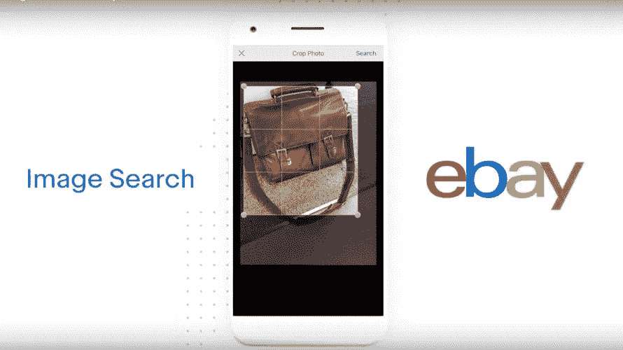

# 品牌如何利用图像识别技术来了解消费者

> 原文：<https://medium.com/swlh/how-brands-can-leverage-image-recognition-technology-to-learn-about-consumers-39673ede51e5>

## 有些人甚至已经这样做了。

*由吴凤和*[伊丽莎白·斯诺 ](https://medium.com/u/24d097e7a363?source=post_page-----39673ede51e5--------------------------------)

EBay uses image recognition technology in its Image Search feature.

想知道你的 iPhone 如何识别你的脸，甚至试图识别你照片中的人吗？

很像人脑处理图像的方式，计算机被训练成像人脑一样处理图像。