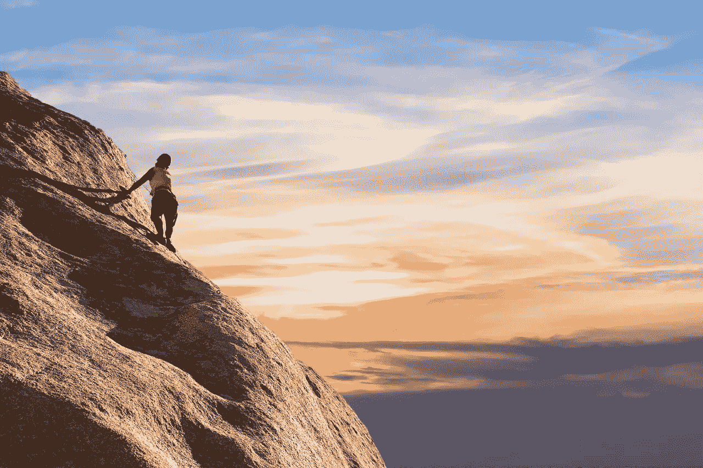
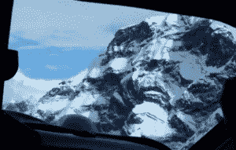

# 商业如何像爬山:巅峰表现的 8 课

> 原文：<https://medium.com/swlh/how-business-is-like-mountain-climbing-8-lessons-for-peak-performance-491dea3069c5>

最近关于珠穆朗玛峰“交通堵塞”和相关危险的新闻标题让我反思我自己的经历——无论是作为一名登山者还是企业家。今年，只有两天的短暂天气窗口在山顶附近造成了严重的瓶颈，迫使近 750 名登山者进行生命竞赛。虽然在压力下做出商业决策的后果很少会像 5 月份 11 个人在珠穆朗玛峰上面临的那样可怕，但规划、准备和执行重大任务(如爬山)的关键步骤与实现你的商业目标是一样的。

在过去的十年里，我已经从建立自己的品牌过渡到帮助许多企业增加销售和增长。在同一时期，我一直在推动自己在登山和其他运动中承担新的个人目标，通过承担更大的风险来超越我的舒适区。我亲身经历的登山越多，我就越发现计划和执行一次成功的登山和建立一个成功的企业之间的相似之处。以下是我用来提高帮助客户的方法的八条经验——也是我登上世界最高峰的经验。

# 我们可以从爬山中学到的八个教训

# 1 —陈述目标

> 通往山顶的路总是比你想象的要长。不要欺骗你自己，当看起来很近的东西仍然很远的时候，那一刻就会到来。~保罗·科埃罗

攀登任何山峰都是从设定目标开始的。在我 50 岁生日的时候，我决定去攀登北美最高的山峰德纳里峰。世界上没有其他山像它一样。它比喜马拉雅山和喀喇昆仑的高峰还要大。它的极北位置不仅使它非常寒冷，而且由于它的亚极地纬度，它的大气比温带或热带地区的类似海拔更稀薄。由于用来攀登德纳里峰的“探险风”，许多人把它作为攀登珠穆朗玛峰的训练场。对我来说，攀登德纳里峰似乎是一个可以达到的目标，因为它相对来说是局部的。这也像是一个延伸的目标，有一个(非常)长的先决条件列表，包括冰川救援培训和冰川旅行。我知道这不是一个小任务，但是我已经攀岩多年，我已经准备好迎接更大的挑战。重要的是，目标本身——登顶这座山——对我来说已经足够激励我提高自己的水平。

同样，在商业中，设定目标是关键。当我创办 Trillium Health Products(juice man 和 Breadman 品牌的母公司)时，我的目标是在五年内实现 1 亿美元的销售额。虽然这是一个雄心勃勃的目标，但我对我们产品的信念以及看到更多人采用健康生活方式的更大愿望推动了我达到这一高水平的愿望。我知道这不是一个容易的“攀登”，但我确信我的目标值得追求。虽然我们没有在五年内达到 1 亿美元的大关，但在销售额达到 7500 万美元后，我们在四年内卖掉了公司。

# 2 —做你的家庭作业

> 每个人都想到达顶峰，但是山顶上没有生长。正是在山谷中，我们艰难地穿过茂盛的草地和肥沃的土壤，学习并成为使我们能够登上人生下一个高峰的人。~安迪·安德鲁斯

在商业中，如果你没有计划，目标只不过是一种渴望。当我第一次见到 Jay Kordich，Juiceman 品牌背后的人物，他正在他的货车后面卖果汁机。杰伊无限的魅力和能量激励我围绕他通过榨汁推广的健康生活方式建立了一家公司。他教育人们多吃水果和蔬菜对健康有益的热情很有感染力。但我需要先自学榨汁，这样我才能制定一个可靠的计划。我不得不做作业。除了研究果汁机和相关的制造选项，我还从西雅图的巴斯特尔大学(Bastyr University)招募了专家，这是自然医学的先驱。深入的研究是延龄草保健品成功的关键，它指导我们推出了一种新的营销和品牌发展方式。

我也同样投入到如何成功攀登德纳里峰的研究中。我开始读了十几本关于这个 20000 英尺的庞然大物的书。我最喜欢的是大卫·布里尔的《欲望与冰》。布里尔对视角的探索给了我严肃对待这一旅程所需的现实检验。他的书和其他书也给了我提前计划所需的实用资源。

# 3-设定最后期限

> *停止凝视群山。相反，攀登它们，是的，这是一个更艰难的过程，但它会让你看到更好的风景。~未知*

随着我对攀登德纳里峰的要求有了更好的了解，包括个人健康、训练和装备，我确定了去阿拉斯加探险的日期，从安克雷奇北部的小城塔尔基特纳出发，这也是大多数德纳里峰探险的出发点。我将成为雷尼尔登山公司(RMI)的一个九人加两名导游的团队的一员。我有四个多月的时间为我人生中最大的冒险进行训练。

几年前，我读到一篇关于“期限”这个词的起源的文章，这篇文章让我印象深刻。这是泰·基尔塞尔为《福布斯》杂志写的。基泽尔对最后期限(以及错过最后期限的后果)的好奇，让他看到了美国内战的报道，在那里，他了解到一条距离寨子 20 英尺的线，那里设立了一条“死线”，“任何囚犯无论白天黑夜都不得越过这条线，否则将被枪毙。”(1)

作为一名作家和企业家，我一直在平衡我对编辑、出版商和客户的承诺。截止日期有助于确保健康的沟通习惯。他们也让我有责任感，激励我去完成我开始的事情。这些年来，我明白了截止日期不仅仅是朝着一个目标行动和进步的必要条件，它们也让你承担责任。

类似地，一旦我预订了去塔尔基特纳的航班，我就敏锐地聚焦于我攀登德纳里峰的目标，只有有限的时间做好准备。

# 4——做好计划，就像你的生活依赖于此一样

> 只有那些敢于冒险走得太远的人，才有可能发现自己能走多远。~ T.S .艾略特

一旦我确定了日期，就该开始计划和准备了。这分为两个部分:(1)我旅行需要的装备，和(2)我为登山做准备的健身和训练计划。

七月，德纳里的气温从 70 多度到零下，风速超过每小时 50 英里。从阳光充足的地方到阴凉处，气温可以在 40 到 50 度之间波动，整个时间都在雪地上跋涉。我了解到兴奋感甚至在我们开始攀登之前就开始了，这要感谢从塔尔基特纳到卡希尔特纳冰川的危险飞行路线。到达那里是它自己的冒险，通过狭窄的地方，就像一个镜头通道，这样命名是因为它太窄了，飞行员只能拍摄一次。

一旦下了飞机，现实给了我沉重的打击，我意识到真的没有犯错的余地。在整个 2-3 周的探险中，我需要维持生命的所有东西都必须储存在我的背包里。落客区没有商店或装备店。80 多磅的装备和供应品是你的生命线。不充分的准备和计划会让你失去一切。

在商业中，良好的战略规划和准备可以决定成败。当我们建立 Trillium Health Products 时，这家公司在不到四年的时间里销售额增长到 7500 万美元，管理团队每 60 天在办公室以外的地方开会一次，目的是回顾我们的进展并规划未来 60 天的工作。虽然我们有一个长期的计划来指导我们，但公司的快速发展需要我们定期讨论我们去过哪里，我们要去哪里。我们对这些规划会议的承诺对公司的成功至关重要。

# 5 —团队合作

> *我们征服的不是山，而是我们自己。~埃德蒙·希拉里爵士*

在现有的商业模式中，很少有你之前的人没有做过你希望做的事情。我非常相信从他人的经验中学习，无论是通过阅读、参加研讨会，还是与导师合作(或者以上所有方式)。我从那些比我更有经验的人身上学到的经验帮助我一次又一次地避免了代价高昂的错误。我经常被邀请到全国各地的智囊团演讲。这些项目将集思广益、教育、同行问责和支持结合起来，以提高你的业务和个人技能。它们旨在帮助你和你的成员取得成功，它们之所以有效，是因为团队的动力是强大而有说服力的。在这些小组中，成员们互相挑战，设定强有力的目标，并为成功提供支持网络。

在高海拔登山运动中，为了安全起见，登山者被用绳子捆在一起。如果一个人滑倒了，其他人可以挖他们的冰斧，希望能阻止下滑。当你们被绑在一起穿越冰川时，使用斧头变得更加重要。你不仅需要阻止自己坠落的技能，还需要警惕绳组中的其他人，并准备好在需要时挖掘。不言而喻，成为一个好的队友，知道正确的技能，并在一起很好地工作可能意味着生与死的区别。

一个很好的例子是在我们到达顶峰之后。我们在从德纳里山口下来的路上海拔 19000 英尺。斜坡很陡，这群人被固定在一条线上，以将风险降至最低。当我们小心翼翼地穿过暴露的路线时，我们一个队员的冰爪突然破了。冰爪是一种牵引装置，你可以绑在每只靴子上，带有像尖牙一样的防滑钉，可以抓住冰面，防止你失足。没有它，前进将是危险的。幸运的是，另一名队友有一套备用的，避免了危险的情况。

# 6——避免意外

> 山只有比你大的时候才是问题。你应该充分发展自己，让自己变得比你面对的大山还要大。~ Idowu Koyenikan

在攀登和商业中，总会有阻碍你朝着既定目标前进的障碍。在德纳里峰探险期间，我们的登山队在 3 号营地遭遇了一场巨大的暴风雪，这已经是跋涉的第八天了。连续几天的新雪造成了真正的雪崩危险。此外，当我们等待风暴结束时，另一组的一名登山者心脏病发作去世了。第二天，他的遗体被直升机运离了这座山。

在商业中，你没有预料到的问题往往是最严重的。几年前，我的直销公司准备推出一款很有前景的新美容产品，名为 Rejuvinque。该产品得到了成千上万顾客的许多五星评价。此外，我们拍摄了大量的证明，并拍摄了有力的前后镜头。剩下要做的就是播放我们拍摄的新电视广告，并确保我们的制造商排队等待完成创纪录的订单。不为我们所知的是，一部重要的电影将于《返老还童》上映的同一个周末在全国各大影院上映。这部电影的主角是一个精神错乱的杀手，他戴着一个面具，看起来就像我们正在销售的美容产品！时机再糟糕不过了。我们没有向前冲，而是调整了时间，在恐怖秀和我们的美容产品之间拉开了距离。危机解除！

# 7 —保持专注

> 多走走，少担心。~未知

我最喜欢攀岩的一点是它需要完全的专注。你必须“活在当下”在这个专注就是一切的空间里，我从日常事务的干扰中找到了解脱。当你爬山时，特别是在高海拔的时候，你的思维就像激光一样集中在你的脚下一步要去哪里。没有时间让外界分心。我第一次学到这一课是在我穿过瑞尼尔山的失望大街的时候。我想拍一张照片，当我摸索着拿相机时，我脚下一滑，差点摔倒。我应该把注意力放在前面的路上。吸取教训！

虽然在工作场所，注意力不集中的身体风险没有那么严重，但你对一项任务的注意力越集中，就越有可能成功完成这项任务。

# 庆祝你的成功

> *最艰难的攀登之后才是最好的风景。~未知*

德纳里峰峰会于 2012 年 7 月 10 日星期二凌晨 4 点开始。吃过立顿茶和速溶燕麦片早餐后，我们早上 5 点离开了高营地。第一段是穿越一个陡坡的漫长旅程，这里发生的事故比山上其他任何地方都多。关于这次穿越，我记得最清楚的是等待我们前面的另一个登山队长达一个小时。这是痛苦和紧张的。看到最近登上珠穆朗玛峰的登山者挤成一排的照片，让我回想起德纳里峰那段危险的时光。但是我们很幸运，在离开营地 9 个小时后终于到达了山顶。我的目标已经达到，但用著名登山家埃德·维埃斯图尔斯的话来说，“登上顶峰是可有可无的，回到山下是必须的。”我们还有很长的路要走，一路上还会有一些小的惊吓。那天总共爬了 19 个小时后，我们回到了高营地。这是令人振奋的(也是完全筋疲力尽的)。我在四个月前达到了我为自己设定的目标，我欣喜若狂地与和我一起亲密工作了 16 天的登山队分享了这一经历。

我们签订延龄草保健品销售合同的那天，也有类似的感觉——既怀念我们一起经历的一切，又为我们一起完成了一些事情而欢欣鼓舞。最初的想法是销售果汁机，现在已经成为一个受欢迎的家庭品牌，有助于改变人们对饮食的看法。

# 结论

> 我意识到在山顶上，还有另一座山。~安德鲁·加菲尔德

当我从佛罗里达州的坦帕湾搬到太平洋西北部时，我的爬山梦就开始了。从我在西雅图市中心的公寓里，我可以看到高耸于城市景观之上的瑞尼尔山。在我越野到达的几天后，我就下定决心要去爬那座山，而在我的日常生活背景中，这座山的实际存在最终激励我坚持我的目标。在商业中，我同样受到激励去实现那些有召唤的目标——与激励我实现的人、产品或品牌的某种联系。

通过实践我在这里分享的八个教训的基本原则，我已经成功地爬山了，无论是字面上还是象征性的，我享受到达山顶的过程，就像在那里一样。虽然我们无法总是避开前进道路上的障碍——有些障碍会比其他障碍带来更灾难性的后果——但我们可以细化我们对目标设定和研究的承诺，我们可以制定计划，就好像我们的生活(和我们的业务)取决于此。这难道不值得庆祝吗？

*(1)小戴维·凯利。“‘最后期限的由来’”今天我发现了:喂饱你的大脑 2014 年 1 月 6 日*[*http://www . Today ifound Out . com/index . PHP/2014/01/Origin-Deadline/*](http://www.todayifoundout.com/index.php/2014/01/origin-deadline/)

最初发表于[里克·塞萨里](https://rickcesari.com/how-business-is-like-mountain-climbing-8-lessons-for-peak-performance/)

Rick Cesari 自 1994 年以来一直从事直接回应和视频营销行业，自 1999 年以来一直从事咨询工作。他的热情是继续这项工作，并与组织分享这方面的知识。你可以关注他在 RickCesari.com 的最新消息。