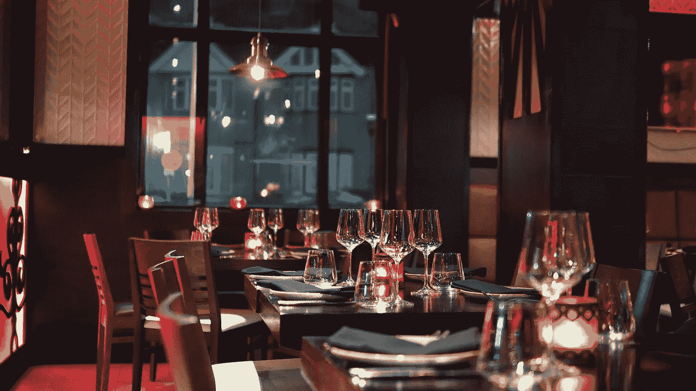
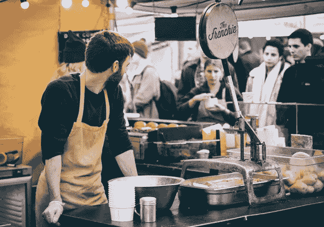
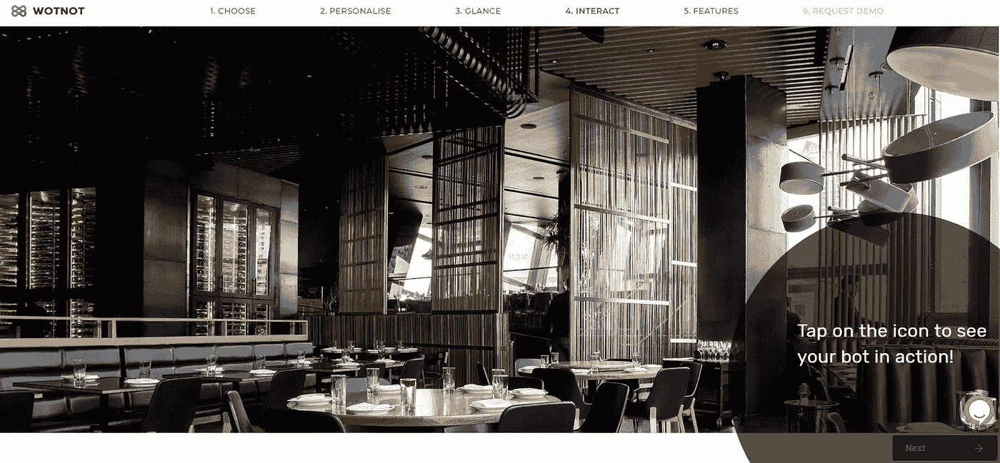

# 餐馆如何在日益激烈的竞争中留住顾客

> 原文：<https://medium.com/swlh/how-can-restaurants-retain-their-customers-in-growing-competition-d8e32df53faf>

## 如果你认为设计良好的客户体验仅仅如此，请三思！

卓越的客户体验不仅能确保你的企业善待客户，还能确保你长期吸引和留住客户，让你的企业发展到一个新的高度。

鉴于顾客维系和忠诚度是任何基于服务的企业的核心，当涉及到顾客服务时，实现并超越顾客的期望是最重要的。从营销活动、网站到线上和线下服务，一切都是实现完美服务这一目标的手段。然而，无论是点餐、预订还是获得推荐，服务人员都不可能始终如一地满足每个人的标准，这会给餐厅带来负面的品牌形象。

对话代理，也就是广为人知的聊天机器人，正被餐馆和其他企业反复灌输，以帮助提供无可挑剔的客户服务，并在日益激烈的竞争面前保持强势。聊天机器人可以被编程来执行各种各样的任务，从回答常见问题、预订、点餐或处理支付。让我们来看看聊天机器人被证明对餐饮业有益的场景。

# 订单和预订

有了聊天机器人，预订管理变得容易多了。有了聊天机器人，你的顾客不再需要打电话预定桌子，等待工作人员来接待他们，或者排队等候空出的桌子。

聊天机器人可以很容易地连接到你的餐厅的数据库/软件，这样所有的预订和可用的时间段都可以自动更新，无需任何人工干预。此外，聊天机器人还可以部署在多个渠道，如脸书、Twitter、WhatsApp、移动应用以及你的网站，这样他们就可以在不离开他们所在的平台的情况下从你的餐厅点餐。这增加了用户与聊天机器人的互动，从而增加了你的品牌参与度。

# 常见问题和菜单选项

当员工专注于准备和提供食物时，聊天机器人可以通过回答与开门和关门时间、奖励积分或餐厅是否在公共假日营业有关的问题来与客户互动。餐馆中聊天机器人的使用案例在很大程度上依赖于餐馆希望为游客提供的体验。

经常发生的情况是，在一个更大的菜单中，一些好的菜肴最终被顾客忽略了。聊天机器人在这种情况下可以证明是有益的，它们可以以视觉上有吸引力的和对话的方式呈现你的菜单，同时还可以了解客户的偏好，以提供更好的建议。

# 促销优惠和交易

聊天机器人可以在你的网站和社交媒体频道上播放特别优惠和交易。聊天机器人还可以向您邮件列表中的人发送促销提醒，以便您的客户和潜在客户了解您提供的最新交易。

通过使用机器学习和深度学习算法，聊天机器人可以识别出你的老客户，并通过短信或 Facebook Messenger 提醒发送新的交易和优惠来吸引他们回头客。

# 个性化推荐

机器人也可以作为一种情报收集工具，帮助餐馆了解他们的顾客。客户联系方式、过去订单、首选付款方式等。—餐厅中的聊天机器人不仅可以个性化客户体验，还可以奖励忠诚的客户，以增加回头客——所有这些都通过一个设计良好的聊天机器人对话来实现。

# 审查和反馈

网络时代网评的重要性不容忽视。根据[的一项研究](https://www.invespcro.com/blog/the-importance-of-online-customer-reviews-infographic/)，90%的消费者在访问商家之前会阅读在线评论。88%的消费者相信在线评论和个人推荐。

但是让你的顾客放弃对你的评价的过程是困难的，耗时的，而且有些打扰。在人类干预被认为是负面的情况下，聊天机器人可以派上用场。聊天机器人可以自动向你的客户发送提醒，敦促他们撰写评论并提交对你的服务的评级。因此，聊天机器人是一种非侵入性的、更好的收集顾客反馈的方式。

各垂直行业的企业都认识到聊天机器人带来的切实好处。采用聊天机器人的餐厅肯定会看到不断增长的客户群和更高的成本效益，这最终将有利于整体增长和创收。

[**WotNot**](https://wotnot.io/) 是一个聊天机器人开发平台，让你专注于重要的事情。在 WotNot 的非凡旅程中，您可以通过 **3 个简单步骤**体验为您的企业量身定制的餐厅机器人[。你需要做的就是:](https://app.wotnot.io/preview/personalise?templateKey=restaurant_booking&alignment=right&isPreviewed=0&url=&themeColor=%23F44336&templateTitle=Nugget&botIcon=https%3A%2F%2Fapp.wotnot.io%2Fstatic%2Fimg%2Favatars%2FCjLMqkYFXTSA153359684227w9AGZlTc_thumbnail.png)

1. [**输入您的网站**](https://wotnot.io/) **:** 您只需输入您想要提供一对一对话体验的网站名称。

2. [**选择模板**](https://app.wotnot.io/preview/choose-template?url=) **:** 从您需要聊天机器人的 15 个模板中进行选择(在本例中为餐馆模板)。

3. [**预览聊天机器人**](https://app.wotnot.io/preview/personalise?templateKey=restaurant_booking&alignment=right&isPreviewed=0&url=&themeColor=%23F44336&templateTitle=Nugget&botIcon=https%3A%2F%2Fapp.wotnot.io%2Fstatic%2Fimg%2Favatars%2FCjLMqkYFXTSA153359684227w9AGZlTc_thumbnail.png) **:** 你没听错吧！在做出决定之前，你可以免费预览这个机器人。

WotNot 使在您的组织中实现聊天机器人变得轻而易举！点击这里注册 30 天免费试用[。](https://app.wotnot.io/preview/request-demo?url=&themeColor=%23F44336&alignment=right&templateKey=restaurant_booking)

[Experience the chatbot](https://app.wotnot.io/preview/experience?url=&themeColor=%23F44336&alignment=right&templateKey=restaurant_booking)

— — — — — — — — — — — — — — — — — — — — — — — — — — — — — — —

> 如果你喜欢这篇文章，请随意点击鼓掌按钮👏帮助其他人找到它。

## 这篇文章发表在 [The Startup](https://medium.com/swlh) 上，这是 Medium 最大的创业刊物，拥有+440，678 读者。

## 在这里订阅接收[我们的头条新闻](https://growthsupply.com/the-startup-newsletter/)。

