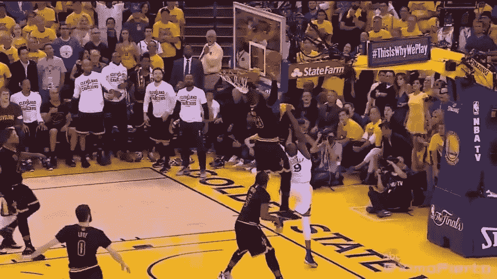

# 怎样才能更有离合器？

> 原文：<https://medium.com/swlh/how-can-we-be-more-clutch-6841f605f7ae>

from NBA on [YouTube](https://www.youtube.com/watch?v=-zd62MxKXp8)

我们每个人的灵魂深处都有紧握的天赋。看看上次你在不到一个小时的时间里有一篇超过两页的论文要写，而你能够完成这篇论文(肯定有非凡的成果)。那就是你当时的状态:离合器。离合器作为一个形容词被[定义为](https://www.dictionary.com/browse/clutch)“在危急情况下可靠”