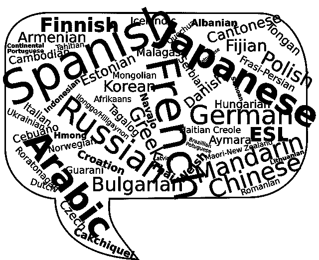

# 聊天机器人如何利用您的客户支持

> 原文：<https://medium.com/swlh/how-chatbots-help-in-leveraging-customer-service-4202f7f43772>

## 客户服务是新的营销方式。挖掘它。

客户服务是新的营销方式。由于互联网时代的到来，现在的顾客对信息了如指掌。有了即时可用的评论和比较应用程序，今天的客户可以更好地了解信息，并对他们互动的企业有更高的期望。

这使我们认识到提高和保持客户满意度对保持业务繁荣的重要性。通过提供优质的客户服务，企业可以培养一个忠诚的客户群，这将推荐他们的朋友和同事，并有助于在市场上为你创造一个积极的品牌形象。

随着人们现在虚拟地生活在网上，企业沿着数字化道路前进已经变得至关重要。因此，需要聊天机器人来提高客户服务不再是一个遥不可及的想法。聊天机器人是计算机程序，更像是虚拟伴侣，与网站或消息应用程序集成在一起，帮助企业自动完成日常任务。

我们都同意聊天机器人无法与人类相匹配，但组织必须解决这样一个事实，即今天的客户希望立即得到答案，而客户支持团队在给定时间只能服务这么多客户。这就是聊天机器人的用武之地。

聊天机器人用即时响应取代了长时间的等待，有助于让您的客户旅途顺畅愉快。聊天机器人回答常见问题，基于 NLP 的聊天机器人也可以被训练来解释和响应客户的定制输入。聊天机器人还可以将请求转发给销售代表。

以下是聊天机器人在您的企业中增强客户服务的方式:

## 1.全天候服务

为了维护客户关系并产生更多的潜在客户，您的企业需要全天候为客户服务。通过您网站/应用上的聊天机器人，您甚至可以在工作时间之外解答客户的疑问。聊天机器人昼夜不停地工作，以满足你的顾客的询问。

如果一个潜在客户在深夜上网时发现了你的网站(他们通常会这样做)，他们仍然可以在你的网站上互动并找到答案。

这样你就可以零等待时间让客户满意，让你的客户体验更优越。

## 2.可量测性

人们通常会挂断客户支持电话，因为播放无聊的音乐让他们等待。

如果您的客户不得不等待(数小时/数天)他们寻求的答案，他们很可能会选择其他人提供与您相同的解决方案(您的竞争对手！).

有了聊天机器人，你的客户就不用等了。

无论你的网站上有 5 个还是 500 个人在寻找答案，聊天机器人都能同时即时回答任意数量的问题。聊天机器人可以同时进行的对话数量没有限制。

## 3.更好的参与

聊天机器人被称为“聊天机器人”是有原因的。这是因为它们给用户提供了一种对话的温暖，就像你在和朋友聊天一样。聊天机器人比表格或问卷更具互动性，因此能更长时间地吸引用户的注意力。

这为他们提供了丰富的用户体验，这反过来让你的客户满意，并保持他们回来更多。

## 4.性价比高

聊天机器人是可扩展的，可以一次处理数百个客户查询。这有助于解放您的销售代表，使他们能够专注于复杂的查询。聊天机器人还消除了雇用更多代理人来满足客户询问一般问题的需要，因为机器人可以很容易地接受这一点。

机器人有能力通过向客户提供简单查询的快速解决方案来提高员工的工作效率。因此，它们降低了运营成本、人力和时间。机器人也有助于企业与客户互动，而不需要额外的员工。这不仅节省了时间，也降低了成本。

## 5.多语言

你可以通过用访问者的语言与他们交流来吸引他们的注意力。聊天机器人可以通过检测浏览器的语言偏好，用目标受众的语言与他们互动。

这为您的客户提供了个性化的体验，同时也让您的企业能够扩展到新的市场。

# 综上

通过将聊天机器人添加到您的业务中，您将增加您的收入，因为您当前的员工将有时间专注于培养潜在客户和完成销售，而聊天机器人则执行日常活动。对你的企业的积极体验鼓励顾客留下来，忠于你的品牌。

我们在 [WotNot](https://wotnot.io/) 明白每个企业都需要为他们的客户定制解决方案。我们开发有价值和可扩展的聊天机器人，作为个人助理，即时解决各种客户问题。

我们还有一个**预定义的客户支持模板，您可以在那里免费体验聊天机器人**。花一分钟时间，感受一下你如何获得上面列出的所有好处[点击这里](https://app.wotnot.io/preview/interact?url=&themeColor=%23F44336&alignment=right&templateKey=customer_support)。

## 这篇文章发表在 [The Startup](https://medium.com/swlh) 上，这是 Medium 最大的创业刊物，拥有+427，678 名读者。

## 订阅接收[我们的头条新闻](https://growthsupply.com/the-startup-newsletter/)。

