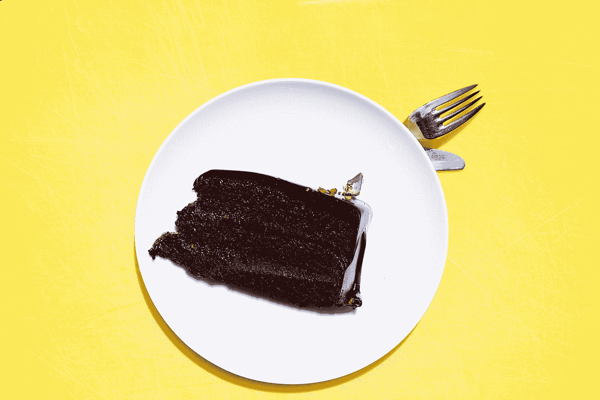

# 为什么你成就如此之大，庆祝却如此之少

> 原文：<https://medium.com/swlh/how-come-you-achieve-so-much-and-celebrate-so-little-2794b7bd2a7e>

Photo by [Toa Heftiba](https://unsplash.com/@heftiba?utm_source=medium&utm_medium=referral) on [Unsplash](https://unsplash.com?utm_source=medium&utm_medium=referral)

我们面临着成就强迫症的流行。

“当我得到 _ _ _ _ _ _ _ _ _ 时，我会庆祝的。”

*“当我得到 ______ 时，我就会快乐。”*

作为一个社会，我们集体这样想过多少次？位数比圆周率多。