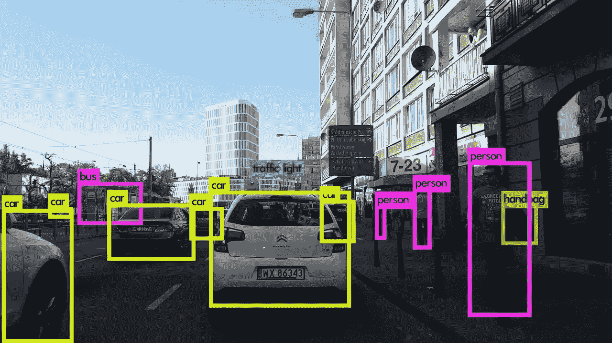
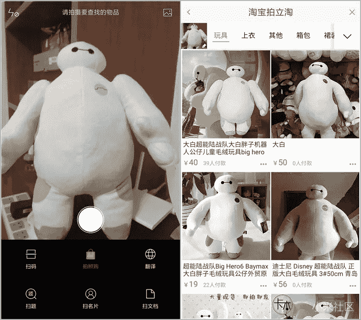
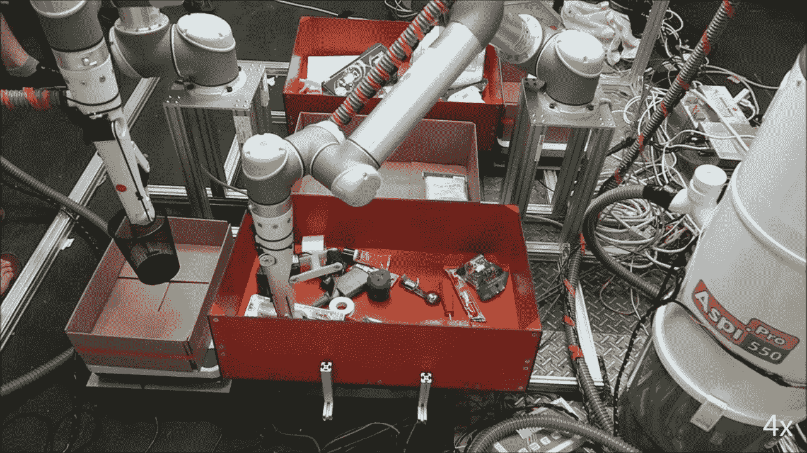
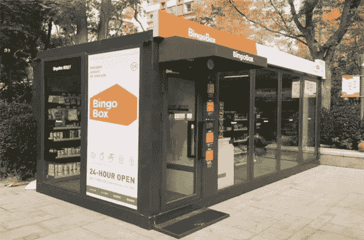
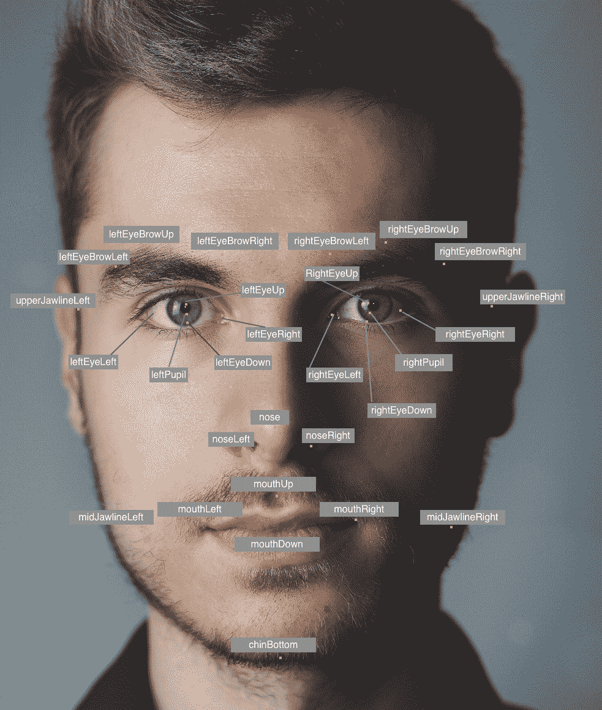

# 计算机视觉如何革新电子商务

> 原文：<https://medium.com/swlh/how-computer-vision-is-revolutionizing-ecommerce-d05e0ca11765>

早在 90 年代，大多数人从未想过网上购物会是什么样子。在 80 年代，许多人可能从未听说过“互联网”这个词。企业不断适应新技术，以便在竞争中取胜。作为人工智能的一个分支，计算机视觉现在在电子商务中发挥着重要作用。

在这篇文章中，我将解释什么是计算机视觉，它如何变革电子商务，以及作为一名工程师或企业家，你可以做些什么来利用自己。

Buying things online is now a common part of life, Image from [Pixabay](https://pixabay.com/photos/ecommerce-shopping-credit-card-2607114/)

# 什么是计算机视觉？

作为人工智能的一部分，计算机视觉是使计算机能够像我们一样看待事物的领域。在互联网繁荣引发的数字存档数据和计算能力的急剧增长之后，计算机科学家和工程师能够以前所未有的方式测试一些复杂的算法。其中一个是深度卷积神经网络(CNN)，在 ImageNet 比赛中被证明具有[出色的性能](https://qz.com/1034972/the-data-that-changed-the-direction-of-ai-research-and-possibly-the-world/)。

ImageNet 是一项竞赛，计算机视觉专家和爱好者聚集在一起，竞争他们在图像分类方面的最佳算法。换句话说，这是一个游戏，职业选手们在比赛他们能让电脑看着一张图片并说出图片里面是什么。这些比赛的结果极大地促进了计算机视觉的发展，使现在的计算机能够更准确有效地检测和分类物体。

Object detection with Computer Vision Algorithms, Image from [Lazy Programmer](https://lazyprogrammer.me/path-to-computer-vision-deep-learning/)

# 计算机视觉如何革新电子商务？

使计算机能够正确地看到解锁许多不同领域的众多应用程序。从人工智能的医学图像处理，到手机上的 snapchat 滤镜，我们的生活都被它大大改善了。从这项技术中获益良多的领域之一是电子商务，我们的网上购物现在比以往任何时候都更容易，这要感谢那些研究使计算机能够看见的计算机科学家和软件工程师。

## 用图片搜索商品，用人工智能标记商品

能够将图像与数据库中的一组其他图像进行比较，电子商务企业现在允许他们的客户通过拍摄物品的照片来找到他们喜欢的物品。

Search an Item on Taobao with Photos, Image from [MIUI.com](http://www.miui.com/thread-4673680-1-1.html)

在企业运营的背后，能够检测图像中的内容也使企业能够立即标记这些图像中的项目，而不是人工手动完成。

## 仓库自动化和自动化商店

回到仓库，工作人员和工程师团队正在非常努力地工作，以确保项目按时交付给你。过去每天都有人在仓库内手动搬运物品，这是一项相当累人的工作。有了计算机视觉和机器人，这些任务的大部分现在都自动化了。机器人手臂能够检测、分类和读取一箱食品中特定物品的确切位置，并以适当的力度精确抓取。

Amazon Robot Picking Challenge, Image taken from [Youtube](https://www.youtube.com/watch?v=qDl459EIlBc)

仓库外开杂货铺不设收银员，开餐馆不设服务员。这是怎么回事？一旦你走进商店，商店实际上会通过你的移动设备来验证你的身份，然后他们将能够通过在他们的摄像头中识别你的脸来跟踪你在商店中的活动。

Shops without cashier, Image from [IFeng.com](http://wemedia.ifeng.com/88988174/wemedia.shtml)

## 未来还会有更多！

随着计算机视觉和其他相关领域的发展，将来会有更多的东西让我们的生活变得更好！下面是 CES 2019 上展示的所有酷炫送货机器人的视频。

# 我们能做些什么来成为它的一部分？

作为一名企业家或工程师，紧跟最新技术，永不落后总是好的。

许多云平台，如亚马逊网络服务(AWS)已经发布了他们的计算机视觉云 API，允许开发人员使用这些技术创建应用程序，而不必成为该领域的专家。对于工程师来说，熟悉设计架构和驱动系统的组件也很有好处，比如 bucket 对象存储和 RESTful API 调用。

如果你想更深入，你可能想进入研究领域，了解对象分割和深度学习的实际工作方式。你可以从大量的网上资源中学习。

Facial Feature Detection with [Amazon Rekognition API](https://docs.aws.amazon.com/rekognition/latest/dg/faces-detect-images.html)

希望这篇文章对你有所启发。敬请关注，工程愉快！

# 最后…

我是一名工程师、程序员，喜欢学习新技术，并与同样热爱新技术的人分享。有些人认为人工智能和自动化会夺走他们的工作，但我认为这实际上会创造更多的机会。这是促使我编写实现指南的另一个原因，这样更多的人可以学习编码，而不必向学校和其他教育机构支付大量费用。让我知道你对什么感兴趣，我会看看我是否能写这方面的东西。

以下是我的其他关于计算机视觉的文章，更多等待发表。

*   [如何用计算机视觉将妖精帽放入你的网站](https://medium.freecodecamp.org/how-to-drop-leprechaun-hats-into-your-website-with-computer-vision-b0d115a0f1ad)
*   [计算机视觉。你需要知道的 js 框架](https://medium.freecodecamp.org/computer-vision-js-frameworks-you-need-to-know-b233996103ce)

## 这篇文章发表在 [The Startup](https://medium.com/swlh) 上，这是 Medium 最大的创业刊物，有+432，678 人关注。

## 订阅接收[我们的头条](https://growthsupply.com/the-startup-newsletter/)。

