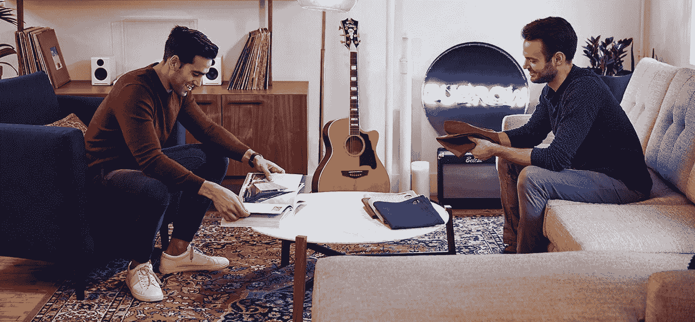

# “盒子里的沙发”公司如何利用大小投资者获得 430 万美元的种子资金

> 原文：<https://medium.com/swlh/how-couch-in-a-box-company-burrow-leveraged-big-and-small-investors-for-a-4-3-million-seed-round-f3f06f968e9f>

直接面向消费者的家具公司 [Burrow](https://burrow.com/) 就是为了短路家具的挫败感而建立的。该公司联合创始人兼首席执行官斯蒂芬·库尔(Stephen Kuhl)表示，任何曾经在车上绑过宜家沙发或等了 12 周才等到 West Elm 送货上门的人都会有同感。

“我们借鉴了床垫公司的书籍，找到了一种逆向工程的方法，可以用紧凑型盒子运输高质量的沙发，”他说，指的是 Casper、Nectar、Leesa 等公司最近的成功。

“这让我们省下了传统上将产品从工厂运送到仓库和当地零售店的大量成本，”斯蒂芬说。"此外，人们把它带回家也方便多了."

斯蒂芬和他的同学卡比尔·乔普拉在沃顿商学院的 MBA 创业课上构思了陋居。甚至在他们毕业之前，他们就筹集了第一轮资金，并加入了 [Y Combinator](http://www.ycombinator.com/) 的 2016 届。

这时候就有意思了。以下是我和斯蒂芬在从研究生院到你的起居室的旅程中的一些精彩片段[。](https://soundcloud.com/user-2586856/how-i-raised-it-with-stephen-kuhl-of-burrowcom-on-12218)

你筹集了多少钱，详细情况是怎样的？

当我们刚开始的时候，我们从朋友和前老板以及一家小种子公司那里筹集了大约 33 万美元。然后我们进了 Y Combinator。他们投资了一些钱[12 万美元]。我们从种子和天使投资者那里筹集了另外 390 万美元。

**给我们讲讲养那第一大块的故事。**

最初的数额相当容易，它给了我们一个错误的感觉，它将如何去。我们从我们认识的人那里筹集资金，这些人认为除非我们真的对某件事很认真，否则我们不会要钱。

然后我们有了一家公司， [Red and Blue Ventures](http://www.redandblue.vc/) ，投资与宾州相关的创业公司。他们开了一张 10 万美元的支票，700 万美元的封顶，20%的折扣和安全票据。

**这是之前的产品，对吧？**

是的，我们刚刚有一个球场。我们还没有制造商。

有很多与床垫公司的比较，但卷起和包装泡沫床垫的想法并不新鲜。他们最近才开始将它作为一种差异化优势进行营销。

但是我们想知道如何用盒子来运输一个高端的豪华沙发。我们想，‘这不是火箭科学。’我们能想出办法。结果比我们预期的要困难得多。

**说说你在 Y Combinator 的经历，以及从那里发生的事情。**

YC 以标准的 12 万美元获得了 7%的股权。这种经历太棒了。我们没想到会被录取。我不认为有人真的知道。

我们不是一家科技公司，所以和其他问我们做什么的创业公司在一起很有趣。我们会说，“我们卖沙发，”他们会说，“软件？”

我们还从高地资本合伙人那里得到了一张 20，000 美元的支票。他们选择学生创办的创业公司，给他们资金和办公场所。2016 年夏天，我们在他们位于帕洛阿尔托的办公室工作，然后通勤到 YC 的山景城。

**你在 YC 学到了什么？**

他们对筹款过程有着有趣的看法。他们敦促创始人以安全的方式融资，因为这让你可以把关于估值的谈话推迟到更晚的时候，那时你实际上已经有了动力。

这个策略也能让你更快的拿到钱。到 2016 年 8 月演示日的时候，我们已经有了一批预订量，但我们还没有交付任何产品。我们仍在修补设计和一系列制造挑战。

筹集一轮合适的种子资金需要花费相当多的时间和精力。我们当时还在商学院，所以我们没钱请两个月的假，全职筹集资金。所以我们只是从感兴趣的人那里筹集了一些安全的资金。

**你是怎么做到的？**

我们的策略是:一开始就设定一个更激进的估值上限，在整个估值过程中不要改变。我不想谈论为什么上个月估值发生了变化。

在 YC 之前，我们以 700 万美元的上限开始。之后，这是 1200 万美元的上限，10%的折扣。

**你是如何找到并接触到这些投资者的？是因为 YC，还是因为其他原因你认识了他们？**

有一堆是演示日的。远程观看演示日演示的人完全是随机的。缪斯乐队的主唱马特·贝拉米(Matt Bellamy)看了我的演示，伸出手说，‘嘿，我想投资。’我当时想，‘这真的很酷。我不知道你在看这个。'

我们遇到了很多这样的人，包括很多前创始人。在演示日的一个月内，我们从观看过我们演示的人那里筹集了大约 100 万美元。我们还通过我们已经认识的投资者找到人，这些投资者把我们介绍给他们网络中的人。

你是在寻找大鱼还是在撒网？

我们的策略是追求大额支票，但不忽视小额支票。我们将最低限额提高到了 25，000 美元，这并不具有挑战性，尤其是在我们取得进展的时候。

投资者可以是任何人——也许是你的牙医。人们喜欢投资他们可以谈论的公司。初创公司很酷——每月给他们发送投资者更新，他们会很兴奋。

人们总是在追逐种子公司，但如果你追逐一些规模较小、2.5 万美元的投资者，他们就会越来越多。通常，他们最终会开出更大的支票。

接下来发生了什么？

当我们在 2017 年春天开始交付产品时，一些 YC 合伙人亲自投资，并把我们介绍给他们网络中的人，他们开出了 5 万到 10 万美元的支票。

随着我们取得进展，Red and Blue ventures 在一系列比赛中又获得了 20 万美元。去年夏天，我们遇到了投资 50 万美元的[互动风险投资](https://www.interplay.vc/)。

随着时间的推移，随着你的进步，你会提出一个更简单的案例。

**一路上你学到了什么？**

起初，我们不知道我们需要多少钱。我们在制造和供应链方面遇到了很多问题，需要的资金比我们预期的多得多。

我们永远不会知道 400 万美元实际上是我们需要的数目。随着时间的推移筹集资金是好的，但在开始时，如果我告诉人们我们筹集了 400 万美元，我们在银行有 100 万美元，他们会说听起来好像没人对我们感兴趣。

有效的办法是说，我们迄今筹集的金额是我们打算筹集的金额，但这不是一个硬性上限——我们希望有更多一点的缓冲。

然后，每个人都觉得自己是最后一关。

你可以说这有点不诚实，但我知道他们不会投资，除非他们相信我们在做有价值的事情。这是人类心理学的一个练习。

在进行首轮融资之前，你的目标是什么？你是一个实物产品，所以你有库存和其他各种各样的东西要对付，其他公司没有。

风投会告诉你，“不管你现在的数字是多少，让我们看看你下个季度会做什么。”你可能会陷入一个陷阱，总有一根胡萝卜在你面前晃来晃去。

我们有自己的内部基准。首先，我们将制造业务从墨西哥转移到了美国，所以我们希望完全实现转型，以表明我们已经做好了规模化的准备。

第二，我们有点武断地选择了一个收入数字来达到——这是风投们确认的——每月 50 万美元的收入。我们确实在去年第四季度跨过了这个门槛。

第三，在获取客户方面变得非常高效，并确保我们能够盈利。我们三人沙发的平均订单价值是 1200 美元多一点。在单位经济学的基础上，我们每笔销售都是有利可图的。但是我们必须达到支付所有运营成本所需的数量。

如果我们想的话，我们可以在 Q2 实现收支平衡，但问题是:我们是想为扩大规模而优化，还是想为不依赖外部资本而优化？

**你选了哪个？**

我们在这个问题上有些纠结。盈亏平衡或略有盈利是很好的，因为这给了我们最终的谈判筹码——你可以放弃一笔交易。如果你能做到这一点，风险投资就在你的掌握之中。

但基于我们已经拥有的吸引力，我们现有的投资者真的很兴奋。他们最近一直敦促我们从他们那里拿更多的钱，这是该加注的迹象。

我们想制造一种紧迫感。如果你有信心拿到投资意向书，那就好好利用这一点。告诉风投，你当然希望看到我在下一年证明这一点，并降低风险，但我们觉得现在是投资增长的时候了。你必须给人们一个期限。证明了人家有没有兴趣。

如果你可以回到 2016 年，当你刚开始的时候，你会给稍微年轻一点的自己什么建议？

不要过度承诺。如果我告诉你，我们第一个月要做 200 万美元，但我们做了 100 万美元，这就相当于 Casper 所做的——历史上最成功的消费者发布。

但是如果你是一个投资者，你会说“他们没有做得那么好——他们说他们会做 200 万美元。”

你最好放弃你的预测，确保你能战胜它们，因为这样你看起来真的很棒。

**言而无信——总是明智的建议！非常感谢。**

*内森·贝克德是*[*Foundersuite.com*](http://foundersuite.com/)*的首席执行官，这是一个软件平台，自 2016 年以来已经帮助用户筹集了超过 10 亿美元的种子和风险投资。这个 Q & A 是根据 Foundersuite 的* [*我如何筹集到它的播客*](https://soundcloud.com/user-2586856/how-i-raised-it-with-amanda-johnson-and-kj-miller-of-mented-on-6112018) *的一集改编的，一个关于创业公司创始人如何筹集资本的幕后故事。*

## 这篇文章发表在 [The Startup](https://medium.com/swlh) 上，这是 Medium 最大的创业刊物，拥有+435，678 名读者。

## 在这里订阅接收[我们的头条新闻](https://growthsupply.com/the-startup-newsletter/)。

