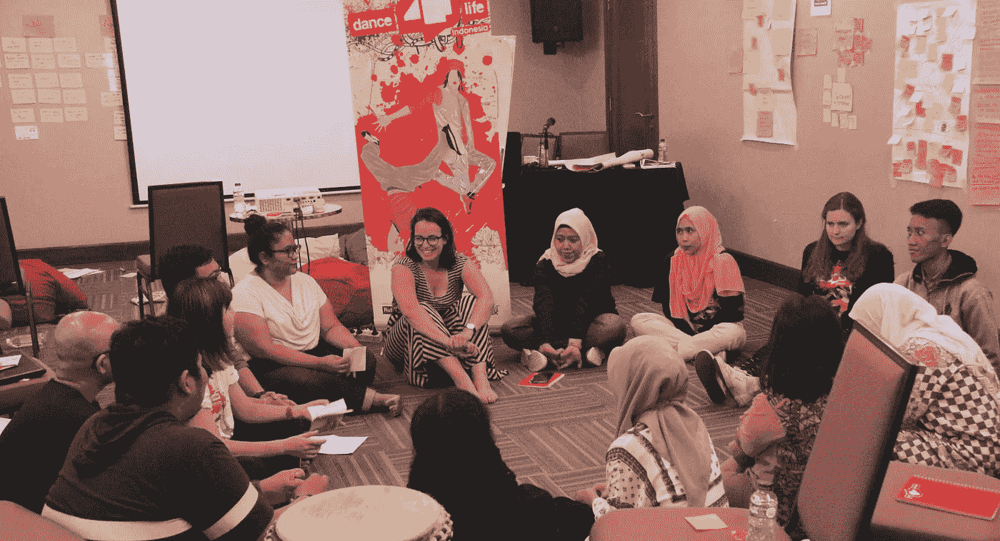

# Dance4Life 如何通过社交特许经营扩大影响力

> 原文：<https://medium.com/swlh/how-dance4life-is-growing-their-impact-with-social-franchising-6284f3732a49>

## 商品的商业模式第二部分

## 好的商业模式是那些想要创造影响力的公司的商业模式。通过使用这些模型中的一个，你正在为解决你的核心业务中的一个社会问题做出贡献。对于商业公司，像 TOMS，他是最早使用“一对一”商业模式的人之一；对于想要成长的基金会，像 Dance4Life，他们以自己的商业模式“社交特许经营”奠定了爆发式增长的基础；对于像 Peerby 这样的社会企业家来说，他们让邻居能够通过他们的多边平台互相借或租东西。

“商业模式为善”系列的第二部分是关于商业模式社交特许经营，并描述了 Dance4Life 如何通过使用社交特许经营来扩大其影响。

Dance4Life, Tanzania dance

**Dance4life 赋予年轻男孩和女孩掌控自己性生活的权利。他们通过一个由青少年开发的国际项目来实现这一目标。Dance4Life 的执行董事雅亿·范德·海登分享了为什么赋予年轻人权力是关键，并解释了社交特许经营如何使 Dance4Life 发展壮大。**

在 2018 年 7 月的国际艾滋病大会上，雅亿分享了来自内罗毕郊区的 16 岁女孩奥利维亚的故事。

Jael van der Heijden, Executive Director of Dance4Life at the International Aids Conference

她的梦想是开一家美容院。但她怀孕后就辍学了。她现在和家人住在一起，包括她 1 岁的儿子。像奥利维亚这样的年轻人不会考虑预防艾滋病毒或怀孕。她更多考虑的是如何能找到一些赞助商，让她的梦想成为现实。这些赞助者都是和她发生性关系的老男人，他们给她手机之类的东西，有时还会给她钱。

除非我们真的花更多的时间去了解奥利维亚，让她思考自己的抱负和生活中的挑战，否则我们并没有真正为她做出可持续的改变。

雅亿:“2016 年，我们决定花点时间反思我们的工作。我们意识到，我们主要是寄钱，我们花在更好地理解奥利维亚上的时间更少了。我们在国外的合作伙伴会收到钱，并按他们说的去做。我们不再批判性地看待这笔交易的目的。所以我们问自己什么样的干预最有效？

# **授权而不是教育**

不安全性行为是全球年轻人面临的增长最快的健康风险之一。当你想对年轻人进行性教育和讨论禁忌时，普通的教室并不是最合适的地方。Dance4Life 开发了一个项目，在这个项目中，年轻人接受培训，以增强他们同龄人的能力。

[In August 2018 the Journey4Life started in Jakarta](https://dance4life.com/dance4life-contextualize-workshop-in-jakarta/). Nina and Oonagh from Dance4Life travelled to Indonesia to contextualize the Journey4Life curriculum for the needs of youngsters in Jakarta.

雅亿:“我们和年轻人一起工作，鼓励他们与他人交往，因为我们知道，有能力的年轻人会在生活中做出更健康的性选择。这是与许多其他项目的一个重要区别。”

这只有与避孕套和医院的可用性相结合才能起作用。Dance4Life 与各种合作伙伴合作，如盖茨基金会，他们致力于实现可扩展性和可持续的未来。

# **为什么是社会特许经营？**

雅亿:“社交特许经营是扩大规模的一种方式。这并不是全新的。在国际上，它已经被使用了很长时间，例如用于扩大当地私人诊所和金融知识。然而，它尚未解决社会影响问题。

社会特许经营尚未广泛使用，但即将到来。许多非政府组织正在寻找新的模式。作为当地的非政府组织，你有什么作用？除了寄钱，你还能扮演什么角色？您如何保证您可以尽可能有效地扩展？

我们已经有了一些合作伙伴，他们负责自己的资金，与这些合作伙伴的关系更加平等。这些合作伙伴要求 Dance4Life 提供关于青年参与的具体专业知识，以便他们能够增加对年轻人的影响。这更有效。这就是我们一直在寻找的。"

# **它是如何工作的？**

“在我们希望活跃的地区，我们有一个区域联络员，根据特许经营者的情况寻找合作伙伴。这个人也在找投资人和赞助商。他们受雇于 Dance4Life，负责创造需求。

当特许经营者有兴趣在当地开展 Dance4Life 计划时，我们可以帮助他们筹集资金。一旦他们有了资金，他们就可以开始这个项目。有些已经有了自己的资金，可以马上开始。

特许经营者想要使用 Dance4Life 计划的主要原因是因为我们采用的是一种经过验证的创新方法。我们和年轻人一起工作，同时让这个项目对年轻人很有吸引力。另一个重要原因是特许经营者拥有完全的所有权，最后一个原因是他们成为全球网络的一部分。"

特许经营者向 Dance4Life 支付启动费，为此他们接受了三次关于该计划如何运作的研讨会。Dance4Life 计划可以完全根据他们的需求量身定制。一旦一切就绪，特许经营者就要支付年费来运行这个项目，并使用 Dance4Life 的知识和专业技能。"

# **资助**

这些费用包括所有的成本吗？

雅亿:“启动费包括了培训的费用。持续支持涵盖大约 20%的成本。对于剩下的 80%,我们积极寻找相信我们的方法和工作的投资者。我们有一个 [Friends4Life network](https://dance4life.com/become-a-friend4life/) ，我们的专属商业网络，并从全国邮政编码彩票中获得资金。

我们用这些资金支持加盟商，成立培训学院，不断创新，做研究。我们一直在寻找能够在这些特定领域帮助我们的合作伙伴。对于如何为我们的计划融资，我们有一个清晰的商业计划，但当然我们一直在寻找对创新感兴趣的投资者。"

# **问题**

*你们在实施社会特许经营模式时遇到了哪些问题？*

*我们从 2017 年开始。主要的挑战是改变当前的网络。尤其是那些还在接受 Dance4Life 资助的合伙人。我们希望在 2020 年转变所有这些合作关系，因为运行两条平行轨道需要花费大量时间。最终，我们多花了一年时间才走到现在。*

*展望未来，我们希望在 2030 年将加盟商的数量从 14 家增加到 60 家。但是我们还没有到那一步。我们期望现在已经增长了，但是我们不会达到这些目标。然而，系统并没有改变。我们一开始表现平平，但随着时间的推移会有所增长。"*

# ***建议***

**对于其他想利用社会特许经营扩大业务规模的非政府组织或社会企业家，你有什么建议？**

*雅亿:“首先，相信你的产品或概念！并且非常仔细地查看您想要扩展的内容以及最低要求是什么。花点时间来发展你的目标。我们得到了一家专业公司的支持。他们有可用的工具包，并通过研讨会支持我们。*

*你真的必须有一个明确的战略，并制定一个明确的报价。你的合作伙伴简介是什么样的？你到底提供什么？做好这些步骤要花很多时间。我们花了一年时间。*

*之后，你必须开发工具和编写手册，这又花了我们一年的时间。一切就绪后，我们在 5 个不同的国家进行了试点，根据这些结果，我们现在准备在全球推广。这总共花了我们 2.5 年的时间。"*

> ***社会特许经营的座右铭是:努力招募，良好培训，轻松管理***

# *****社会特许经营的力量*****

***社会特许经营的座右铭是努力招募，良好培训，轻松管理。我们现在投入更多的时间寻找完美的伴侣，但这绝对是值得的。一旦我们找到了符合我们标准的合作伙伴，我们就可以真正起飞了。社交特许经营使我们能够真正扩大我们的影响！”***

# *****良好的商业模式*****

***这是“良好的商业模式”系列的第二篇文章，Dance4Life 在其中表明，与目标市场和正确的合作伙伴合作是成功增长的关键。***

***[在第一篇文章](/swlh/why-and-how-toms-is-giving-new-meaning-to-one-for-one-1b2a8775bbbb)中，TOMS 展示了他们如何像 Dance4Life 一样，通过仔细倾听客户的需求来创新商业模式。***

***本系列的最后一篇文章是关于 Peerby 的，peer by 是一个多方平台，邻居可以互相借或租东西。对于专注于社区建设的社会企业家来说，多边平台是一个完美的商业模式。***

# ***你准备好开始了吗？***

***我已经为你创建了一个[免费清单](https://lnkd.in/eCXWgat)，让你开始一个有影响力的成功商业。如果你勾选了所有的选项，你就为你的事业打下了完美的基础。***

******

## ***这篇文章发表在 [The Startup](https://medium.com/swlh) 上，这是 Medium 最大的创业刊物，拥有+445，678 读者。***

## ***订阅接收[我们的头条新闻](https://growthsupply.com/the-startup-newsletter/)。***

******