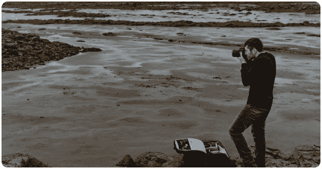

# 你要有多大的决心才能把摄影作为自己的职业？

> 原文：<https://medium.com/swlh/how-determined-do-you-have-to-be-to-make-photography-your-career-a92082ddd4c1>

*最后更新:2019 年 8 月 9 日*

在过去的 5 年里，T2 最有趣的电影之一是理查德·林克莱特的《T4 的少年时代》。

这可能是你第一次听说它——虽然它赢得了许多奖项，但它也有一种独立电影的感觉，对于大多数不是电影迷的人来说，它仍然没有引起注意…