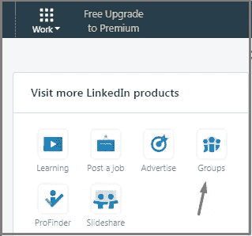
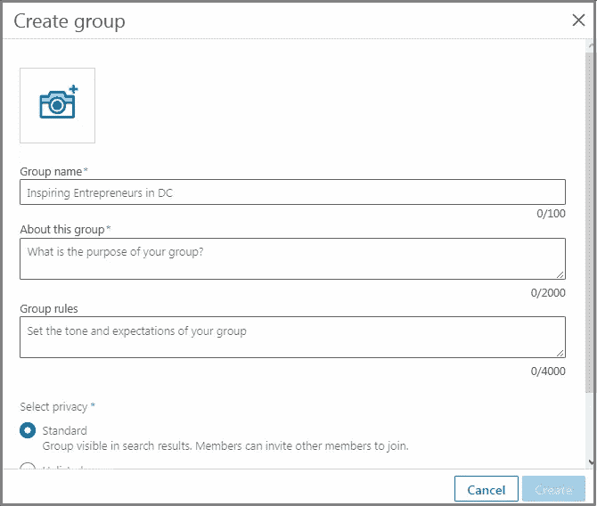

# 我是如何在一天之内在 LinkedIn 上产生 20 个潜在客户的？

> 原文：<https://medium.com/swlh/how-did-i-generate-20-leads-on-linkedin-in-single-day-2eb4588c336c>

LinkedIn——最被低估的社交媒体平台之一。

你如何产生销售线索？你买吗？

勒索他们？(*免费建议:绝不)*。

有很多社交媒体和在线平台可以帮助你挖掘销售线索，增加销售额。但是今天我将重点介绍一个特殊的平台: **LinkedIn** 。

我爱这个平台胜过一切。无论你是大企业还是自由职业者，它对所有人都适用。

在这篇文章中，你会发现 LinkedIn 如何帮助你每天产生有针对性的潜在客户。

# 首先…关于我的一些误解

**我想坦白一件事:**

从去年开始，我再也没有积极使用 LinkedIn(我在 2014 年创建了个人资料，但我偶尔会打开它)。

我相信 LinkedIn 只是一个求职平台，人们去那里更新他们的简历。它对产生线索毫无用处，如果我想获得一些线索，我必须潜入 Twitter 和脸书这样的大池塘。

你也这么想吗？

你错了。我错了。面对现实吧！

事实远非如此。你想知道真相吗？让我给你看一些数字。

LinkedIn 拥有 5.62 亿的常规用户，91%的营销专业人士将 LinkedIn 列为寻找优质内容的首选(我就是其中之一)。

[按国家分类的 LinkedIn 用户](https://www.statista.com/statistics/272783/linkedins-membership-worldwide-by-country/):

LinkedIn 占 B2B 博客和网站全部社交流量的 50%以上。

[92%的 B2B 营销人员将 LinkedIn](http://go.demandwave.com/rs/306-MLQ-910/images/2016-State-of-B2B-Digital-Marketing.pdf) 列入他们的数字营销组合中(领先于 Twitter 和脸书)。

但这些只是 ***的数字*** ！

在这里，我遇到了许多了不起的人，我们每天都互相分享见解。这个平台最好的一点就是:用户参与度。

它只是需要你的时间和努力。如果你下定决心，就会成功。

剧透:仅在一天之内，我就收到了 20 条潜在线索，几乎每天我都会收到一些询问。

怎么会？

在这里，我将讨论 5 个可行的 LinkedIn 策略，它们将帮助你创造商机。让我们开始吧。

# 1.优化您的 LinkedIn 个人资料

我相信你的 LinkedIn 战略的第一个也是最重要的部分一定是:**优化你的个人资料。**

让我们想一想:你收到一个从未谋面的人的连接请求。你会怎么做？

你会查看这个人的个人资料，发现一张不专业的自拍照和两个字的简历。你不太可能接受邀请。

对吗？

问题很简单:*如果你想与你不认识的潜在客户建立联系，你需要优化你的个人资料。*

我做的第一件事:我优化了我的个人资料。真是一塌糊涂！

***我做了什么？***

我完全填写了我的个人资料。LinkedIn 称之为全明星档案。

上传了一张专业的图片。

我花时间写了一份描述性的简历和简介摘要。

我自定义了个人资料的网址。

我优化了我的技能，增加了我的成就。

[阅读本文，了解 LinkedIn 档案优化的更多信息。](http://prepawan.com/improve-linkedin-profile/)

看看我的 LinkedIn 个人资料:

# 2.创建您自己的群

创建一个 LinkedIn 群帮助我建立了威信，并产生了一些好的线索。

最精彩的部分？

创建一个很容易(但要发展和维持群体需要努力)。

首先，确定你的群体定位和你的目标受众。就像如果你提供营销服务，为营销人员创建一个小组。

如果你为房地产企业提供服务，创建一个房地产代理商，建筑商和开发商的群体。

你怎么能创造一个呢？

首先点击顶部菜单上的“工作”,然后从下拉菜单中选择小组。

这将把你带到新的一页。现在点击“创建一个新组”按钮，一个表单将会打开。

填写表格，上传徽标，然后单击“创建”按钮。

开始在您的群中共享热门内容，并邀请相关人员加入您的群。

**内幕提示:**利用 [Buzzsumo](https://buzzsumo.com/) 寻找热门、常青的内容。

# 3.创建潜在销售线索列表

这是有趣的部分:我开始寻找可以成为线索的人。

首先，我创建了一个 500 个潜在线索的列表。听起来像是一项艰巨的任务，但事实并非如此。

LinkedIn 的高级搜索对我来说就像一根魔杖。这让我可以过滤我的搜索，找到相关的人。

以下是我对营销和广告行业首席执行官的高级搜索结果:

进入下一步，开始连接。

# 4.开始联系名单

让我诚实地告诉你:这个过程将消耗更长的时间。

我开始向我列表中的每个成员发送一条简单的个性化消息来请求连接。

连接后，我给他们发了一条感谢短信。

# 5.定期发布文章或更新

我开始和我的观众互动。通过每天在 LinkedIn 上定期发布帖子和文章(我现在也是)。

我总是试图在我的每一篇文章中给我的关系提供价值。当有人向我提出疑问时，我会回应并尽力解决他们的问题。

当你更新一篇文章时，它会显示在你联系的新闻源中。LinkedIn 也提供了一个发表文章的平台。

看看我几个月前在 LinkedIn 上分享的这个更新，它让我在一天之内得到了 20 个潜在的查询。

# 轮到你了

所以如果你问我“我能每天从 LinkedIn 产生潜在的潜在客户吗？”我的答案是百分百肯定的！

但这不是一蹴而就的，你必须为之努力。如果你致力于付出你的时间和努力，你会有很好的结果。

如果你正确地执行这些步骤，你将会产生更多你想象不到的转化率。现在就开始！

你最喜欢的 LinkedIn 挖掘潜在客户的策略是什么？

【prepawan.com】原载于

**

## *这篇文章发表在 [The Startup](https://medium.com/swlh) 上，这是 Medium 最大的创业刊物，拥有+422，678 名读者。*

## *在此订阅接收[我们的头条新闻](https://growthsupply.com/the-startup-newsletter/)。*

**