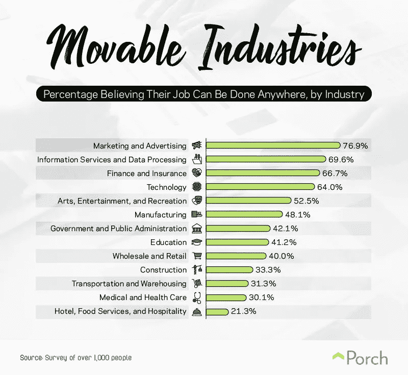

# 数字游牧如何解决全球性别差距

> 原文：<https://medium.com/swlh/how-digital-nomadism-can-solve-the-global-gender-gap-1c95f173cf81>

远程工作是帮助女性最终打破玻璃天花板的关键吗？

Photo by [Les Anderson](https://unsplash.com/photos/woVoM7dKGTk?utm_source=unsplash&utm_medium=referral&utm_content=creditCopyText) on [Unsplash](https://unsplash.com/search/photos/women-walking?utm_source=unsplash&utm_medium=referral&utm_content=creditCopyText)

十年前，[莉莉·莱德贝特](https://www.lillyledbetter.com/index.html)成功起诉她的雇主固特异轮胎公司，要求同工同酬，创造了历史。在忍受了 19 年的性别歧视和性骚扰后，Lilly 发现她挣的钱只有同样职位的男同事的 40%。在陪审团审判中赢得 300 万美元的判决后，该裁决最终被最高法院推翻。虽然法院多数人默认了她受到歧视的事实，但他们援引了诉讼时效的技术细节作为驳回的理由。

露丝·巴德·金斯堡以臭名昭著的 RBG 方式表示反对:

> "法院不理解或对女性成为薪酬歧视受害者的潜在方式漠不关心。"

然后，她呼吁国会采取行动，纠正法院对第七章的“吝啬”解读。金斯堡的论点导致了公平薪酬恢复法案，该法案成为奥巴马总统在 2009 年签署成为法律的第一项法案。

Watch RBG briefly tell Lilly’s story

自那以后，令人惊讶的是，在实现同工同酬方面进展甚微——无论是在美国还是在国际上。12 月 17 日，世界经济论坛发布了他们的 2018 年[全球性别差距报告](https://www.weforum.org/reports/the-global-gender-gap-report-2018)，该报告旨在“捕捉性别差异的幅度”，并跟踪他们的进展。

**他们的结论？只要女性能再等 202 年，工资差距就会缩小。尽管这一数字令人沮丧，但薪酬不平等只是当今职场女性面临的诸多挑战之一。随着这场运动尘埃落定，很明显，世界在实现性别平等方面还有很长的路要走。**

显然，过去的解决方案和当前的立法做得还不够。我有一些关于我们如何取得更好进展的建议(稍后会有更多)。但是首先，让女性知道她们拥有在 Ledbetter 诉 Goodyear 案中不存在的选择是很重要的。有了今天的技术，成为一名数字流浪者、远程员工或自雇企业家，比以往任何时候都更容易离开办公室政治。历史上第一次，女性可以想象地绕过性别差距，避开玻璃天花板——全体。

事后看来，在 2011 年成为一名数字流浪者以我从未预料到的方式积极影响了我的生活:

*   我不用担心男上司滥用职权。
*   我不必带客户去感觉太像约会的商务晚宴。
*   我不必为爬上公司的阶梯而紧张。
*   我不必忍受男同事的挑逗或目光。
*   我再也不用满足于 1 美元只值 0.70 美元了。

在我早期的职业生涯中，我拒绝、忽视或压制了许多工作场所的歧视或骚扰，此后我享受了 7 年的相对幸福——这都是因为我在家工作。当男人从未和你有过身体接触时，他们很难逾越界限。我的客户和承包商也很偏远。我完全掌控我的商业运作、我的收入潜力、我的工作环境和我的时间。

对女性来说，远程办公是一个潜在的游戏规则改变者——你可以赚更多的钱，同时保护自己免受职场女性普遍接受的负面影响。然而，这不是灵丹妙药。为了搞清楚这一点，我必须深入挖掘。

> 历史上第一次，女性可以想象地绕过性别差距，避开玻璃天花板——全体。

# 问题是

Photo by [Kendyle Nelsen](https://unsplash.com/photos/w-WuF2NlQ2o?utm_source=unsplash&utm_medium=referral&utm_content=creditCopyText) on [Unsplash](https://unsplash.com/?utm_source=unsplash&utm_medium=referral&utm_content=creditCopyText)

现在是 2019 年。大多数工作可以在任何地方完成，但女性仍在应对自我们进入现代劳动力市场以来就一直存在的《广告狂人》式的等级制度(更不用说自古以来一直保持不变的男性主导模式了)。

妇女有三大劣势:

*   我们仍然赚 0.70 美元。
*   我们不太可能成为首席执行官，而更有可能在晋升方面被忽略。
*   我们经常是工作场所歧视和性骚扰的受害者。

女人想要什么:

*   同工同酬。
*   机会均等。
*   工作中的公平待遇。

# 数字游牧是解决方案吗？

Photo by [rawpixel](https://unsplash.com/photos/GIIiJuvLkfY?utm_source=unsplash&utm_medium=referral&utm_content=creditCopyText) on [Unsplash](https://unsplash.com/?utm_source=unsplash&utm_medium=referral&utm_content=creditCopyText)

数字游牧民是指所有年龄段的人，他们可以通过笔记本电脑和互联网连接在任何地方工作。他们可以在各种行业从事各种不同类型的工作，尽管他们通常与零工经济联系在一起。

根据 [FlexJobs](https://www.flexjobs.com/blog/post/flexjobs-digital-nomad-survey-insights-remote-lifestyle/) 的数据，数字游牧人口包括:

*   41%的 x 世代
*   27%的 Z 世代或千禧一代
*   32% -婴儿潮一代

35%受雇于一家公司，28%是自由职业者，18%是企业主。

虽然已经有大量的数字游牧测试版和早期采用者，远程革命无疑将定义未来的工作。这种未来尤其会改变女性的生活和我们的职业前景——尤其是如果它能带来更多的职业自主权、个人成就感和更高的薪酬。

对女性来说，重要的是要知道她们不必等待就能开始收获加入零工经济的好处。他们可以从今天开始成为:

*   自由记者
*   企业家
*   远程员工
*   另一种类型的在线企业主、投资者或个体创业者

成为远程女性员工的好处包括:

*   更多的自由和财务独立
*   绝对控制你的时间
*   更高的收入潜力
*   更好的生活质量
*   减少工作场所的骚扰和歧视
*   更灵活地照顾家庭

# 女性数字游牧者加入进来

Photo by [Joshua Reddekopp](https://unsplash.com/photos/OrzZ1c_-tUo?utm_source=unsplash&utm_medium=referral&utm_content=creditCopyText) on [Unsplash](https://unsplash.com/?utm_source=unsplash&utm_medium=referral&utm_content=creditCopyText)

我向数字游牧社区的女性同胞发出了一份调查，询问她们远程工作如何影响她们的收入、福利和职业前景。

税务咨询公司*的老板格蕾丝·泰勒优雅地移居*T3，他回应道:

> “虽然攀登公司阶梯有其优势，会吸引一些人，但当女性成为企业家时，我们在收入潜力和职业/个人发展方面有更多优势。”
> 
> 女性通常被教导要请求许可，在许多公司环境中，你需要向一层又一层的人(通常是男性)请求许可。
> 
> 作为企业主，我们可以突破所有这些障碍，挖掘我们自己的决策权，而不必等待别人告诉我们这样做是可以的。"

现在女性可以享受这些以及更多的好处。 [Upwork](https://porch.com/resource/future-of-work) 显示三分之二的公司已经有全职员工远程工作。与地点无关的工作数量预计将在未来 10 年呈指数级增长。

我认为，阻碍人们从事远程职业的主要原因是伴随着如此重大的人生转变而来的恐惧和不确定性。但是，一种集体心态的转变即将到来。下面是一个指标，显示了有多少工作可以跨行业远程完成。

Source: [Porch Future of Work Report](https://porch.com/resource/future-of-work)

# 女性作为数字游牧者如何赚取更多

Photo by [Sharon McCutcheon](https://unsplash.com/photos/rItGZ4vquWk?utm_source=unsplash&utm_medium=referral&utm_content=creditCopyText) on [Unsplash](https://unsplash.com/?utm_source=unsplash&utm_medium=referral&utm_content=creditCopyText)

“根据支付平台 Hyperwallet2017 年的一项研究，推动女性从事零工的一个关键因素是同工同酬的前景。”

虽然只有 5%的美国女性收入超过六位数，但超级钱包调查报告称，“86%的女性认为她们通过自营职业更有可能赚到和男性一样多的钱。”

**结果是否符合预期？**我们来看数字。

作为一个群体，远程工作者可能比他们在办公室工作的同事挣得更多——无论性别如何。FlexJobs 报告称 [18%的数字游民年收入超过 10 万美元](https://www.flexjobs.com/blog/post/flexjobs-digital-nomad-survey-insights-remote-lifestyle/)。22%的人说他们的年收入在 5 万到 9.9 万美元之间，相比之下，美国传统职位的普通员工年收入约为 4.6 万美元。

此外，“虽然数字游牧民通常被描述为单一的男性背包客类型，但根据同一项调查， [70%的数字游牧民是女性](https://www.flexjobs.com/blog/post/flexjobs-digital-nomad-survey-insights-remote-lifestyle/)——女性 x 世代，”事实上。

格蕾丝还指出，女性数字游牧者比我们在企业环境中更快地赚到更多的钱，“我们收获了我们劳动的全部回报，而不是在等待‘轮到’的时候让那些顶层的人变得富有。”

话虽如此，女性*仍然*面临着偏远工作的薪酬差距。一项 [2018 远程年研究](https://www.and.co/anywhere-workers)表明，男性数字游牧民比女性更有可能赚取 6 位数的收入(13%至 6%)。

然而，女性有很大的机会获得专业技能，进入目前男性难以涉足的热门高薪领域，如人工智能。

# 缺点

Photo by [Eunice Lituañas](https://unsplash.com/photos/bpxgyD4YYt4?utm_source=unsplash&utm_medium=referral&utm_content=creditCopyText) on [Unsplash](https://unsplash.com/?utm_source=unsplash&utm_medium=referral&utm_content=creditCopyText)

尽管当今的技术提供了更加公平的竞争环境，但女性工人仍然处于不利地位。虽然女性可能认为我们可以和男性一样(甚至更多)远程工作，但事实并非总是如此。当涉及到远程员工时，性别偏见仍然存在，尽管自雇的女性数字游民可以说对我们的收入有更多的控制权。

由于文化规范、先例、法规和思维方式的原因，女性仍然比男性挣得少——不管她们是自由职业者、远程员工还是传统工作。

一位女性数字游牧自由职业者与我分享了以下内容:

> “我认为即使作为一名自由职业者，女性仍然要应对来自男性的歧视。如果我的名字不那么明显是女性的话，也许我就能出演收入更高的角色。”

然后，她解释了她过去是如何多次工资过低，不得不将工资翻倍的。无论如何，成为一名数字流浪者是我全心全意为那些寻求更多自由、灵活性、满足感、目标和机会的人所认可的。

不幸的是，由于种种原因，并非所有女性都有去偏远地区的奢侈。仅举几个例子:

*   不是每项工作都可以远程完成。
*   不是每个人都有辞职或转行的选择。
*   许多人有家庭责任或与一个地点的其他地理联系，等等。
*   女性仍然比男性更有可能成为主要的照顾者，她们被不成比例的清洁、照顾孩子、跑腿和其他家务负担束缚在家庭中。

# 长期解决方案

Photo by [Juan Ramos](https://unsplash.com/photos/EWN0rrwbBIQ?utm_source=unsplash&utm_medium=referral&utm_content=creditCopyText) on [Unsplash](https://unsplash.com/?utm_source=unsplash&utm_medium=referral&utm_content=creditCopyText)

女性可以通过过渡到与地点无关的职业来摆脱沮丧和不公平的待遇。通过远离，我们可以赚更多的钱，远离恐怖故事，走出玻璃天花板。

然而，**女性显然不应该*有*退出实体职场去获得公平的薪酬和平等的待遇。**

要想有任何形式的长期改变，社会各个层面的领导人都必须致力于帮助改变人们的集体心态——从出生到退休。

这需要立法者、教育者、公司、父母和个人的共同努力来实现持久的改变。

**在政府层面**，立法者可以制定公平薪酬法案，改变基于工资的雇佣惯例，制定儿童保育、带薪休假和其他福利。

从消费者的角度来看，流行文化中的媒体和娱乐公司必须更加意识到他们对性别角色的描述。

**在教育层面**，学校必须从学前班到研究生院努力改变教科书和案例研究中过时的性别陈规定型观念。

**在私营部门层面**，企业应在其组织中灌输灵活的工作政策，确保公司招聘和管理政策公平平等，注重改变有害文化，使工资透明，并杜绝开放式平面办公室。公司必须根据业绩而不是个人喜好或关系来提升员工。风投和其他组织应该有意识地寻找和支持女性创业企业。

私下里，父母可以抵制将性别陈规定型观念强加给他们的孩子。他们可以重新考虑将家务分配给女儿而不是儿子。他们给鼓励基于传统性别角色的某些运动或活动的倾向带来了更多的自我意识。

从个人角度来说，女性必须知道自己的价值，她们应该得到经济上的平等。应该鼓励他们追寻自己的梦想，拥有自己的企业，或者远程工作和旅行。当工作中出现问题时，男人和女人都应该大声说出来并抵制。

我们每个人都应该认识到并抓住 2019 年及以后的机遇，因为技术让我们有前所未有的机会在世界任何地方独立支持自己。

> **女性不应该*为了获得公平的薪酬和平等的待遇而退出职场。***

# 未来的工作场所

Photo by [rawpixel](https://unsplash.com/photos/xYjWeyS235w?utm_source=unsplash&utm_medium=referral&utm_content=creditCopyText) on [Unsplash](https://unsplash.com/?utm_source=unsplash&utm_medium=referral&utm_content=creditCopyText)

在一个完美的世界里，厌女症和不平等不会存在。但是，根据世界经济论坛，我们正处于“第四次工业革命”的边缘。远程工作是“工作场所变革的最大驱动力之一。”

这是女性要求我们的权力的机会。如果我们在生理上是弱者，这不再重要。女性可以申请远程工作，或者按照自己的意愿成为她们梦想的任何人。

格蕾丝补充道，

> “新千年女性和我们之后的女性看不到等待别人决定轮到我们的价值。
> 
> 数字游牧运动的惊人之处在于，它提供了另一条可以根据每个人的偏好和优势量身定制的道路。
> 
> 这不仅为我们创造了更好的职业道路和生活方式，而且最终对每个人都有好处，因为我们独特的才能和能力可以最大限度地造福于我们的客户、社区、家庭和我们支持的事业。"

只要男人和女人互相影响，就会发生倒霉事。但是远程工作革命为女性提供了一个新的机会，让她们可以一劳永逸地完全掌控自己的事业、职业和收入。

[***克里斯汀·威尔森***](https://www.travelingwithkristin.com/about-1/) *通过她的两家* [*搬迁公司*](http://www.pokerrefugees.com/) *，已经帮助超过 1000 人搬迁到> 25 个国家。*

她现在也是一名作家和演说家，她教人们如何在数字游牧生活方式中获得成功，并帮助公司设计远程工作政策。了解更多 [*在这里*](https://www.travelingwithkristin.com/speaking-workshops/) *。*

*特别感谢* [*梅赖玲*](https://medium.com/u/3c0787b27ffa?source=post_page-----1c95f173cf81--------------------------------) *为本文撰稿。*

## 这篇文章发表在 [The Startup](https://medium.com/swlh) 上，这是 Medium 最大的创业刊物，拥有+406，714 名读者。

## 在这里订阅接收[我们的头条新闻](http://growthsupply.com/the-startup-newsletter/)。

