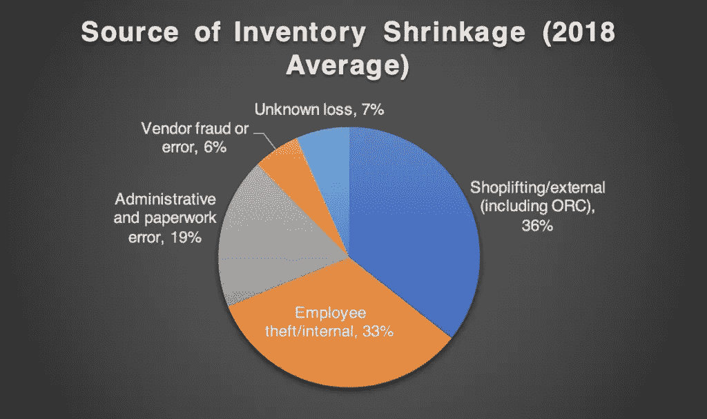
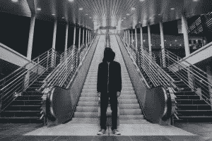
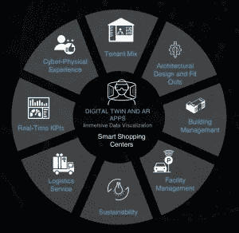

# Digital Twins & AR 如何提高购物中心的安全性并最大限度地减少库存缩减

> 原文：<https://medium.com/swlh/how-digital-twins-ar-improve-safety-and-minimize-inventory-shrinkage-for-shopping-centers-24a581fdc1ac>

大型购物中心和购物中心已经变得像城镇一样，大量的人群和车辆不断向不同的方向移动。例如，位于美国明尼苏达州布鲁明顿的美国购物中心[每年吸引约 4000 万游客，就像一个拥有约 11 万居民的城市(每天有 11 万人参观购物中心)。每年有 100 万游客的零售中心越来越多。](http://triplefive.com/en/pages/moa/tourism-facts.)

一方面，购物中心的大量访客是一个关键的绩效指标，反映了其商店的较高销售额以及对其空间租赁率的积极影响。另一方面，购物中心的巨大人群也意味着更多的不守秩序的人，小偷，流浪者，乞丐，罪犯，有时甚至是恐怖分子，使他们容易遭受暴力事件和商店盗窃。

# 零售中心的安全和库存缩减问题

尽管暴力犯罪并不经常发生，但它会导致巨大的声誉和附带损害。最近，2018 年 11 月 7 日，一名中年男子在纽约布鲁克林的城市点购物中心[目标](http://www.nbcnewyork.com/news/local/Target-Shooting-Brooklyn-Albee-Square-Mall-Killed-Machete-NYPD-500001102.html)内枪杀了一名 25 岁的男子。在美国，[零售中心](http://d-ddaily.com/archivesdaily/2018-Q1-Death-Report.htm)的暴力死亡人数在 2018 年比前一年增加了 12%。2017 年，暴力事件导致 424 人死亡，其中约 94%的死亡发生在零售场所内(如商店和停车场)。零售/销售员工占美国工作场所凶杀案受害者总数的 26.3%。大多数伤亡是由枪击造成的。

由于员工盗窃、入店行窃和其他错误导致的商店库存损失或[零售萎缩](https://cdn.nrf.com/sites/default/files/2018-10/NRF-NRSS-Industry-Research-Survey-2018.pdf.)在 2017 年使美国零售业损失了 468 亿美元。入店行窃是最重要的因素，占 2018 年零售萎缩的 36%，其次是员工盗窃，占 33%。

在假日季节，小偷经常以购物中心的停车场为目标。2018 年 10 月 8 日，[窃贼](https://www.fox23.com/news/trending-now/nearly-100-car-breakins-reported-in-one-night-at-georgia-mall/849061276)在乔治亚购物中心闯入约 100 辆汽车。据报道，在几个受欢迎的购物中心，包括哥伦比亚的 Columbiana Centre 和纽约的 Gateway Center，发生了多起汽车被盗事件。

# 数字双胞胎和增强现实有什么帮助？

数字双胞胎模型和增强现实可视化，也称为沉浸式数据可视化，可以帮助零售商和商场运营商遏制暴力和零售萎缩。

Digital twin 是一个实体购物中心的 3D 数字表示。它使用先进的统计决策方法、人工智能(或机器学习)、计算机视觉、高性能 GPU 计算和虚拟现实游戏引擎技术进行数据挖掘和可视化。该软件模型从物联网(IoT)传感器、设备和业务系统中收集数据，并在这个虚拟副本上实时显示这些数据，为管理人员提供商场运营的完整情况感知。就像视频游戏一样，用户可以沉浸在虚拟购物中心中，以 360 度的视角检查资产。

对于许多组织来说，数字孪生作为一个集中的平台来模拟假设的情况，利用更新的数据进行假设分析或根本原因分析，以便企业及时做出决策。Digital twin 利用购物中心的历史数据监控和预测即将发生的事件。例如，该软件可以提供目前在商场中的人数，并预测如果有 1000 多名游客来到商场，在停车场的可用性、商场内的空气质量或管理人流的难度方面会发生什么。

增强现实(AR)应用程序使用与 digital twin 相同的技术，但它不是将用户的放在虚拟现实中，而是将数字内容放在物理现实中。例如，AR 应用程序可以在桌子上或物理 HVAC 系统本身上叠加 3D 数字版本的供暖、通风和空调(HVAC)系统，允许用户在不打开系统的情况下查看系统的实际工作情况和实时性能数据。当与数字双胞胎集成时，AR 应用程序成为管理现场操作的引人注目的信息交付系统。

用户可以在智能手机、智能眼镜(如谷歌眼镜)和头戴设备(如 HTC Vive)上访问数字双胞胎和 AR 应用。直观的 3D 可视化、便携性以及与远程专家实时协作的能力使身临其境的数据可视化成为智能购物中心的必备工具。

## 零售店的库存损失预防

监控摄像头和传感器全天候捕捉购物中心里人和机器的活动。他们将流式视频和地理空间数据发送到 digital twin 的强大分析引擎，该引擎内置了计算机视觉技术。摄像头和物联网传感器传输的数据包含元数据，包括时间、位置、大小和许多其他用于定位和创建与对象相关的行为特征的属性。

digital twin 软件分析购物中心内人们的面部表情和身体姿势，以检测任何犯罪意图。如果访客的姿势与商店扒手的姿势相匹配，该软件就会向附近的店员发出警报，告知嫌疑人的位置和照片，以监控他或她的活动。职员去问嫌疑人是否需要帮助。商店工作人员的来访向嫌疑人传递了一个信息，即他或她正受到监视，不应试图偷窃任何东西。

当收银员避免或伪造扫描时，Digital twin 还可以检测出结账异常，并实时通知他或她的经理。

有时，即使供应商没有将货物送到零售商的商店，他们也会向零售商开账单。Digital twin 可以使用来自摄像头、门口入口和送货车辆详细信息的数据来监控和创建商店送货的完整日志；因此，可以检查与伪造装运相关的欺诈。

## 加强零售中心的安全和安保措施

Digital twin 可以存储罪犯、小偷和黑名单上的人的照片以及与他们的车辆相关的数据。如果有这种背景的人或与罪犯或假冒公司有联系的车辆进入商场，软件模型可以使用面部识别和车牌扫描算法识别他们。然后，它向安全人员发出警报，让他们在门口停下来，并提高警惕，看看他们是否有任何危险物品，如刀或枪。

Digital twin 的算法可以发现一个人的可疑行为，分配一个威胁倾向分数，并向当局发出警报。它还可以检测无人看管的行李，并向安全人员发送通知以及其位置，以便迅速采取行动。如果未经授权的人试图进入禁区，它还可以提醒当局。

Digital twin 可以检测通风不良或 CO2 浓度升高的区域，以注入新鲜空气。如果一个购物中心有快餐亭、油漆和家庭用品商店，这些商店中的许多产品会产生与呼吸系统问题有关的挥发性有机化合物(VOCs)。

人们经常丢失他们的物品(例如，手表、钱包和智能手机在洗手间或收银台)；有时，他们的孩子会在购物中心的人群中迷路，或者一个人突然生病(例如癫痫发作)。Digital twin 可以使用物联网传感器和摄像头提供的数据来定位遗留物品、失踪儿童和需要紧急医疗帮助的人。

数字双胞胎可以使用激光雷达发现购物中心建筑和商店中的裂缝，激光雷达是一种使用激光找到结构位移的检测系统。工厂经理可以使用这些数据来安排维护工作，避免任何事故。

在紧急情况下，数字双胞胎和 AR 应用程序可以为被困在中心的人提供位置和方向，以便快速疏散。它们还可以帮助在 3D 室内地图上定位故障设备或受火灾影响的区域，以及维修和管理它们的说明，以便第一反应人员或工人更快地做出反应并做出明智的决定。数字双胞胎使用来自购物中心区域的声音传感器的数据，可以检测出声音是否是枪声，并找到发生的位置以通知安全人员。

# 部署数字双胞胎和增强现实应用

Gartner 预测，到 2023 年，50%的主要企业将结合数字业务平台使用其组织的数字双胞胎。购物中心可以通过将其运营、销售和建筑管理系统的信息系统连接到软件来部署数字孪生和 AR 可视化解决方案。他们可以使用预定义的模式和技术提供商的现有数字资产来加速数字双胞胎的开发。

数字双胞胎有自我学习的算法，并且和我们提供给他们的数据的数量和质量一样好。购物中心已经安装了一些数字技术和监控传感器，为最先进的技术生成足够的数据，使他们的空间对来访的人来说安全可靠。当他们部署新的监控技术时，他们可以不断将其集成到现有的数字孪生系统中，使其成为更强大的决策和监控系统。

Hashplay’s [immersive data](https://hashplay.net/retail-supply/) for retail

## **作者**

**Jan-Philipp Mohr —** 创始人&首席执行官 [Hashplay](http://www.hashplay.net)

除了领导 Hashplay，Jan-Philipp 还是旧金山 Founders Space 的导师。他还在美国、欧洲和亚洲的许多活动上发表过关于 VR&AR、AI 和可视化的演讲。他拥有肯特大学商学学位。在业余时间，他参加了多个慈善组织。

## 这篇文章发表在 [The Startup](https://medium.com/swlh) 上，这是 Medium 最大的创业刊物，拥有+408，714 名读者。

## 订阅接收[我们的头条新闻](http://growthsupply.com/the-startup-newsletter/)。

